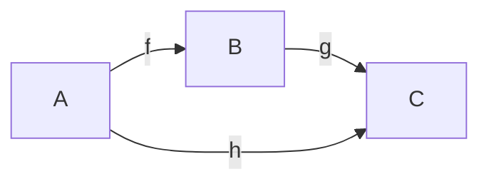
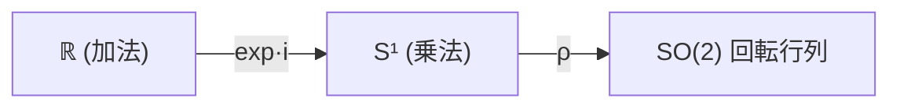
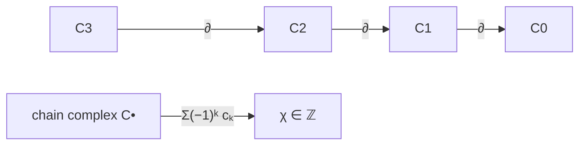
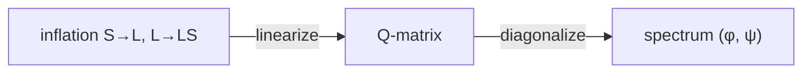
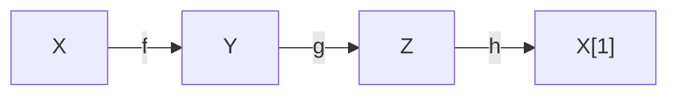

# 三角形（幾何）⇄ 圏論 対応リファレンス

**版**: v4.3 (2026-04-18)
**ステータス**: 公式リファレンス（純粋対応表）+ §3.bis 正五角形 + §3.ter 立体閉じ込め (J₂ → icosahedron / dagger vs pivotal / **F ⊣ U lifting-projection 随伴**)
**核フレーミング**: 三角形 = 計量付き 2-圏的 2-単体 / 長さ = metric enrichment / 角 = phase

> 開発過程の Integrity Verdict / 棄却台帳 / Source Ledger は本書末尾の吸収 annex に統合済み。

---

## §0  一目でわかる対応

```
三角形                    圏論
─────────────────────────────────────
頂点            ↔  0-cell (対象)
辺              ↔  1-cell (射)
面 (内部)       ↔  2-cell (2-morphism)
長さ ℓ          ↔  metric enrichment d: Hom → [0,∞]
角 θ            ↔  phase / turning: ∂ → S¹
三角不等式      ↔  合成則 d(A,C) ≤ d(A,B) + d(B,C)
```

無向辺は「互いに逆向きの 1-cell の対」として扱う。

---

## §1  関手の骨組み

### walking triangle Δ²

三角形の抽象データを担う最小の 2-圏。**3 対象 + 3 生成射 + 1 非自明 2-cell**：



2-cell `σ: g∘f ⇒ h` が面を塗る。圏論標準用語では **walking X** = 構造 X を普遍的に実現する最小の圏 (Street / Leinster / nLab)。

| walking X | 対象 | 生成データ |
|:---|:---|:---|
| walking arrow `[1]` | 2 | `f: 0→1` |
| walking composition | 3 | `f, g, g∘f` |
| walking 2-cell | 2 | `f,g: 0⇉1`, `α: f⇒g` |
| **walking triangle Δ²** | **3** | **`f,g,h` + `σ: g∘f ⇒ h`** |

`Δ²` は walking arrow / walking composition / walking 2-cell を同時に普遍的に含む。

### 関手 𝓕: Δ² → 𝒟

```
𝓕: Δ²  →  𝒟

    3 対象 A,B,C  ↦  𝒟 の対象
    3 射 f,g,h    ↦  𝒟 の射
    2-cell σ      ↦  𝒟 の 2-cell  σ: 𝓕(g)∘𝓕(f) ⇒ 𝓕(h)
    合成と恒等を保存
```

**universal property**: 任意の 2-圏 `𝒟` の中の「三角形パターン」は `Δ²` からの 2-関手と一対一対応する。

### L0–L4 実在化ラダー

domain は常に `Δ²`、**変化するのは codomain のみ**：

| L | codomain | ここで初めて言えること |
|:---|:---|:---|
| L0 | 純粋 2-圏 | 頂点・辺・面 |
| L1 | Lawvere 計量豊穣 2-圏 | 辺の長さ、三角不等式 |
| L2 | S¹ 作用付き 2-圏 | 内角・外角・境界 holonomy |
| L3 | Euc² 幾何 2-圏 | 中線・重心・内心・外心・内接/外接円 |
| L4 | dagger / Hilbert 2-圏 | 三平方 |

### 自己同型関手

自己同型 `𝓕: Δ² → Δ²` は **対称群 S₃** (3 回転 + 3 鏡映)。「辺のつながりを壊さない変換」の group-theoretic 表現。

---

## §2  基本対応表

13 項目を **最小前提 L 層 / 形式化候補 / 前提を落とすと壊れる点 / 強度** で整理。

| # | 幾何 | 圏論対応 | 最小前提 | 形式化候補 | 壊れる点 | 強度 |
|:---|:---|:---|:---|:---|:---|:---|
| ① | 内角 | 頂点での局所 turning / phase | L2 | θ: 頂点 → S¹ | L2 なしでは角は射の並びに退化 | Medium |
| ② | 外角 | 境界 holonomy | L2 | holonomy: ∂Δ → S¹ | 境界 holonomy 不定義 | Medium |
| ③ | 辺の長さ | metric 豊穣化 Hom | L1 | d: Hom → [0,∞] | 純粋圏では内在しない | **Strong** |
| ④ | 中線 | 頂点 → 対辺中点 object の canonical arrow | L3 affine | 中点 canonical arrow | 計量だけでは中点一意ならず | Analogy |
| ⑤ | 角の二等分線 | 局所 phase を等分する方向射 | L3 affine + L2 | turning を等分する射 | 対辺との交点保証消失 | Analogy |
| ⑥ | 内心 | 3 辺への等距離普遍対象 | L3 Euc | 辺距離 equalizer | 実現なしでは等距離比較不能 | Analogy |
| ⑦ | 外心 | 3 頂点への等距離普遍対象 | L3 Euc | 頂点距離 equalizer | 同上 | Analogy |
| ⑧ | 重心 | 3 頂点の等重み barycenter | L3 affine | weighted colimit | affine 平均構造に依存 | Analogy |
| ⑨ | 辺と角の大小 | 長さと対向 turning の単調対応 | L3 (余弦定理) | c² = a²+b²−2ab·cos C | 一般計量では余弦定理等号不成立 | Medium |
| ⑩ | 三角形成立条件 | 三角不等式 = 合成則 | L1 | d(A,C) ≤ d(A,B) + d(B,C) | 合成が距離として読めない | **Strong** |
| ⑪ | 内接円 | 内心中心の side-distance level set | L3 Euc | 辺距離一定軌跡 | 円形は Euclidean 平面特有 | Analogy |
| ⑫ | 外接円 | 外心中心の vertex-distance level set | L3 Euc | 頂点距離一定軌跡 | 球面では小円、双曲面では超曲線 | Analogy |
| ⑬ | 三平方 | ‖u+v‖² = ‖u‖² + ‖v‖² (u⊥v) | L4 内積 | dagger / Hilbert | metric のみでは直交性不足 | **Strong** |

### 強度ラベル

- **Strong**: 圏論言語で直接書き下せる構造命題（L1-L2 の enrichment だけで閉じる）
- **Medium**: 追加構造が入れば構造命題、欠けると比喩
- **Analogy**: L3 以上の実現を要する設計的対応

---

## §2.bis  metric 退化と自己同型の随伴

§1 末尾の自己同型 `Aut(Δ²) = S_3` は、L1 metric 豊穣を加えると metric 像の退化度に応じて縮退する。「二等辺 = 1 辺を複製した三角形」という素朴直観は、圏論的には **metric 関手 `d: {f,g,h} → [0,∞]` の fiber が粗くなる degeneration** として読む。関手の domain 側で辺を増やすのではなく、codomain 側の metric が退化することで対称性が拡大する。

### 退化度 ↔ Stab の対応

| 三角形 | `d` の像 | Stab ⊆ S_3 | &#124;Stab&#124; |
|:---|:---|:---|:---|
| 不等辺 | 単射 (3 値独立) | `{e}` | 1 |
| 二等辺 | 2-to-1 fiber を 1 つ持つ | `Z/2` | 2 |
| 正三角形 | 定数 (3-to-1 fiber) | `S_3` | 6 |

随伴的読み:

```
d の fiber 粗さ  ⟺  S_3 軌道の融合度  ⟺  Aut の大きさ
```

### walking 派生の明示

| walking X | 対象数 | 追加制約 | Stab |
|:---|:---|:---|:---|
| scalene (= `Δ²`) | 3 | なし | `{e}` |
| **isosceles** | 3 | `d(f)=d(g)` | `Z/2` |
| **equilateral** | 3 | `d(f)=d(g)=d(h)` | `S_3` |

これらは `Δ²` 上の metric 制約による quotient で得られ、`§1` の L0→L1 昇格 (純粋 2-圏 → 計量豊穣) でのみ意味を持つ。L0 では辺の区別が長さを持たないので退化そのものが定義できない。

---

## §3  4 機械メタ構造

幾何三角形の対応を支える **4 つの独立装置**。各機械は固有の入力・内部規則・出力を持つ自律的な圏論的機構。

| 機械 | 入力 | 内部規則 | 出力 |
|:---|:---|:---|:---|
| **M1 回転機械** | θ ∈ ℝ | `ρ: θ ↦ 回転行列 / e^(iθ)` | S¹ 上の点、cos/sin |
| **M2 交代和機械** | chain complex | `χ = Σ(−1)ᵏ cₖ` | 不変量 χ ∈ ℤ |
| **M3 再帰スペクトル機械** | 再帰 endomorphism | 特性方程式の対角化 | 固有値 (φ, ψ) |
| **M4 exactness 機械** | 3 対象 + 3 射 | TR1–TR4 + shift [1] | distinguished triangle |

### M1: 回転機械

入力 `θ ∈ ℝ` → 出力 回転表現。



```
ρ(θ) = | cos θ   -sin θ |       e^(iθ) = cos θ + i sin θ
       | sin θ    cos θ |
```

- **sin, cos** = 回転表現の **行列要素**
- **tan** = `cos θ ≠ 0` 上の **射影座標** (派生量、主役ではない)
- **π** = `ℝ → S¹` の **周期化商** (θ ∼ θ + 2π)
- **e** = 指数写像の **規格化定数** (加法 → 乗法)

**オイラー等式** `e^(iπ) + 1 = 0` = 一般法則 `e^(iθ₁)·e^(iθ₂) = e^(i(θ₁+θ₂))` の **半回転特殊化**。

### M2: 交代和機械

入力 chain complex → 出力 Euler 標数。



- 三角形: V=3, E=3, F=1 → `χ = 3 − 3 + 1 = 1` (2-disk)
- 四面体: V=4, E=6, F=4 → `χ = 2` (球面)
- 一般: `χ = Σₖ (−1)ᵏ cₖ`

本体は **chain complex の交代和**。多面体公式 `V − E + F = 2` はその 3 次元特殊化。

### M3: 再帰スペクトル機械

入力 再帰 endomorphism (Q-matrix) → 出力 固有値。

```
| F_{n+1} |   | 1  1 | | F_n     |        Q = | 1 1 |
|         | = |      | |         |            | 1 0 |
| F_n     |   | 1  0 | | F_{n−1} |
```



特性方程式 `λ² − λ − 1 = 0` の根:

- **φ = (1 + √5)/2** ≈ 1.618 = **支配的成長モード** (Perron-Frobenius)
- **ψ = (1 − √5)/2** ≈ −0.618 = **従属的補正モード**

inflation rule `S ↦ L, L ↦ LS` が symbolic dynamics 側表現 (詳細は Appendix B)。

### M4: exactness 機械

入力 3 対象 + 3 射 → 出力 distinguished triangle。



公理 TR1–TR4 + shift functor `[1]`。homological functor は long exact sequence を生む。

**decategorification**:

```
K₀(𝒟) 上で  [Y] − [X] − [Z] = 0        (distinguished triangle より)
χ(X) = Σᵢ (−1)ⁱ [Hⁱ(X)]  が additive  (derived category 上)
```

### M2 ⇄ M4: decategorification 橋

```
     M2 (χ)                  M4 (K₀)
  ┌─────────┐  decategorify  ┌─────────┐
  │ 幾何側   │ ←──────────→  │ 圏論側   │
  │ 不変量   │                │ 不変量   │
  └─────────┘                └─────────┘
```

M2 ↔ M4 軸が「**幾何三角形**」と「**exact triangle**」を、名前の一致ではなく **decategorified invariant** として結ぶ主線。M1 は M4 の基礎 (回転群が shift を代替する局面)、M3 は M2 の動力学化 (交代和を時間発展で読む局面) として M2 ↔ M4 軸に寄り添う。

---

## §3.bis  正五角形 — Fibonacci inflation の幾何実装

§3 M3 の inflation rule `S ↦ L, L ↦ LS` と Q-matrix は symbolic / 線形代数で記述される抽象規則。**正五角形はこれを平面幾何で具現する標準例**。

### 3 分割

正五角形の辺長 `s`、対角線長 `d` は `d/s = φ`。1 頂点から 2 本の対角線を引くと 3 三角形に分割される:

| 位置 | 辺の組 | symbolic | 角 | 三角形型 |
|:---|:---|:---|:---|:---|
| 両脇 (2 個) | `(s, s, φs)` | `(S, S, L)` | 36°-36°-108° | 鈍角二等辺 |
| 中央 (1 個) | `(φs, s, φs)` | `(L, S, L)` | 72°-36°-72° | 黄金二等辺 |

中央の `(L, L, S)` は inflation rule `L ↦ LS` の 1 ステップ像 (L を L と S に拡張したときの辺比対応)。両脇の `(S, S, L)` は `S ↦ L` 側の双対像。3 三角形を組み合わせた正五角形は **inflation rule の 1 段階を空間に刻んだ図形**。

### φ の発現

M3 Q-matrix `[[1,1],[1,0]]` の主固有値 `φ = (1+√5)/2` は、文字個数ベクトル `(#L, #S)` の Perron-Frobenius 支配モード。**正五角形の対角線は `L`、辺は `S`** に対応するので、`d/s = φ` は抽象主モード比が幾何に射影された形。古典的には相似と二次方程式 `x² − x − 1 = 0` から出るが、圏論骨格では Q-matrix の対角化として読める。

### pentagram の 35 三角形

5 本すべての対角線を引くと pentagram が得られ、内部に **35 個の二等辺三角形** (黄金型 20 + 鈍角型 15) が現れる。これは inflation rule の反復適用を平面に展開した自己相似構造で、対角線の交点に現れる小五角形が `1/φ²` スケールで nest する。

- golden (36°-72°-72°): 20 個 (大 5 + 中 10 + 小 5)
- obtuse (36°-36°-108°): 15 個 (大 10 + 小 5)

`φ² = φ + 1` (Fibonacci 恒等式) の空間版が pentagram の自己相似 nest、と読める。

### M3 との対応

| M3 (抽象) | §3.bis (幾何) |
|:---|:---|
| `S ↦ L, L ↦ LS` | 対角線/辺の長さ対応 |
| Q-matrix 主固有値 `φ` | `d/s = φ` |
| `n → ∞` 漸近 | pentagram 自己相似 nest |
| inflation step | 1 頂点からの 2 対角線分割 |

pentagon は inflation rule の **最低次元な平面実装**。球面三角形 (Appendix A.2) が曲率付き実現なら、pentagon は **再帰付き実現**。

### 3 軸分離 — closure schema の独立軸

Δ² と P₅ を並べると、**三つ組の閉じ方 (closure schema)** が 3 つの独立軸に分離できることが見える。§1 自己同型関手節 (S₃) は 3 軸の 1 つ (対称軸) にすぎない。

| 軸 | 数学的対象 | Δ² での実現 | P₅ での実現 | 強度 |
|:---|:---|:---|:---|:---|
| **対称軸** (辺の区別消失) | 自己同型群 | S₃ (3! = 6 元) | D₅ (10 元) | Strong |
| **スペクトル軸** (自己相似比) | 固有値 | 正三角形で 1 に退化 | **φ, 1/φ** (Q-matrix 対角化) | Strong (§3 M3) |
| **位相軸** (端点で閉じる) | 周期化商 | `e^{iπ}+1=0` (半周回) | F-行列 pentagon equation | Analogy |

**読み**: Δ² ではスペクトル軸と位相軸が退化または自明化 (正三角形では固有値 1 のみ、位相は S¹ の任意点で閉じる) するため、1 軸で閉じるように見える。P₅ では 3 軸すべてが非自明に立つ。

- **対称 → スペクトル**: S₃ が退化しない (正三角形にならない) と D₅ が立ち、D₅ の不変量として Q-matrix 固有値 φ が出てくる
- **スペクトル → 位相**: φ が F-行列の成分として現れると、その F-行列が満たす pentagon equation が位相軸の非自明実現を担う
- **位相 → 対称**: pentagon equation の解を要求する coherence が、結果として D₅ および A₅ (正 20 面体群) の対称性を選ぶ

[Open] 位相軸の Mac Lane pentagon coherence 解と Fibonacci anyon F-行列との接続は、本リファレンスの射程を超える。σ 統一論文または incubator `pentagon_sigma_conjecture.md` で育てる対象。

---

## §3.ter  立体閉じ込め — J₂ vertex figure と pivotal twist

§3.bis は P₅ を **平面のまま** 扱った。本節は **平面 → 立体への昇次元** で 3 軸分離がどう変化するかを記録する。Tolmetes 観察 (2026-04-18, `pentagon_sigma_conjecture.md §種⑩`) を本リファレンス側で正規化したもの。

### 5 等分割と立体化

正五角形の中心 O から 5 頂点へ線を引くと、§3.bis の 3 分割 (黄金 + 鈍角 2 個) とは異なる **5 等分割** が得られる。各三角形は合同な二等辺で、頂角 72°、底角 54° × 2。中心 O を高さ `h` に持ち上げると側面三角形の頂角が変化し、

```
h/s = √((5 − √5)/10) ≈ 0.5257  ⟺  側面三角形が正三角形 (60°-60°-60°)
```

このとき得られる立体が **Johnson J₂ (正五角錐, pentagonal pyramid)**。

### J₂ = icosahedron vertex figure

[SOURCE: 正二十面体の標準幾何] 正二十面体 (V=12, E=30, F=20) の **任意の頂点 v** の周りには正三角形が **5 枚集まる** (頂点角 5 × 60° = 300°、欠損角 60° で凸性確保)。この vertex figure は P₅ で、付随する局所構造は **J₂ そのもの**。つまり:

> **J₂ = 正二十面体の頂点近傍 (vertex figure)**

これは平面 P₅ の対称軸 (D₅, 10 元) を立体化すると、自然に **A₅ = 正二十面体回転群 (60 元)** に拡張されることを示す。`§3.bis` の 3 軸分離における対称軸の **次元勾配** が顕在化する。

### 反対圏 J₂^op と閉じ方の階層

J₂ には orientation (法線方向) があり、その逆向きコピー J₂^op が必然的に存在する。J₂ と J₂^op の貼り合わせは twist 次第で異なる立体を生む:

| 貼合方式 | 構成 | V | E | F | 面の質 | 圏論的読み |
|:---|:---|:---:|:---:|:---:|:---|:---|
| **直接** (twist 0°) | J₂ ⊔_{P₅} J₂^op | 7 | 15 | 10 | φ 比率二等辺 (歪) | dagger structure (`C ≅ C^op` 直接) |
| **π/5 twist 経由** | J₂ ⊔_{P₅} (五角反プリズム) ⊔_{P₅^op} J₂^op | 12 | 30 | 20 | 全正三角形 (Kalon) | pivotal/spherical structure |

直接貼合は **Johnson J₁₃ (五角双錐)** を与える。これは μ 近傍 (歪な双錐) で、平面 σ closure の素朴な立体延長にすぎない。

π/5 twist 経由は **正二十面体** を与える。**「閉じ方が Kalon になるためには反対圏との貼合に π/5 twist が要る」** — これは MTC で言えば pivotal/spherical structure に相当する。

### 36° = π/5 の出所

| 出所 | 同じ 36° / π/5 |
|:---|:---|
| D₅ 群の最小回転 | `2π/10 = π/5` |
| 黄金比の角度実現 | `cos 36° = φ/2` |
| 五角反プリズムの捻り角 | 上下 P₅ を `2π/10` ずらす |
| Mac Lane pentagon equation の coherence twist [Open] | F-matrix の位相成分 |
| MTC pivotal/spherical structure の自然変換 | C ⇄ C^{op,op} の twist |

### 3 軸分離の立体側拡張

§3.bis の 3 軸分離テーブルに **次元勾配** 列を追加すると:

| 軸 | Δ² (2D) | P₅ (2D) | icosahedron (3D) |
|:---|:---|:---|:---|
| **対称軸** | S₃ (6 元) | D₅ (10 元) | **A₅ (60 元)** |
| **スペクトル軸** | 1 (退化) | φ | φ (保存、quantum dim 不変) |
| **位相軸** | `e^{iπ}+1=0` | F-matrix pentagon eq | **π/5 twist (反プリズム捻り)** |

立体化により対称軸が D₅ → A₅ に昇格し、位相軸が「F-matrix の方程式」から「実際の幾何 twist」に具現化する。スペクトル軸の φ は次元によらず保存される (quantum dimension の topological invariant 性)。

### F ⊣ U: lifting と projection の随伴

§3.ter は P₅ → J₂ の **lifting** (中心 O を高さ H に持ち上げる操作) を主軸にしているが、これは F ⊣ U adjunction の **左随伴側のみ** を書いた読みである。逆向き U: J₂ → P₅ (z 座標を忘却する鉛直射影) を **右随伴** として併置することで、本節は lifting / projection の双方向リファレンスとして完成する。

**正規化された関手対**:

| 関手 | 方向 | 操作 | 圏論的型 |
|:---|:---|:---|:---|
| **F** (lifting) | P₅ → J₂ | 中心 O を H = 1/φ (R=1 norm) に持ち上げる | 左随伴 (free) |
| **U** (forgetful) | J₂ → P₅ | z 座標を忘却する鉛直射影 | 右随伴 (forgetful) |

**正規化された高さの導出**: J₂ が正三角形 5 面を側面に持つ条件は

```
H² = L² − R² = 4 sin²(36°) − 1 = (3 − √5)/2 = 2 − φ = 1/φ²
∴ H = 1/φ (R=1 norm)
```

`U ∘ F = id_{P₅}` (正規化された 1 点 lift は projection で同一点へ戻る)。`F ∘ U ≠ id_{J₂}` (J₂ の z 情報を一度捨てて lifting で復元しても、向き付けと scale は一意に戻らない)。これが F ⊣ U が adjoint であって equivalence ではない事実の局所表現。

**次元勾配との接続**: §1 の L0–L4 ラダーで、F は metric enrichment を 1 段増やす方向、U は 1 段減らす方向。§3.ter の P₅ (2D) ⇄ J₂ (3D) は L_n ⇄ L_{n+1} の最小実装例。

**何が原型か**: F ⊣ U adjoint pair において、どちらを「原型」と呼ぶかは普遍的問いに答えがない。ただし以下の対比は記録に値する。

| 立場 | 原型 | 派生 | 根拠 |
|:---|:---|:---|:---|
| **Lifting 主導** | P₅ | J₂ | 平面が建材、立体は構築物 |
| **Projection 主導** | J₂ (or icosahedron) | P₅ | 立体が原型、平面は shadow |

種⑩a で確立した「J₂ = icosahedron vertex figure」を採ると、**P₅ は 12 個の icosahedron 頂点近傍の 1 つを平面に射影した shadow** として読める。

[Open] F ⊣ U adjunction を定義する正確な圏 (metric 2-圏 / simplicial complex 圏 / piecewise-linear category) は本リファレンスの射程を超える。`pentagon_sigma_conjecture.md §種⑩d` を参照。

[Open] 多面体一般化 (P₃/P₄/P₆ × Plato 立体の shadow 表) は incubator 候補。本リファレンスでは P₅ × icosahedron の最小実装のみ正規化する。

[Open] Plato 『ティマイオス』 53C-56C の正多面体実体論 (元素 ↔ 正多面体) と shadow projection の体系的対応は哲学射程。本リファレンスでは記録のみ。

### Closure schema の精度階層

§4 で導入する closure schema は、本節により以下の **精度階層** を持つことが見える:

```
Δ² (2D triangle)        : closure 自明 (S₃)
P₅ (2D pentagon)        : D₅ closure, σ 三軸分離が立つが平面で頭打ち
J₁₃ (3D, dagger 直接)    : 立体に昇るが面が歪 (μ 近傍)
icosahedron (3D, pivotal): 立体で全面 Kalon (A₅, 三軸揃う)
```

[Open] この精度階層が任意の n-cell tower (Stasheff associahedra) で一般化されるかは、`Face5Lemma_draft.md §20` の F5-pivotal 仮説の射程。

[Open] `cos 36° = φ/2` から `e^{iπ/5}` の Fibonacci anyon F-matrix 位相成分への直接導出は、本リファレンスの射程を超える。`pentagon_sigma_conjecture.md §種⑩c` を参照。

---

## §4  exact triangle との境界

**同名警告**: 幾何三角形は triangulated category の exact triangle ではない。

| 幾何の三角形 | exact triangle |
|:---|:---|
| 3 頂点・3 辺・1 面 | 3 対象 + 3 射、最後は `Z → X[1]` |
| 平面内で閉じる | shift を介して閉じる |
| 長さ・角度が主役 | exactness・cohomology が主役 |
| 面積をもつ | long exact sequence を生む |
| metric + phase 要 | TR1–TR4 + shift 要 |

両者が共有するのは「**三つ組の閉じ方 (closure schema)**」というメタ構造のみ。具体的接続は §3 M2 ⇄ M4 の decategorification 橋 (`χ ↔ K₀`) 経由。

**誤読回避**: 「triangle という名前が同じだから対応する」ではなく、「`K₀` / Euler characteristic 経由の decategorification が、幾何の交代和不変量と圏論の exactness 不変量を同一視する」という経路だけが構造命題。

---

## Appendix A — Worked Examples

### A.1  3-4-5 直角三角形 (L1 + L3 + L4 のフル実装)

- **L1 metric**: `d(A,B) = 3, d(B,C) = 4, d(A,C) = 5`。三角不等式 `5 ≤ 3 + 4` ✓
- **L3 Euclidean**: 座標 `A = (0,0), B = (3,0), C = (0,4)`。重心 `G = (1, 4/3)`。内心・外心・内接円半径 `r = 1`・外接円半径 `R = 5/2` が一意に決まる
- **L4 Hilbert**: `3² + 4² = 5²` (三平方)。ベクトル形 `‖u+v‖² = ‖u‖² + ‖v‖²` が `u ⊥ v` で成立

**要点**: 内積実現の典型。L0–L4 ラダーのすべての層が同時に走る標準例。

### A.2  球面三角形 (L1 + L2 + L3')

- **L2 phase**: 内角和 `> π`。外角 holonomy の積分は **Gauss-Bonnet** で球面曲率に一致
- **L3' 球面幾何**: 外接「円」は球面上の **小円**。余弦定理は球面版:
  ```
  cos(c/R) = cos(a/R) cos(b/R) + sin(a/R) sin(b/R) cos C
  ```
- 平面三角形の余弦定理 `c² = a² + b² − 2ab cos C` は `R → ∞` 極限で回復

**要点**: 曲率付き実現の典型。「角 = turning」「辺 = metric」の読みが Euclidean 直感から独立に機能することを示す。

---

## Appendix B — Fibonacci Inflation Rule

§3 M3 の symbolic dynamics 側表現。

### inflation rule

```
S ↦ L
L ↦ LS
```

初期文字列 `L` から反復:

```
Step 0: L                     (長さ 1)
Step 1: LS                    (長さ 2)
Step 2: LSL                   (長さ 3)
Step 3: LSLLS                 (長さ 5)
Step 4: LSLLSLSL              (長さ 8)
Step 5: LSLLSLSLLSLLS         (長さ 13)
```

各ステップの文字列長が Fibonacci 数列 `1, 2, 3, 5, 8, 13, ...`。`#L / #S` 比は `n → ∞` で `φ` に収束 (Perron-Frobenius 支配モード)。

### Q-matrix 表示

inflation rule を文字個数ベクトル `(#L, #S)` に作用させると:

```
| #L_{n+1} |   | 1  1 | | #L_n |
|          | = |      | |      |
| #S_{n+1} |   | 1  0 | | #S_n |
```

これは §3 M3 の Q-matrix そのもの。**Q-matrix は inflation rule の線形代数的影**。

**読み**: φ と ψ は単なる数値ではなく、**生成規則を対角化したときのスペクトル不変量**。`n-cell tower` の有効構成数が Fibonacci 再帰に従う現象は、この inflation rule と同一構造。

---

## 用語索引

| 用語 | 節 | 定義 |
|:---|:---|:---|
| walking triangle `Δ²` | §1 | 三角形データを普遍実現する最小 2-圏 |
| L0–L4 ラダー | §1 | codomain の enrichment 階層 (純粋 → 計量 → phase → Euc → Hilb) |
| 最小前提 | §2 | 各対応が成立するための最小 L 層 |
| 4 機械 (M1–M4) | §3 | 回転 / 交代和 / 再帰スペクトル / exactness の独立装置 |
| decategorification 橋 | §3 | `χ ↔ K₀` 経由の幾何⇄圏論接続 |
| closure schema | §4 | 幾何 triangle と exact triangle が共有するメタ構造 |
| Perron-Frobenius | §3 M3 / App B | 正値行列の支配的固有値定理 |
| 正五角形 `P₅` / pentagram | §3.bis | inflation rule の幾何実装、35 個 isosceles の自己相似 nest |
| 3 軸分離 (対称/スペクトル/位相) | §3.bis | closure schema を自己同型群・固有値・周期化商の 3 独立軸に分解 |
| J₂ / icosahedron vertex figure | §3.ter | 正五角錐 = 正二十面体の頂点近傍、平面 D₅ → 立体 A₅ の昇次元 |
| dagger vs pivotal (閉じ方階層) | §3.ter | J₁₃ (直接貼合, 歪) vs icosahedron (π/5 twist, Kalon) の構造差 |
| π/5 twist | §3.ter | 五角反プリズムの捻り角 = pentagon coherence の幾何実装候補 |
| F ⊣ U (lifting / projection 随伴) | §3.ter | F: P₅ → J₂ (高さ 1/φ への持ち上げ, free) ⊣ U: J₂ → P₅ (z 忘却の射影, forgetful)。`U∘F = id` だが `F∘U ≠ id` |

---

## 付録A: 吸収された開発過程要約台帳 (2026-04-18)

旧 `triangle_category_functor_map_development_log.md` の live file はここへ要約吸収した。
詳細な探索順序や逐次草案までは repo 内に保持していないため、以下の 4 面だけを見出し名ごと残す。

### Source Ledger

- 対応表 v1-v3 の骨格、`walking triangle Δ²`、L0-L4 実在化ラダー、4 機械 M1-M4、`sin/cos/tan` の型分離、`φ/ψ` の Q-matrix 固有値化、`Aut(Δ²)=S₃` の整理は旧開発ログから本書 §1-§3 に正規化済み。
- 立体閉じ込め (`J₂ → icosahedron`, `π/5 twist`, dagger vs pivotal) は旧開発ログ単独ではなく、後続の `pentagon_sigma_conjecture.md` 種⑩と合流して §3.ter に昇格済み。
- v3.2 以前の SOURCE/INFERENCE の分離は、現行版では「本文に残した SOURCE」と「版履歴にだけ残す provenance」に再配置した。

### Rejection Ledger

- 「三角形そのものが関手である」という読みは棄却し、`walking triangle` を domain に取る関手像だけを許す立場に固定した。
- 「三平方の定理 = そのまま exact triangle」という短絡は棄却し、metric enrichment と closure schema の二段階を経る設計対応に限定した。
- 「幾何→圏論対応は標準理論の直訳である」という誤読は棄却し、本書全体を設計的 correspondence として扱う方針に固定した。

### Remaining Ambiguities

- `F ⊣ U` の lifting 主導 / projection 主導のどちらを本文既定読みにするかは比較表まで整備し、最終確定は [Open] のまま。
- Plato 元素論への哲学射程は v4.3 時点でも [Open] であり、本リファレンスでは技術面だけを正本とする。

### Integrity Verdict

- 本リファレンスの正本は現行本文であり、旧開発ログは探索順序の記録としてだけ意味を持つ。
- 旧ログの価値は「何を棄却し、どこから本文骨格が生えたか」にあるため、見出し名は保存しつつ live navigation は本書へ一本化した。
- 詳細な逐次草案や途中の語りは本書には保持していない。必要なら git と外部復元面から遡る。

---

*v4.3 — 2026-04-18 §3.ter に「F ⊣ U: lifting と projection の随伴」サブセクションを追加。Tolmetes 方向反転観察 (`pentagon_sigma_conjecture.md §種⑩d`) を本リファレンス側で正規化。`H = √(2 − φ) = 1/φ` の R=1 norm 導出を明示、`U∘F = id` / `F∘U ≠ id` の adjoint 非対称性を局所表現として記録、Lifting 主導 vs Projection 主導の二読みを比較表化、Plato 元素論との哲学射程は [Open] 化。用語索引に F ⊣ U エントリを追加。*
*v4.2 — 2026-04-18 §3.ter 立体閉じ込め節を追加。J₂ = icosahedron vertex figure 同型、J₂+J₂^op の閉じ方が直接 (J₁₃) vs π/5 twist 経由 (icosahedron) で階層化、3 軸分離テーブルに次元勾配列 (A₅/φ/π-twist) を追加。Tolmetes 観察 (pentagon_sigma_conjecture §種⑩) を本リファレンス側で正規化。*
*v4.1 — 2026-04-17 §3.bis に「3 軸分離」節を追補。対称 (S₃/D₅) / スペクトル (φ) / 位相 (e^{iπ}/pentagon eq) の独立軸を明示。v4.0 骨格は不変。*
*v4.0 — 公式リファレンス版。v3.2 以前の主要台帳 (Integrity Verdict / 棄却台帳 / Source Ledger / 設計過程メタノートの要点) は 2026-04-18 に本書付録Aへ要約吸収。*
