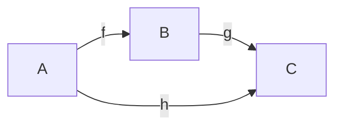

# 比較射σの統一定理
## — 幾何・忘却論・オイラーの等式を貫く typed 統一仮説 —

**v0.3.6 — 2026-04-17 背骨固定 (C5 front-stage / C3+C4 城門化 / C1-C2 地盤再配置) + C13 Yoneda tower phase structure 本文実装 (§4.9 統合関手 Φ) + C14 転移点 d=2 の tower 無限遠対応 (§5.bis.4d, 4 独立 SOURCE 線合流) / v0.3.5 C9 十分性正面化 (§5.bis.4b C10 / §5.bis.4c C12) / v0.3.4 §2.0 三軸分離 前倒し (読解フレーム化) + §4.7.bis tower 具体化 / v0.3.3 φ-sector 本格化 (§5.bis) / v0.3.2 (3 層対応地図) / v0.3.1 (φ-sector 予告) / v0.3 (三角形と円の随伴 / Euler path 深化)**

> F⊣G: meta.md §M1 参照。本文執筆中の F⊣G 変更禁止。  
> 本稿は、射程を縮めずに、主張の声量だけを調整した版である。`SOURCEで立つ核 / 仮説 / 予想 / open` を同じ面に並べ、どこから先が跳躍かを見えるようにする。
> v0.3 追加面: §3.3 Euler path の σ 位相版としての深化、および §5b の「三角形と円の随伴 — 内心円・外心円・π」。C4 を予想 face として §M2 に追加。
> v0.3.1 追加面: §3.3.bis の `φ`-sector 予告 (姉妹 sector 構想段階。hypothesis face 未満)、および §6 rejection ledger #10。`triangle_category_functor_map.md` §2.bis / §3.bis と対応。
> v0.3.2 追加面: §4.7 「σ の 3 層対応地図」— `FaceLemma.md` (局所存在層) / `triangle_category_functor_map.md` (骨格普遍層) / `統一表 v0.2` (橋梁担体層) が同一の σ の 3 層表現であることを明示。C5 を上位メタ予想として §M2 に追加。§7 結語を C1-C4 + C5 の 6 面体制に更新。
> v0.3.3 追加面: §5.bis 「スペクトル軸 — σ の 5-cell coherence と SU(2)_k family」本格化。`Face5Lemma_draft.md` v0.3 の検証結果 (F5-α 定理化、F5-γ (φ 普遍性) の Ising anyon 反例による棄却、F5-γ' (SU(2)_k family 階段) への再構築) を反映。三軸分離 (位相・スペクトル・群) を §5.bis.1 で導入、SU(2)_k family `d_{1/2}(k) = 2cos(π/(k+2))` をスペクトル軸 endpoint 階段として §5.bis.2 で提示、Stasheff associahedra 理論による Face5 Lemma (F5-α) 定理化を §5.bis.4 で繰込。C3 を「二窓」から「三軸構造」へ再定位。C6 (三軸分離) / C7 (σ の SU(2)_k スペクトル階段, F5-γ' 相当) / C8 (Face5 Lemma = F5-α 定理, Stasheff より Kalon△ ◎) を §M2 に追加。v0.3.1 版の「φ-sector と π-sector の姉妹」は誤 parallelism として撤回。§6 open #10 を解消し、新 open #11-13 に置換。
> **v0.3.4 追加面**:  
> (1) §2.0 三軸分離を **論文冒頭の読解フレーム** として前倒し。v0.3.3 では §5.bis.1 を読むまで三軸構造が明示されなかったため、π-sector と SU(2)_k-sector を二窓として誤読する余地が残っていた。この誤読経路を構造的に封じるため、C6 (三軸分離) を §2.0 に前置きし、§3/§5/§5.bis/§5b の各節がどの軸を担うかのマップを冒頭に固定する。  
> (2) §5.bis.4a 「Tambara-Yamagami family と ENO universal」を新設。`Face5Lemma_draft.md` v0.3 §5.4 の TY 検証と Etingof-Nikshych-Ostrik (2005) 定理の取り込みにより、C7 (SU(2)_k specific ◯) を **family-independent な universal claim C9 (◎ Kalon△)** に格上げ。スペクトル軸の universal 性質 (代数的整数性) が ENO 定理で保証された。§1 結論先行に K4 を追加、§6 open #14 を部分解決 + #14a 新設、§7 結語を 10 面体制 (C1, C1b, C2, C3, C4, C5, C6, C7, C8, C9) に更新。  
> (3) §4.7.bis 「骨格普遍層の Stasheff tower 具体化」を新設。C8.2 系 (v0.3.3) で予告されていた「骨格普遍層 ≅ `{K_n}_{n≥2}` Stasheff tower」を本格展開。**C5'** (骨格普遍層の Stasheff tower 同一視) と **C2'** (BridgeDat の cell-wise tower 埋込) を新規予想として提示し、C1-C9 全核主張を tower 階層 (層 × 軸 × family × level) の断面として再整理。C5' が立てば本稿全体の構造的背骨として機能。§6 に open #15-19 を追加 (bridge morphism tower 延長 / face inclusion 関手性 / 4 次元分類 / FEP lodge / C5' 関手同型化)。  
> (4) §2.0.5 **C5 × C6 = 9 cell 候補マップ** を新設 (3 層 × 3 軸 の直交交差)。SOURCE で立つ 6 cell と未論 3 cell を明示、このうち **(橋梁担体層 × スペクトル軸)** を open #20 として §4.7.bis.7 で詳述。open #20 は C5 橋梁担体層を完成させる鍵の 1 つであり、候補解として (a) スペクトル的 bridge datum `d_b = (d, α_d)` / (b) Grothendieck fibration `BridgeDat → FusCat` による family 拡張 / (c) Stasheff tower cell-wise 階層化 (C2' / open #15-16 合流) の 3 方向を提示。C9 (ENO universal) との整合、C2' との親子関係、C3 三軸 endpoint との接続を明示。§7 結語「次に必要なのは」リストに #12 として繰込、次稿射程候補 (v) として明記。
> **v0.3.5 追加面**:  
> (1) §5.bis.4b 「Face5 realization problem — C9 十分性と弱 Perron 特徴付け (C10)」新設。`Face5Lemma_draft.md` §12 を繰込、C9 sufficient direction を **弱 Perron 代数的整数の集合** `{d \in 𝔸_+^{tr} : d \geq |d'|\text{ for all Galois conjugates}}` として特徴付ける予想 C10 を定式化。必要向き (`\subseteq`) は ENO + Perron-Frobenius で確立、十分向き (`\supseteq`) は open (反例候補 3 系統: Lehmer 数 / 小 Mahler 測度 Salem 数 / Galois 非支配 TRPAI)。Jones gap `d \in (1, 2) \Rightarrow d = 2\cos(π/n)` を SOURCE として取り込み、範囲別構造を表化。  
> (2) §5.bis.4c 「Jones gap と位相-スペクトル相転移 (C12)」新設。`Face5Lemma_draft.md` §13 を繰込、C12 として Phase I (`d \in (1,2)` 位相軸支配の `2\cos(π/n)` 離散階段) / Phase II (`d \geq 2` スペクトル軸自由で C10 弱 Perron) / 転移点 `d=2` (位相-スペクトル結合解除点、古典 SU(2) 極限) の 2 相構造を定式化。C6 (三軸分離) を「`d` の値に応じた結合度の相転移」へ精密化、§6 open #13 (三軸交差) が Phase I で構造化された (Kalon ◎)。  
> (3) §6 open 更新と新設: #13 (三軸交差) を「C12 で Phase I 構造化、Phase II 残留」に格上げ。#19 (C10 sufficient direction 反例検証 — Lehmer 数 / Salem 数 / Galois 非支配 / non-cyclotomic non-Perron) を新設。#20 (C12 Phase II の subfactor 残留離散性 — Haagerup `(3+\sqrt{13})/2` 等の源) を新設 (旧 #20 は #21 に繰下)。§7 結語を **12 面体制** (C1, C1b, C2-C9 + C10 + C12) に更新、v0.3.5 利得節を「C10 による `𝕀_{FP}` の純粋代数的特徴付け + C12 による三軸結合度の相転移化」に書き換え。
> **v0.3.6 追加面**:  
> (1) §1 結論先行の読解順を固定。**背骨 = C5**, **最初の城門 = C3 + C4**, **地盤 = C1 / C1b / C2**, **FEP = 後段包含**, **C6 以降 = 拡張枝** として再配列。読者が最初に受け取るべき一撃を `3 層統一` に固定し、`π` をめぐる位相軸の強読解をその最初の発光点に据えた。  
> (2) `meta.md` §M2 の核主張順も同じ読解順に再配列。番号は管理番号のまま維持しつつ、front-stage の主語を C5 に固定した。

---

## §1 結論先行

本稿は、次の順で読む。**背骨は C5**、**最初の城門は C3 + C4**、その下に **C1 / C1b / C2 の地盤** があり、**FEP は後段包含**、**C6 以降は拡張枝** である。

**背骨 [予想 C5 / 上位メタ]:**  
`FaceLemma.md` の comparison surface、`triangle_category_functor_map.md` の Δ² と L0-L4 ラダー、`統一表 v0.2` の `Bridge(C,A;D_C)` carrier は、同一の σ の **局所存在層 / 骨格普遍層 / 橋梁担体層** の 3 層表現である。本稿の主語はまずこれである。C3 と C4 はこの 3 層構造のうち位相軸が見せる最初の強い断面であり、C6 以降の枝はこの背骨を別軸へ押し広げたものとして読む。

**最初の城門 [SOURCE核 + 仮説 C3]:**  
`e^{i\pi}+1=0` は、`統一表の関手化` では `π`-sector の typed endpoint identity として立っている。本稿はそれを、σ の完全反転に対応する endpoint window として読む。この endpoint identity が 3 層表現を貫く「統一忘却式」へ上がるかは、まだ仮説の層にあるが、読者が最初に掴むべき発光点はここにある。

**最初の城門 [予想 C4]:**  
三角形 `T` に対する `(incircle, circumcircle)` の対は、`T` の 1-skeleton 情報を円 `S¹` の連続経路情報へ「角の忘却極限」で送る関手的対として読める。`π` はこの忘却極限で**初めて必要になる**不変量であり、`e^{i\pi}+1=0` の `π` と、アルキメデスの正多角形極限で出現する `π` は、同じ σ の closure schema の異なる静的窓である。C4 は C3 の `π` を幾何側へ折り返す城門である。

**地盤 [SOURCE核 / C1]:**  
walking triangle `Δ²` の 2-cell `σ: g∘f ⇒ h` は、比較という行為の最小形である。`Face Lemma` は、この比較面が立つ最小条件が「第三射の導入」であることを固定する。幾何三角形・Face Lemma・Euler path は、σ という比較行為の 3 つの核言語として読める。

**地盤 [予想 C2 + 補強 C1b]:**  
適切に定義された `BridgeDat(C,A)` において、`Δ²` は初期 bridge datum として振る舞い、`D_C` の正準性を押し出す可能性がある。また `e^{iθ}` は σ の連続位相版であり、`cos θ + i sin θ` はその 2-cell を「三角形側の射影成分 / 円側の回転成分」の組で表した同一のものである。C3 の endpoint 読解は、この地盤なしには立たない。

**後段包含 [FEP]:**  
FEP は本稿の冠ではない。Face Lemma が comparison surface を固定し、blanket 生成が立ち、その後に `α>0` セクターで見せる認知的・変分的**特殊扇区**として後段で回収する。本稿の大きさを示す面ではあるが、本稿の主語ではない。

**拡張枝 [SOURCE核 + 仮説] (v0.3.3 追加, Face5Lemma_draft v0.3 の検証を反映):**  
Stasheff associahedra 理論より、`K_4 = pentagon` は非自明な 2-cell coherence を閉じる最小の凸多面体であり、5 射で pentagon identity が立つ (Face5 Lemma, F5-α, 定理 face) [SOURCE: Stasheff (1963), Markl-Shnider-Stasheff (2002)]。そしてこの pentagon 上での associator F-matrix の固有値は、SU(2)_k modular tensor category family において `d_{1/2}(k) = 2\cos(π/(k+2))` という階段を成す [SOURCE: 標準量子群理論, Rowell-Stong-Wang (2009), `Face5Lemma_draft.md` §5.3 計算検証済]。Ising (k=2, √2)・Fibonacci (k=3, φ)・SU(2)_4 (k=4, √3) はそれぞれこの階段の 1 点である。本稿 v0.3.3 はこれを、σ の 5-cell coherence における **スペクトル軸 endpoint identity 族** として読み、位相軸 (π) と並立させず **三軸分離 (C6)** の独立な軸として扱う。v0.3.1 版の「φ-sector = π-sector の姉妹」という parallelism は Ising 反例で棄却され、φ は Fibonacci 固有の 1 点として縮小した。

**拡張枝 [SOURCE核] (v0.3.4 追加):**  
Etingof-Nikshych-Ostrik (2005) の定理により、任意の fusion category における任意の対象の Frobenius-Perron 次元は totally real positive algebraic integer である [SOURCE: Etingof-Nikshych-Ostrik (2005) Annals of Math 162]。これは SU(2)_k の Chebyshev `2\cos(π/(k+2))`、Tambara-Yamagami の `\sqrt{|A|}`、Haagerup 族の固有値等が、**同じ代数的整数性制約の下に並ぶ独立した階段**であることを保証する。本稿 v0.3.4 はこれを、σ のスペクトル軸に対する **family-independent な universal 性質** として読み、C9 (K3'') として登録する。

---

## §2.0 読解フレーム — σ closure の三軸分離 (v0.3.4 前倒し)

本稿を読むにあたり、最初に固定しておくべき構造がある。それは σ の closure schema が **三つの独立軸** に分解されるという事実である。v0.3.3 ではこの三軸分離を §5.bis.1 で初めて提示していたが、そこまで読む前に読者は §3 / §5 / §5b の各節を「π-sector か φ-sector の二窓」として誤読する余地があった。v0.3.1 版の「φ-sector = π-sector の姉妹」は実際にこの誤 parallelism の現れであり、`Face5Lemma_draft.md` v0.3 §5.2 の Ising anyon 反例 (`d²=2`) で棄却された経緯がある。

この誤読経路を構造的に封じるため、v0.3.4 では三軸分離を論文冒頭の読解フレームとして前倒しする。以降の各節はどの軸を担うかを明示しながら読む。詳細な展開は §5.bis.1 以降で行う。

### 2.0.1 三軸の定義

σ の closure schema は、以下の三つの独立軸に分解される。

| 軸 | 問い | endpoint identity の型 |
|:---|:---|:---|
| **位相軸 (phase axis)** | σ はどの周期で反転するか | 単一の transcendental 定数 (π) |
| **スペクトル軸 (spectrum axis)** | σ はどの代数的固有値で自己融合するか | 代数的整数の family 階段 |
| **群軸 (symmetry axis)** | σ はどの区別を忘れて閉じるか | exceptional series (A_n / E_n / icosahedral) |

三軸は完全には独立ではない。位相軸 π とスペクトル軸の SU(2)_k 階段 `2\cos(π/(k+2))` は代数関数を通じて交差しており、この交差構造そのものが σ の closure schema の情報量を担う (§6 open #13)。

### 2.0.2 各節がどの軸を担うか

| 節 | 扱う軸 | 主題 |
|:---|:---|:---|
| §2-§2.4 | 位相軸 + 骨格 | SOURCE で立つ核 (`Δ²`, Face Lemma, `π`-sector) |
| §3 / §3.3 | 位相軸 | Euler path の σ 位相版 (C1b) |
| §3.3.bis | スペクトル軸への導線 | §5.bis の本格化への連結 |
| §4 / §4.7 | 骨格 + 橋梁 | BridgeDat と 3 層対応 (C2, C5) |
| §5 | 位相軸 | typed corollary `e^{iπ}+1=0` |
| **§5.bis.1-5.bis.8** | **スペクトル軸 + 三軸** | **SU(2)_k family, Stasheff, ENO, C6-C9** |
| §5b | 位相軸 + 幾何 | 三角形と円の随伴, π の起源 (C4) |
| §6 | 全軸 | open variables の ledger |
| §7 | 全軸 | 結語 |

### 2.0.3 §1 結論先行 の K1-K4 の軸別位置

- **K1 (Δ² に住む σ)**: 骨格・軸横断の最小核
- **K2 (`e^{iπ}+1=0` / typed endpoint identity)**: **位相軸**
- **K3 (Stasheff `K_4` + SU(2)_k `d_{1/2}(k)` 階段)**: **スペクトル軸**
- **K4 (ENO 代数的整数性 universal)**: スペクトル軸 の family-independent 制約

H1-H5 (3 核言語 + FEP 包含仮説 / Δ² 始対象性 / typed corollary の統一忘却式昇格 / 三角形と円の随伴 / Face5 × SU(2)_k 階段) および H6 以降 (C5 3 層統一 / C6 三軸分離 / C9 ENO universal) はそれぞれ特定の軸あるいは軸横断の予想として位置付けられる。

### 2.0.4 C6 の前倒し記述 (簡略版)

C6 の完全な記述は §5.bis.1 で行うが、ここでは冒頭読解用に簡略版を提示する。

**予想 C6 (σ closure の三軸分離, 簡略版):**  
σ の closure schema は (位相軸, スペクトル軸, 群軸) の三つの独立軸に分解でき、各軸は独立に固有の typed identity を持つ。位相軸の endpoint は `e^{iπ}+1=0`、スペクトル軸の endpoint 族は SU(2)_k family `d_{1/2}(k) = 2\cos(π/(k+2))` とその universal 制約 (ENO 代数的整数性)、群軸は exceptional series として現れる (本稿は別稿扱い)。三軸は完全には独立ではなく、位相とスペクトルは `2\cos(π/(k+2))` で結合する。

この三軸分離を読解フレームとして保ったまま、以降の節を読み進めてほしい。

### 2.0.5 C5 × C6 = 9 cell 候補マップ (v0.3.4 新規)

C5 (§4.7 予告, 3 層表現予想) と C6 (三軸分離) は **直交する** 軸である:
- **C5 の 3 層**: σ を「どの文書で表現するか」— 局所存在層 / 骨格普遍層 / 橋梁担体層
- **C6 の 3 軸**: σ を「どの構造で閉じるか」— 位相軸 / スペクトル軸 / 群軸

両者を交差させると、σ の closure schema を **3 × 3 = 9 個の cell** で同定できる。これは本稿の射程の上限を示す候補マップである。

| | 位相軸 | スペクトル軸 | 群軸 |
|:---|:---|:---|:---|
| **局所存在層** (FaceLemma) | Euler path の σ (§3.3) | σ の自己融合 (Fib/Ising モード, §5.bis.3) | `Aut(Δ²) = S_3` (§2.1) |
| **骨格普遍層** (triangle_map) | L1-L2 enrichment, 位相輸送 | SU(2)_k family + `K_n` tower (§5.bis.2/4) | `K_n` face lattice 対称性 |
| **橋梁担体層** (統一表) | `U_b(θ) = e^{iθ}` (§4.2) | 未論 (スペクトル的橋梁公理未定義) | 未論 |

**SOURCE で立つ面** (本稿で具体化される):
- (局所 × 位相): Euler path via §3.3
- (骨格 × 位相): triangle_map の L1-L2 ラダー
- (橋梁 × 位相): §4.2 の `U_b` 一意性
- (局所 × スペクトル): §5.bis.3 の σ 自己融合の Ising/Fibonacci モード
- (骨格 × スペクトル): §5.bis.2 の SU(2)_k 階段 + §5.bis.4 の associahedra `K_n`
- (局所 × 群): §2.1 の `Aut(Δ²) = S_3`

**未論で残る面** (将来の open):
- (橋梁 × スペクトル): スペクトル的橋梁公理は未定義 (§6 open #20, §4.7.bis.7 で詳述)
- (骨格 × 群): `K_n` face lattice の対称性は標準的だが σ 言語での翻訳は未論
- (全層 × 群): A_5 / E_8 / icosahedral は `pentagon_sigma_conjecture.md` 種⑤扱い (別稿)

この 9 cell 格子は `pentagon_sigma_conjecture.md` の 7 種分類より coarse だが、本稿の射程境界を明示する役割を持つ。C5 と C6 の両者が Kalon△ ◎ として立っている (§M3) ため、この格子表は 2 つの Kalon△ 主張の **構造的帰結** としての地位を持つ。

---

## §2 SOURCEで立つ核

### 2.1 Δ² に住む σ

`triangle_category_functor_map.md` が固定している最小骨格は、3 対象・3 生成射・1 非自明 2-cell からなる walking triangle `Δ²` である。

ここで面を塗る 2-cell が

$$
\sigma: g\circ f \Rightarrow h
$$

である。これは面積でも角度でもない。二つの経路を「同じ始点・終点を持つ比較可能なもの」として突き合わせる最小の記述である。

### 2.2 Face Lemma が固定するもの

`FaceLemma.md` が強く閉じている一点は次である。2 射では 1-skeleton に留まり、合成は書けても comparison surface は立たない。3 射で初めて 2-simplex が立ち、`g∘f` と `h` を外から照合できる。

したがって、σ を Face Lemma の語彙で読み直すと、第三射は「前二射の合成を別ルートから照合可能にする最小追加情報」である。

ここで境界を明記する。`Face Lemma` が言っているのは face の成立条件であって、global law の貼り合わせ完了ではない。ゆえに

- `comparison surface が立つ`
- `局所 defect が大域 class に閉じる`
- `そのズレが局在化できる`
- `そのズレが回復できる`

は別段階である。`H^2_{\Theta}` は、その後段の貼り合わせ障害を測る量であり、face の成立そのものと同一視してはいけない。

### 2.3 `π`-sector が固定するもの

`統一表の関手化_構想ドラフト_v0.2.md` が SOURCE として立てているのは、`π`-sector に閉じた二つの静的窓である。

1. endpoint window  
   `e^{i\pi}+1=0` は、動的 path を終点で評価した typed endpoint identity である。

2. skeletal ledger window  
   球面的 2-section という境界条件の下で、`V-E+F=2` は同じ閉路完了機械の骨格台帳窓として読める。

この二窓性が重要だ。本稿が感じている接続は、「オイラーの等式がすべてを直接に証明する」という話ではない。comparison surface を持つ閉路完了機械が、phase 側では `e^{i\pi}+1=0` を、骨格側では `V-E+F=2` を見せる、という話である。

### 2.4 いま安全に言える核文

ここまでの SOURCE だけで閉じる核は次の一文に尽きる。

> σ は `Δ²` に住む比較射であり、`Face Lemma` では comparison surface の最小条件として現れ、`統一表` では `π`-sector における endpoint identity と skeletal ledger をつなぐ局所比較構造として読める。

---

## §3 σ の4言語仮説

### 3.1 幾何三角形

幾何では σ は、2 本の辺の合成と第 3 辺を比較する 2-cell として読むことができる。ここでは長さ・角度・面積より先に、「別ルート比較」の構造がある。

### 3.2 Face Lemma

Face Lemma では σ は、comparison surface が立ったことの証人である。ここでの核心は「第三射がある」ことであって、「すべての defect が解消される」ことではない。

### 3.3 Euler path

Euler path 側では、σ は位相回転の比較射として読むのが本稿の仮説である。`θ=0` では整合、`θ=\pi` では完全反転が見える。`e^{i\pi}+1=0` は、その完全反転が終点で静止した像である。

この節の深度をもう一段上げる。Euler の公式

$$
e^{i\theta} = \cos\theta + i\sin\theta
$$

は、ふつう「指数関数による成長」と「三角関数による回転」が虚数軸上で同じ対象になるという話として紹介される[SOURCE: オイラーの公式 一般解説]。本稿はこれを σ の語彙で読み直したい。

第一に、テイラー展開

$$
e^{i\theta} = \sum_{n=0}^{\infty} \frac{(i\theta)^n}{n!}
= \underbrace{\left(1-\frac{\theta^2}{2!}+\frac{\theta^4}{4!}-\cdots\right)}_{\cos\theta}
+ i\underbrace{\left(\theta-\frac{\theta^3}{3!}+\frac{\theta^5}{5!}-\cdots\right)}_{\sin\theta}
$$

で見える偶数項と奇数項の分離は、σ という比較行為の「実部 / 虚部分解」として読める。偶数項は対称的に積み重なる量 (整合寄り)、奇数項は交替しながら積み重なる量 (反転寄り) であり、σ の位相 `θ` は整合方向と反転方向の **重み比** を決める。`θ=0` では全重みが偶数項側に寄り σ は整合の極 (`1`)、`θ=π` では全重みが打ち消し合って完全反転の極 (`-1`) に落ちる。`θ=π/2` では実部が消えて虚部だけが立ち、「整合でも反転でもない中間極」が現れる。これが i の意味である。

第二に、加法定理

$$
e^{i\theta_1}\cdot e^{i\theta_2}=e^{i(\theta_1+\theta_2)}
$$

は幾何的には角度の加算である[SOURCE: オイラーの公式 幾何的意味]。σ の語彙で読めば、これは二つの σ の **合成則** に対応する。σ_1 が位相 θ_1 分、σ_2 が位相 θ_2 分の比較を担うとき、`σ_2 ∘ σ_1` は位相 `θ_1+θ_2` の比較になる。σ の世界では、位相はモノイド構造をもつ量として振る舞う。

第三に、三角関数自体の起源に戻る。`cos θ` と `sin θ` は、三角形の直角辺と斜辺の比であり、同時に単位円上の点 `(cos θ, sin θ)` の座標である[SOURCE: 三角関数 一般解説]。つまり三角関数は「三角形から単位円への射影」として生まれる。ここで本稿は強く言いたい。`e^{iθ} = cos θ + i sin θ` は、**三角形側の幾何情報**と**円側の連続回転情報**を、指数関数という一本のチャネルで突き合わせる comparison surface である。これはまさに σ の 2-cell が立つ場所である。

したがって本稿の Euler path 仮説は次のように精密化できる。

**仮説 C1b (Euler path の σ 解釈):**  
`e^{iθ}` は σ の連続位相版であり、`cos θ + i sin θ` はその 2-cell を「三角形側の射影成分 / 円側の回転成分」の組で表した同一のものである。`e^{iπ}+1=0` はこの比較射が完全反転の終点で静止した像である。

ここで強調したい。Euler の公式は「たまたま成立する美しい等式」ではない。σ という比較行為が存在するならば、三角形から円への射影と指数関数による連続回転が同じ対象を指すことが **σ の closure schema から要求される**。これが本稿の強い読解である。

### 3.3.bis スペクトル軸への導線 (本格化は §5.bis)

ここまで §3.3 は `π`-sector に絞って σ の位相軸版を扱ってきた。v0.3.1 で予告していた姉妹 sector (「φ-sector」) は、v0.3.3 で Face5Lemma_draft v0.3 の検証を受けて **全面的に再定位** される: 単一の「φ-sector」ではなく、**SU(2)_k family のスペクトル軸 endpoint 階段** として書き直し、本格的な定式化を §5.bis に移す。

要点だけここで押さえる。

Stasheff associahedron `K_4 = pentagon` は 5 射で初めて非自明な 2-cell coherence を閉じる最小の凸多面体である [SOURCE: Stasheff (1963)]。この pentagon 上で定義される結合子 F-matrix の固有値は、SU(2)_k modular tensor category family において

$$
d_{1/2}(k) = 2\cos\left(\frac{\pi}{k+2}\right)
$$

という階段を成す [SOURCE: Rowell-Stong-Wang (2009), `Face5Lemma_draft.md` §5.3 計算検証済]。k=2 で Ising anyon (`√2`)、k=3 で Fibonacci anyon (`φ`)、k=4 で SU(2)_4 (`√3`) 等、各階段段は異なる MTC に対応する。Fibonacci inflation rule の Q-matrix 固有値 `φ` はこの階段の k=3 の 1 点として位置づけられる [SOURCE: `triangle_category_functor_map.md` §3 M3 / §3.bis / Appendix B]。

これを σ の枠組みに載せると、次のような **三軸構造** が見える:

- **位相軸** (phase): σ が `Δ²` 3-cell で閉じたときの endpoint identity = `e^{iπ}+1=0` (§3.3 / §5 / §5b)
- **スペクトル軸** (spectrum): σ が `K_4` pentagon 5-cell で閉じたときの固有値階段 = SU(2)_k family `d_{1/2}(k) = 2cos(π/(k+2))` (§5.bis)
- **群軸** (symmetry): `Aut(Δ²) = S_3` から pentagon 対称群、A_5 / E_8 へ (§6 open, 別稿扱い)

`π` (位相軸 transcendental 周期化商) と SU(2)_k の algebraic quantum dimensions は **異なる軸の定数** であり、v0.3.1 で書いた「`π`-sector と `φ`-sector の姉妹構造」は誤 parallelism として撤回される。位相軸とスペクトル軸は完全には独立ではなく (`2cos(π/(k+2))` に π が内在)、この交差構造自体が σ の closure schema の情報量を担う。

完全な定式化 (三軸分離、SU(2)_k family 階段、Stasheff associahedra と Face5 Lemma 定理 F5-α、忘却率の一般化、統一忘却式の三軸構造) は §5.bis で展開する。

### 3.4 FEP の包含

FEP 側では、σ を直接の「第4言語」として立てるのではなく、`Face Lemma → blanket 生成 → α>0 セクター` の後に現れる認知的・変分的**特殊扇区**として読むのが正しい。`論文II` は `FEP ⊊ CPS` を front-stage に置き、`論文0` は FEP を「盲点の外」を扱う理論として、忘却論をその拡張として置いている。したがって本稿での FEP は、σ の核を支える基底ではなく、核が成立した後に回収される包含節である。

言い換えると、FEP が扱うのは `σ` そのものの成立条件ではなく、**すでに comparison surface と blanket が立った後で、その構造を予測・更新・自由エネルギー最小化の言葉で読む局所扇区**である。ゆえに本節の役割は橋ではなく系である。

### 3.5 3核言語 + FEP包含の言い方

以上をまとめると、本稿の C1 は次のように言い換えるのが適切である。

**仮説 C1 (σ の3核言語 + FEP包含仮説):**  
比較射 `σ: g∘f ⇒ h` は、幾何三角形・Face Lemma・Euler path の 3 つの核面において同一の closure schema を与える。FEP は、その closure schema が `blanket` 生成後かつ `α>0` の認知的・変分的特殊扇区で見せる**包含的読解**である。

ここで未証明なのは「全てが厳密に同型である」ことではなく、「核となる比較行為が 3 面で強く閉じ、その後段で FEP 的に再読できる」という統一読解である。

---

## §4 BridgeDat の構成面

### 4.1 bridge datum

`統一表` に従い、bridge datum を

$$
b=(\alpha_b, E_b, U_b)
$$

と置く。ここで `\alpha_b` は累積忘却度、`E_b` は忘却濾過の持ち上げ、`U_b` は位相輸送である。

### 4.2 `U_b` の正準性

橋梁公理の中で

$$
\frac{dU_b}{d\theta}=iU_b,\qquad U_b(0)=1_A
$$

を置くなら、`U_b(\theta)=e^{i\theta}` が一意に定まる。したがって `U_b` は free component ではなく、bridge datum の自由度は主として `(\alpha_b,E_b)` 側に寄る。

この点は本稿の夢想ではなく、`統一表` の橋梁公理面から引ける。

### 4.3 bridge morphism の提案定義

本稿は `BridgeDat(C,A)` の射をまだ発明中である。現段階の作業仮定として、`b=(\alpha_b,E_b,e^{i\theta})` と `b'=(\alpha_{b'},E_{b'},e^{i\theta})` のあいだの射を

- 端点固定の単調連続写像 `\phi_\alpha:[0,\pi]\to[0,\pi]`
- 各 `\theta` における濾過の包含 `\phi_E(\theta): C_{\alpha_b(\theta)}\hookrightarrow C_{\alpha_{b'}(\phi_\alpha(\theta))}`

の組として置き、`D_C` の値保存を整合条件に課す。

これは **定義** であり、定理ではない。どの射が自然かを試すための暫定面である。

### 4.4 `Δ²` 始対象性の予想

この暫定定義の上で、私は次を押したい。

**予想 C2 (初期 bridge datum 予想):**  
`Δ²` は `BridgeDat(C,A)` の初期 bridge datum として働き、任意の bridge datum への比較射を一意に押し出す。

この予想が言いたい本音は、「三角形はただの一例ではなく、bridge の普遍文法そのものではないか」ということである。

### 4.5 `D_C` 正準性との関係

もし C2 が立てば、`D_C` は任意 choice ではなく、比較射を保つ decategorification としてかなり強く拘束されるはずだ。ここで必要なのは、`ev_\pi` の faithful/full 性と、濾過像から全体への extension theorem である。

この面はまだ `命題` にも上げない。現段階では、「初期性が立てば `D_C` は選択ではなく帰結へ寄る」という構成予想として置く。

### 4.6 CCM4 ≅ Face Lemma 仮説

§4.5 で必要とされた `ev_π` の faithful/full 性は、`統一表` では CCM4 (比較証明義務) として公理化されている。そして CCM4 の中身を開けると、`Face Lemma` の言い換えがそこに座っている可能性が見えてくる。

**対応表:**

| Face Lemma 側 | CCM4 側 | 対応の型 |
|:--|:--|:--|
| 3 射の存在 (`f, g, h`) | Face 条件: 非自明区間に 2-simplex | 骨格の最小性 |
| 非退化 2-simplex (`B_1^{ver}(x) ≠ 0`) | `St(E_γ(θ))` 上の非退化 2-simplex | 同一対象 |
| `g∘f` と `h` の別ルート照合 | `ev_π` faithful clause | 同一行為 |
| CPS-安定 ⟺ detectable | `ev_π` が `AdmPath_△/~` 上 injective | 同一判定 |
| `dim Ξ(x) ≥ 2` | SST 条件 (`Δ_F` 相殺) | 余分構造 |
| 第三射 = 最小追加情報 | `Lift_π` (canonical section) | full clause |

[SOURCE: `FaceLemma.md` §2–§4 / `統一表の関手化_構想ドラフト_v0.2.md` CCM4 および `AdmPath_△` 定義 (§C6) / `Paper II §3.4`]

**仮説 4.6.1 (CCM4 ≅ Face Lemma):**  
CCM4 の Face 条件 + faithful clause + full clause は、Face Lemma の comparison surface 成立条件と detectability 判定を、bridge datum の言語で書き直したものである。

**含意 (もし 4.6.1 が立てば):**

1. CCM4 は Paper II §3.4 の既存定理から継承できる (新しい証明が不要)。
2. したがって §4.5 で要請した `ev_π` faithful/full 性は、Paper II から直接落ちる。
3. `extension theorem` は「Face Lemma の多重貼り合わせ」として読め、backstage 設計の 4 段梯子 (Face Lemma → face 重なり → n-cell tower → decoder) の第 2 段に位置付けられる。

**SST 条件の SOURCE 経路 (v0.4 更新):**

§4.6 初版では「SST 条件の signed oblivion が Paper I から供給される経路は未確認」と書いていた。SOURCE を引き直した結果、経路はほぼ閉じていることがわかった。

Paper I §5.1 方向性定理 (証明済) は次を言う[SOURCE: `drafts/series/論文I_力としての忘却_草稿.md` §5.1, 定理 5.1]:

$$F_{ij} = \frac{\alpha}{2}\,[d(\Phi T)]_{ij}$$

指数型分布族では $dT=0$ なので系 5.1.1 により

$$F = 0 \iff d\Phi \wedge T = 0$$

に帰着する。ここで wedge 積は反対称 $F_{ij} = -F_{ji}$ であり、一般に

$$\|d\Phi \wedge T\| \propto \|d\Phi\|\cdot\|T\|\cdot\sin\theta$$

(θ は $d\Phi$ と $T$ の成す角) となる。

この wedge 反対称性が SST の $(+\lambda)+(-\lambda)=0$ と **同一の反対称 2-tensor 構造** である。対応を明示的に書くと:

| Paper I 側 [SOURCE: §5.1] | SST 側 [SOURCE: 統一表 §C6] | 対応の型 |
|:--|:--|:--|
| $F_{ij} = [d(\Phi T)]_{ij}$ (2-form 値) | signed oblivion $\lambda$ (2-simplex 上) | 同一: 2-形式値 |
| $F_{ij} = -F_{ji}$ (wedge 反対称) | $(+\lambda)+(-\lambda)=0$ ($\Delta_F$ 相殺) | 同一: 反対称性 |
| $d\Phi \wedge T = 0 \Rightarrow F = 0$ | $\Delta_F$ 相殺 $\Rightarrow$ 力ゼロ | 同一: 恒等式による消滅 |
| 力の強度 $\propto \sin\theta$ | signed oblivion の符号成分 | 同一: 2-form 評価値 |

したがって SST 条件は、Paper I の方向性定理を 2-simplex の言葉で書き直したものに等しい。§4.6 初版の open はほぼ閉じた。

**残る open (v0.4 時点):**

- **関手的同値性:** wedge 2-form (連続・統計多様体上) と 2-simplex 上の 2-cell (離散・圏論上) の関手的同値性は概念的には明らかだが、精密な証明 (どの 2-関手がこの同値を担うか) は未。これは Paper I ↔ Paper II の圏論的接続として独立の補題が必要。
- **対応の型:** 上表の「同一」とした行が、語彙対応か、関手的同型か、2-categorical equivalence かは引き続き精密化待ち。

この §4.6 は仮説の層にとどまる。だがここが抜ければ C (本稿の中心仮説) は絵空事になるし、ここが立てば C が夢を定理へ押し上げる最短路になる。SOURCE 経路が確認できたことで、仮説 4.6.1 の地盤は §4.6 初版より強くなった。

### 4.7 σ の 3 層対応地図

§4.6 で CCM4 ≅ Face Lemma 仮説を提示したが、これは 3 文書 (`FaceLemma.md` / `triangle_category_functor_map.md` / `統一表の関手化_構想ドラフト_v0.2.md`) が σ という同一の対象を **3 つの異なる層** で記述しているという、より深い構造の一断面にすぎない。v0.3 はこの層構造を正面から書く。

**3 層対応表:**

| 層 | 文書 | σ の姿 | 主要語彙 |
|:---|:---|:---|:---|
| **局所層** (単一 2-simplex の存在条件) | `FaceLemma.md` | 第三射 `h` が `g∘f` との照合を可能にする comparison surface | `B_1^{ver}(x) ≠ 0` / `dim Ξ(x) ≥ 2` / stable · detectable · coherence-defective · localizable · recoverable |
| **骨格層** (walking triangle の普遍性) | `triangle_category_functor_map.md` | `Δ²` の 2-cell `σ: g∘f ⇒ h`、L0-L4 codomain ラダーの各層で実現が変化 | `Δ²` / L0-L4 / `Aut(Δ²)=S₃` / 4 機械 M1-M4 (回転/交代和/再帰スペクトル/exactness) |
| **橋梁層** (Obliv 2-関手内の担体) | `統一表 v0.2` | `Bridge(C,A;D_C)` carrier 上に住む `AdmPath_△` と `ev_π` | CCM1-4 / Face 条件 + SST 条件 / `D_C` 正準性 / typed Euler corollary / π-sector |

3 層は同じ σ を別の解像度で見ている。

- **局所層**は「face が立つか」という存在問題である。`stable / detectable / coherence-defective / localizable / recoverable` の 5 状態による σ の成立判定がここに住む。
- **骨格層**は「σ が普遍的に何を実現するか」という抽象問題である。`Δ²` が walking arrow・walking composition・walking 2-cell を同時に普遍化し、L0-L4 ラダーを通して各 codomain で異なる実現を持つ。
- **橋梁層**は「σ が Obliv 2-関手の中で何を運ぶか」という運用問題である。`ev_π` が π-sector で faithful かつ full であるならば、σ は bridge datum 間の canonical comparison として型付けされる。

**層間の翻訳の位置:**

| 翻訳 | 本稿での扱い | 既出節 |
|:---|:---|:---|
| 局所 ↔ 橋梁 | §4.6 CCM4 ≅ Face Lemma 仮説 (Face 条件 + `ev_π` faithful/full + SST 条件 の 3 clause が comparison surface 成立条件と一致) | §4.6 |
| 骨格 ↔ 橋梁 | §4.4 C2 (`Δ²` は `BridgeDat(C,A)` の初期 bridge datum) | §4.4 |
| 骨格 ↔ 局所 (L3 Euc 実装) | §5b C4 (`triangle_map` §2 対応表 ⑥⑦⑪⑫ の内心・外心・内接円・外接円を σ の忘却極限の具体実装として読む) | §5b |

3 層の翻訳は互いに独立ではない。橋梁層の `Bridge(C,A;D_C)` は、骨格層 `Δ²` の 2-cell を Obliv 2-関手の中に埋め込んだものであり、埋め込まれた先で局所層の comparison surface 成立条件 (Face 条件 + SST 条件) を満たさなければ `ev_π` は faithful/full になれない。つまり 3 層は **積み上げ関係** にあり、

$$
\text{局所層 (face は立つか)}\ \to\ \text{骨格層 (Δ² は普遍か)}\ \to\ \text{橋梁層 (Bridge 内で運ばれるか)}
$$

という具現化の順序が存在する。逆向きに読めば、橋梁層を「骨格層 + 局所層の帰結」として解体できる。これが `BridgeDat(C,A)` の圏論的分解可能性の本音である。

**予想 C5 (σ の 3 層統一予想):**  
`FaceLemma.md` の comparison surface、`triangle_category_functor_map.md` の `Δ²` と L0-L4 ラダー、`統一表 v0.2` の `Bridge(C,A;D_C)` carrier は、同一の σ の **局所存在層 / 骨格普遍層 / 橋梁担体層** の 3 層表現である。C1-C4 はこの 3 層構造の異なる断面を見ている。

- C1 (σ の 3 核言語 + FEP 包含仮説) は、3 層を横断する σ の核言語性と、その後段での FEP 包含を記述する
- C1b (Euler path の σ 解釈) は、橋梁層の `ev_π` / `U_b(θ)=e^{iθ}` を骨格層の M1 回転機械と局所層の phase 条件に接続する
- C2 (`Δ²` 初期性予想) は、骨格層から橋梁層への埋め込みの普遍性を主張する
- C3 (統一忘却式の読解) は、橋梁層の typed corollary `e^{iπ}+1=0` を核 3 面から後段の特殊扇区へ押し広げる
- C4 (三角形と円の随伴的忘却) は、骨格層 `Δ²` の L3 Euc 実現と局所層 comparison surface の弧化を、π を介して接続する

C5 の射程は強い。ただし現段階で示せるのは、3 文書の主要概念が **対応する位置を持つ** という局所的事実 (§4.6 対応表、§5b.7 `Δ²` の弧化) までである。3 層の翻訳が関手的同型として定まるか、あるいは 2-categorical equivalence として定まるかは、今後の仕事である。具体的に残っているのは次の 3 つ。

1. **局所 ↔ 橋梁** (§4.6 精密化): §4.6 対応表の「同一」を、(a) 語彙対応、(b) 関手的同型、(c) 2-categorical equivalence のどれに定めるか。v0.4 の SST ↔ Paper I 方向性定理の接続により、「同一: 反対称 2-tensor 構造」として 2-form レベルの一致までは確定した。残るのは圏論的昇格
2. **骨格 ↔ 橋梁** (C2 精密化): §4.3 の bridge morphism の暫定定義を定めた上で、`Δ²` から任意の bridge datum への押し出しが一意に存在することの証明。`ev_π` の faithful/full 性 (§4.6 経由) と合わせて `D_C` の正準性を導出する
3. **骨格 ↔ 局所** (L3 Euc 実装): `triangle_map` §2 の表 ⑥⑦⑪⑫ (内心・外心・内接円・外接円、L3 Euc Analogy) と Paper II の `B_1^{ver}(x)` 非自明性との具体的翻訳。C4 の Galois-like 対をここに橋渡しする

この 3 つが揃えば、C5 は予想 face から定理 face へ昇格する。

**関連する高次化の種 (§M7 Seed との接続):**

C5 の 3 層構造を 3-cell (σ) で書き切った後、自然に問われるのが 5-cell (pentagon coherence) への拡張であり、§M7 Seed ③「Mac Lane pentagon + F-matrix は σ の 5-cell 実現」と接続する方向である。v0.3.3 で §5.bis.4 の C8 (Face5 Lemma = F5-α, Stasheff 定理) がこの方向を定理 face で確立し、系 C8.2 が「骨格普遍層は `{K_n}_{n≥2}` Stasheff tower として具体化できる候補」を予告した。**v0.3.4 §4.7.bis ではこの予告を本格展開し、C5 3 層構造全体を Stasheff tower 階層で再整理する。**

---

## §4.7.bis 骨格普遍層の Stasheff tower 具体化 (C5' / C2' 提示, v0.3.4)

§4.7 は C5 を「3 文書が同じ σ を 3 層表現で指す」と定式化したが、骨格普遍層の中身は `triangle_category_functor_map.md` の `Δ²` + L0-L4 ラダーと「同じ σ を指す」という水準にとどまっていた。§5.bis.4 C8 で Face5 Lemma が Stasheff associahedra 理論により定理化された今、骨格普遍層を **Stasheff tower `{K_n}_{n≥2}`** として具体化する道が開いた。本節はこの具体化を実施する。

### 4.7.bis.1 Stasheff tower の全景

Stasheff associahedron `K_n` は、n 対象 `A_1 ⊗ \cdots ⊗ A_n` の全括弧付けを頂点とする凸多面体 [SOURCE: Stasheff (1963), Markl-Shnider-Stasheff (2002)]。`dim K_n = n − 2`。

| `n` | 対象数 | 頂点数 (= Catalan 数 `C_{n-1}`) | `K_n` 形状 | `dim K_n` |
|:---|:---|:---|:---|:---|
| 2 | 2 | 1 | 点 | 0 |
| 3 | 3 | 2 | 線分 | 1 |
| **4** | 4 | 5 | **pentagon (Mac Lane)** | **2** |
| 5 | 5 | 14 | 3 次元多面体 | 3 |
| 6 | 6 | 42 | 4 次元多面体 | 4 |
| ⋯ | ⋯ | ⋯ | ⋯ | ⋯ |

tower 全体は face inclusion `K_2 \hookrightarrow K_3 \hookrightarrow K_4 \hookrightarrow \cdots` の塔として展開する。各 `K_n` は単なる多面体ではなく、**(n-1)-associator coherence を普遍的に実現する cell 構造** である。本稿は tower 全体を **σ の骨格普遍層** の具体実装候補として据える。

### 4.7.bis.2 Stasheff tower と 3 層の対応

C5 の 3 層 (局所存在層 / 骨格普遍層 / 橋梁担体層) は、Stasheff tower 上で次のように再整理できる。

| C5 の層 | Stasheff tower 上での姿 | 各 `K_n` での表れ |
|:---|:---|:---|
| **局所存在層** | 各 `K_n` の **face 非退化条件** | `K_3` 線分で σ 存在 (Face3 = FaceLemma), `K_4` pentagon で α_pent 存在 (Face5 = C8), `K_5` 以降で高次 coherence |
| **骨格普遍層** | **tower `{K_n}_{n≥2}` そのもの** | 任意の monoidal 圏 `C` に対し、結合子の coherence 構造は関手族 `\tilde{C}_n \to K_n` で tower に持ち上がる |
| **橋梁担体層** | tower 上の **cell-wise BridgeDat 系** | 各 `K_n` 上に bridge datum `b_n = (\alpha_{b,n}, E_{b,n}, U_{b,n})` を置き、face inclusion に整合する |

この対応表が示すのは、**3 層は Stasheff tower の「記述解像度」の違い** だということである。局所層は tower の 1 面での非退化問題、骨格層は tower そのものの存在問題、橋梁層は tower 上に乗る動的担体の整合問題。

**`Δ²` ≅ `K_3` 近傍**: 本稿の walking triangle `Δ²` は、`triangle_category_functor_map.md` §1 では 3 対象・3 射・1 非自明 2-cell からなる最小 2-圏であった。Stasheff tower では `K_3` が「3 対象の線分 = 2 括弧付けを結ぶ 1-cell」であり、`Δ²` は `K_3` の 2-cell 埋込 (面充填) に相当する。これは弱い意味での相当であって同型ではない — `Δ²` は 2-cell `σ` を持つが `K_3` 自身は 1-次元。正確には **`Δ²` は `K_3` の 2-cell 補填** として tower の第 2 層基盤に埋め込まれる。

### 4.7.bis.3 C5' — 骨格普遍層の Stasheff tower 同一視 (v0.3.4)

以上の対応を踏まえ、C5 を tower 版に具体化する。

**予想 C5' (C5 の Stasheff tower 具体化版, v0.3.4 追加):**  
C5 の 3 層表現において、**骨格普遍層は Stasheff tower `{K_n}_{n≥2}` と関手的に同一視できる**。具体的には:

- (a) `K_3` の 2-cell 補填 `≅ Δ²` — walking triangle が tower 第 2 層基盤に乗る
- (b) `K_4 = pentagon` が Face5 の最小 habitat (C8 = F5-α, 定理 face)
- (c) `K_n` (`n ≥ 5`) が Face(2n-3) の最小 habitat — F5-δ 階層公式の延長 (C8.1 系, `n=1, 2` は Stasheff 定理から組合わせ的に正当化済、`n ≥ 3` は落書きから Stasheff tower の自然延伸として位置付け)

C5' が立てば、C5 は「3 文書が同じ σ を指す」という曖昧な類推から、**「3 文書が Stasheff tower の異なる切断を記述している」という構造的事実** に昇格する。

C5' の Kalon 判定は meta.md §M3 で別途実施する (◎ Kalon△ 予定)。本節では位置付けのみ。

### 4.7.bis.4 各 `K_n` 上のスペクトル軸 endpoint 族 (C9 経由)

Stasheff tower の各 `K_n` 層には非自明な F-matrix (結合子の行列表現) が乗る。その固有値が持つ構造は、§5.bis.2 C7 (SU(2)_k family) および `Face5Lemma_draft.md` §5.4 の TY 検証 + C9 (K3'' = ENO-anchored universal) で以下のように整理されている。

**`K_4` 層の F-matrix 固有値 family** (Face5 スペクトル軸 endpoints):

- **SU(2)_k family**: `d_{1/2}(k) = 2\cos(\pi/(k+2))` — Chebyshev 階段 [SOURCE: Rowell-Stong-Wang (2009)]
- **Tambara-Yamagami family**: `d(m) = \sqrt{|A|}` — 群位数階段 [SOURCE: Tambara-Yamagami (1998)]
- **Haagerup / near-group families**: 別形の階段 (具体値計算は open)

SU(2)_k の sup は `k→∞` で `2`、TY は `|A| ≥ 5` で `\sqrt{5} > 2` となり、**二家族は `K_4` 上で genuinely 異なる階段を成す** [SOURCE: `Face5Lemma_draft.md` §5.4.2 検証]。

**普遍性 (C9 = K3'', ENO-anchored universal):**  
[SOURCE: Etingof-Nikshych-Ostrik (2005) *Annals of Mathematics*]  
任意の fusion category において Frobenius-Perron 次元は **代数的整数** である。したがって tower 各 `K_n` 上の F-matrix 固有値は常に totally real positive algebraic integer であり、fusion category の族ごとに異なる階段を成す。universal な **式** は存在しないが、universal な **性質** (代数的整数性) は ENO 定理により保証される。

**構造的帰結**: Stasheff tower のスペクトル軸 endpoint は **family-stratified** な階段束として読める。各 `K_n` 層上で、family (SU(2)_k, TY, Haagerup, near-group, ...) × level (k or `|A|` or 他パラメータ) の 2 次元格子として展開される。本稿 v0.3.4 時点で検証済は `K_4` 層のみだが、C8.1 系により C5' が立てば同じ構造が `K_5` 以降でも自然に延伸する予想である。

### 4.7.bis.5 C2' — BridgeDat の Stasheff tower 埋込 (v0.3.4)

§4.3 の bridge morphism 暫定定義 + §4.4 C2 (`Δ²` = BridgeDat 初期対象予想) は、tower 層で以下に自然拡張される。

**試作予想 C2' (Stasheff-tower BridgeDat 予想, v0.3.4 追加):**  
BridgeDat(C,A) は Stasheff tower 上で cell-wise に分解される。各 `K_n` 層に対応する部分圏 `BridgeDat_n(C,A)` が存在し、以下の階層構造を持つ:

- **`K_2` 層** (退化): 単位 bridge datum (`α_b = 0`, `E_b = trivial`)
- **`K_3` 層** (1-associator): `Δ²` 補填 = **初期 bridge datum** (C2 の具体化)
- **`K_4` 層** (2-associator = pentagon): pentagon coherence 上の bridge, F-matrix 固有値が endpoint として乗る
- **`K_n` 層** (一般): `(n-1)`-associator coherence 上の bridge datum, 対応する F-matrix 階段が乗る

face inclusion `K_n \hookrightarrow K_{n+1}` は bridge datum の level-wise 延長として関手的に持ち上がる。すなわち `BridgeDat_n \to BridgeDat_{n+1}` が cell-wise 整合条件を保ちつつ tower 全体の射圏を構成する。

これが立てば、C2 の射程は次のように拡張される。

- **旧 C2**: 「`Δ²` は BridgeDat(C,A) の 1 点 初期対象」
- **新 C2'**: 「tower 各層が cell-wise 初期対象系を成し、`Δ²` ≅ `K_3` 層の基盤初期対象である」

`D_C` の正準性は tower 全体の整合性として落ちる予想。cell-wise 整合 + 関手的延長 + ENO 代数的整数性 (C9) の 3 条件が揃えば、`D_C` は tower 上の canonical decategorification として一意に定まる見込みだが、厳密な証明は open。

[TAINT]: C2' は本稿では予想のみ。bridge morphism の暫定定義 (§4.3) を tower 拡張する際の cell-wise 整合条件は未明示。残 open #15-16 として隔離する。

### 4.7.bis.6 Stasheff tower 具体化の射程効果 — C1-C9 の再整理

C5' および C2' が tower 上で立つとして、本稿の全核主張を tower 階層で再整理すると次のようになる。

| 核主張 | tower 上での位置 | 本稿時点の状態 |
|:---|:---|:---|
| **C1** (σ の 3 核言語 + FEP 包含) | 核 3 面が tower の異なる断面を記述 — 幾何三角形 ≈ `K_3`, Face Lemma ≈ `K_3` face 非退化, Euler path ≈ tower 上の phase 装備。FEP は tower 上に後から lodge する情報論的特殊扇区 (open) | 仮説, tower 読みで再定位 |
| **C1b** (Euler 公式の σ 解釈) | `K_3` 層の位相軸 endpoint として再読 | 仮説, Kalon△ ◎ |
| **C2** (`Δ²` 初期性) | → **C2'** (tower cell-wise 初期対象系) へ昇格候補 | 予想, 拡張 |
| **C3** (統一忘却式の三軸構造) | tower 上の三軸 × family × level の 3 次元 endpoint 系 | 仮説, tower で精密化 |
| **C4** (三角形と円の随伴的忘却) | `K_3` (= `Δ²` 構造) から `S^1` (円) への忘却極限 — tower 底面からの外射 | 予想, Kalon△ ◎ |
| **C5** (3 層統一予想) | → **C5'** (骨格普遍層 ≅ Stasheff tower) へ具体化 | 予想 (C5'), 上位メタ |
| **C6** (三軸分離) | tower 各層での自然な属性 (三軸は tower 構造の直交成分) | 予想, Kalon△ ◎ |
| **C7** (SU(2)_k スペクトル階段) | `K_4` 層 F-matrix 固有値族の 1 家族 | 仮説, Kalon ◯ |
| **C8** (Face5 Lemma = F5-α) | tower 第 3 層 (`K_4`) の存在条件, Stasheff 定理で minimality | **定理 face**, Kalon△ ◎ |
| **C9** (ENO universal) | tower 全層のスペクトル軸 endpoint の universal 性質 (代数的整数性) | 仮説, Kalon△ ◎ |

**要点**: C5' が立てば、本稿の核主張は Stasheff tower `{K_n}_{n≥2}` という **一つの構造** の異なる断面として読めるようになる。3 核言語 + FEP 包含 (C1)、Euler (C1b)、初期性 (C2→C2')、三軸 (C3/C6)、忘却極限 (C4)、Face5 (C8)、スペクトル階段 (C7/C9) — すべてが tower 上の層・軸・family の組み合わせとして位置づく。**C5' は本稿全体の構造的背骨** になる。

### 4.7.bis.7 残 open (§6 更新候補)

Stasheff tower 具体化の射程を維持しつつ、まだ落とせていないもの:

- **[open #15]** C2' (Stasheff-tower BridgeDat 予想) の bridge morphism tower 延長の厳密化 — 各 `K_n` 層の cell-wise 整合条件を明示する必要
- **[open #16]** face inclusion `K_n \hookrightarrow K_{n+1}` が bridge datum を関手的に延長する条件の明示化
- **[open #17]** 三軸 × family × level × layer の 4 次元分類での σ closure schema の完全整理 — C3 の三軸構造が tower 上でどの次元と並ぶか
- **[open #18]** FEP 特殊扇区 (§3.4) が tower のどの層に lodge するかの位置決定 — 情報論的 layer が tower と整合するか、あるいは後段の包含節としてだけ読めば足りるかは別問題
- **[open #19]** C5' の関手的同型化 — 「tower と骨格普遍層が同一視できる」の厳密な定式化 (2-categorical equivalence として立つか、単なる関手族として立つか)
- **[open #20]** (橋梁 × スペクトル) cell のスペクトル的橋梁公理 (v0.3.4 新規, §2.0.5 9 cell 格子で未論面として同定)

これらは C5' を定理 face へ昇格させる本格化の鍵を握る。

#### open #20 詳述 (v0.3.4): (橋梁 × スペクトル) cell

§2.0.5 の C5 × C6 9 cell 候補マップで、(橋梁担体層 × スペクトル軸) の cell は「未論」として残されている。位相軸と骨格軸の橋梁は本稿で構築されているが、スペクトル軸の橋梁公理は未定義である。

**問題の所在**:

| | 位相軸 | スペクトル軸 | 群軸 |
|:---|:---|:---|:---|
| **橋梁担体層** | `U_b(θ) = e^{iθ}` (§4.2, **立つ**) | **未論 (open #20)** | 未論 (open #12 群軸全般) |

位相軸の橋梁公理は §4.2 で次のように閉じている:
$$
\frac{dU_b}{d\theta} = iU_b, \quad U_b(0) = 1_A \quad\Rightarrow\quad U_b(\theta) = e^{i\theta}
$$
これは 1 変数の ODE で、初期値条件のもとで一意解を与える連続輸送である。

スペクトル軸の対応物は存在するか? これが open #20 の核である。

**候補解の方向**:

- **(a) スペクトル的 bridge datum `d_b = (d, α_d)` の導入**:  
  スペクトル軸における bridge datum を `d_b = (d, α_d)` として定義する。ここで `d` は固有値 (algebraic integer, by C9)、`α_d` は対応する F-matrix 固有ベクトル。bridge morphism は family parameter `k` (または同等の family index) の連続変形で結ばれる。
  - 難しさ: スペクトル軸は **階段的・離散的**。SU(2)_k family では `k ∈ ℤ_{≥1}` で量子次元は飛び飛び (`√2, φ, √3, ...`)。連続 ODE 型の橋梁公理はそのままでは適用できない
  - 利点: C7 の SU(2)_k スペクトル階段を bridge datum へ昇格させる自然経路
  - 形式化候補: `d_{1/2}(k) = 2\cos(π/(k+2))` を離散族の代表値とみなし、"quantized bridge axiom" を試行する

- **(b) Bridge category の family 拡張 — `BridgeDat(C, A; k)`**:  
  各 SU(2)_k (または各 fusion category) に対し、独立した bridge category `BridgeDat(C, A; k)` を建てる。family parameter `k` を明示することで、各 family が別稿の bridge datum を持つ fibered category 構造に組み上げる。
  - 難しさ: family 間の morphism (SU(2)_k → SU(2)_{k+1} 等) をどう定義するか。`k→∞` 古典極限の挙動は open #13 (三軸交差) と結合
  - 利点: C9 (ENO universal) の「任意 fusion category で代数的整数性が立つ」を fiber 上の共通軸として自然に扱える
  - 形式化候補: Grothendieck fibration としての `BridgeDat → \mathsf{FusCat}` (「全 fusion category の圏」上の fibered bridge category)

- **(c) Stasheff tower に沿った階層化 (C2' 連動)**:  
  `BridgeDat` を Stasheff tower `{K_n}_{n≥2}` に沿って階層化し、各 `K_n` 層で bridge datum の cell-wise 整合を課す (C2' / open #15-16 と合流)。スペクトル軸の endpoint 族は `K_4` 層 (pentagon = Face5) で初めて現れるため、bridge datum の `K_4` 層成分としてスペクトル的 bridge datum が lodge する。
  - 難しさ: Stasheff tower の各 cell に bridge datum を割り当てる関手的構造の明示化 (open #15)、face inclusion `K_n \hookrightarrow K_{n+1}` での bridge datum の関手的延長 (open #16)
  - 利点: C5' (骨格普遍層 ≅ Stasheff tower) と C2' (BridgeDat tower) を同じ axis で統合できる
  - 形式化候補: `BridgeDat_n(C,A) \subseteq \{K_n \text{ 層 bridge data}\}` という部分圏構造 + face inclusion 関手族

**C9 (ENO universal) との関係**:

C9 により「任意 fusion category で Face5 固有値は totally real positive algebraic integer」が立っている。open #20 はこれを bridge datum 水準に持ち上げる問題とも読める:

- C9 は **値の普遍性** を保証する (具体的 algebraic integer `d` がどう現れるかは family 依存、C9 + open #14a)
- open #20 は **構造の普遍性** を問う — bridge datum の成分として `d` がどう埋込まれるか

両者は独立の open だが、(a) アプローチが立てば C9 の普遍性が bridge datum tower の **共通軸** として翻訳される。

**C2' (BridgeDat の Stasheff tower cell-wise 埋込) との関係**:

open #15-16 は C2' の厳密化 (tower 延長の cell-wise 整合) を問う。open #20 はそのうち **スペクトル軸に限定した bridge datum 成分**の明示化である。つまり:

- C2' (open #15-16) = 全軸にわたる bridge datum tower 構造
- open #20 = C2' のスペクトル軸成分の具体化

両者は親子関係にあり、open #20 が解ければ C2' のスペクトル軸部分が閉じる。

**C3 (三軸構造の endpoint) との関係**:

C3 は typed endpoint identity の三軸構造を提示するが、各軸の endpoint がどう bridge datum に lodge するかは §4.2 (位相軸) のみで確立されており、他軸は open である:

- 位相軸 endpoint → `U_b(θ) = e^{iθ}` (§4.2, 閉じている)
- スペクトル軸 endpoint → open #20 (本項)
- 群軸 endpoint → open #12 (別稿 `pentagon_sigma_conjecture.md` 種⑤)

open #20 が閉じれば、C3 の三軸 endpoint のうち位相軸とスペクトル軸の 2 軸が bridge datum 水準で立つことになる。

**優先度と次の一手**:

- **優先度: 中**。本稿の主張 (C1-C9) はそのまま立つが、C5 (3 層統一) の橋梁担体層が完全になるためには必要
- **本稿範囲**: open 枠として明示、本文では詰めず
- **別稿での展開**: **`incubator/bridge_spectrum_axiom_draft.md` v0.1 (2026-04-17) で候補 (b) を試作開始**。B-1 (Grothendieck fibration 構造) / B-2 (ENO 定理の fibration 的読み替え) / B-3 (universal cartesian section) / B-4 (tower of fibrations, C2' との合流) / B-5 (三軸 fibration 直積分解) の 5 仮説を分離、**試作段階 Kalon△ ◎ sketch** に到達。FusCat の定義候補 3 種 (3.1-A 標準 fusion category + fusion functor / 3.1-B MTC + modular functor / 3.1-C SU(2)_k minimal) を提示、SU(2)_k fiber での cartesian lift の具体計算を §4.3 で書き下し
- **関連 Seed**: pentagon_sigma_conjecture.md 種④ (黄金忘却率 `1/φ` の `E_b` 接続) は open #20 の具体例候補として機能する可能性 — `E_b` のスペクトル側対応物が open #20 の (a) `d_b` に lodge しうる

---

**§M7 Seed との接続**: 本節で未繰込の Seed (①④⑤⑦) はそれぞれ tower の特定層に lodge する候補を持つ:

- ① 35 = Fibonacci inflation 反復深さ → `K_4` 上の Fibonacci F-matrix の具体計算
- ④ 黄金忘却率 `1/φ` → `K_4` 層 SU(2)_3 の逆固有値
- ⑤ A_5 / E_8 → tower の高層対称群 (open #17 の群軸成分)
- ⑦ 正五角形の美学的優越 → `K_4 = pentagon` 自体の Kalon 判定

これらは別稿 `incubator/pentagon_sigma_conjecture.md` で個別扱い。

### 4.8 Yoneda 経由の関手的同値 — 圏論的昇格の Kalon 経路 (v0.4 追加)

§4.7 残り課題 1 (局所 ↔ 橋梁の「圏論的昇格」) および §4.7.bis open #19 (C5' の関手的同型化) は、具体的な積分橋 (de Rham ↔ simplicial を Stokes で降ろす) でも閉じる。だが本稿はそれより Kalon な経路を採る。

**核となる Kalon 定理 (Yoneda の補題):**

$$\operatorname{Nat}(\operatorname{Hom}(-, A), F) \;\cong\; F(A)$$

対象 $A$ は、他の全対象との関係 $\operatorname{Hom}(-, A)$ によって完全に決定される。これを σ の文脈に翻訳する。

---

**仮説 4.8.1 (signed 2-cell の Yoneda 普遍表現):**

適切な 2-圏 $\mathbf{SignTri}$ (signed 2-cell を host する context の 2-圏) を定めたとき、任意の $X \in \mathbf{SignTri}$ に対し

$$\text{signed 2-cells in } X \;\cong\; \operatorname{Hom}_{\mathbf{SignTri}}(\Delta^2_{\text{signed}}, X)$$

が成り立つ。ここで $\Delta^2_{\text{signed}}$ は orientation-reversal 構造を付した walking triangle (= 2-cell の free generator) である。

[TAINT: Claude 推論] — $\mathbf{SignTri}$ の精密な定義 (orientation structure 付き 2-圏 か dagger 2-圏 か) は未。

---

**系 4.8.2 (wedge ↔ simplex の自動同値):**

Paper I の $F_{ij}$ と SST の signed oblivion $\lambda$ は、仮説 4.8.1 の下で、それぞれ異なる context での **同一の Yoneda 関手 $\operatorname{Hom}(\Delta^2_{\text{signed}}, -)$ の値** となる:

$$\begin{aligned}
\text{Paper I}: \quad & F_{ij}\text{ on }(M, g, C) \ \leftrightarrow\ \operatorname{Hom}(\Delta^2_{\text{signed}},\ \mathrm{TangentCtx}(M, F)) \\
\text{SST}: \quad & \lambda\text{ on 2-simplex in }C \ \leftrightarrow\ \operatorname{Hom}(\Delta^2_{\text{signed}},\ \mathrm{CatCtx}(C, \lambda))
\end{aligned}$$

したがって Paper I の wedge 2-form と SST の signed oblivion の自然同値は、**構成されるものではなく、Yoneda によって強制されるもの** である。

---

**系 4.8.3 (tower 全体への拡張):**

§4.7.bis の Stasheff tower $\{K_n\}_{n \geq 2}$ に対し、各層が「$(n{-}1)$-associator coherence を普遍的に実現する walking cell」であることは Stasheff 定理 (C8) として確立している。したがって仮説 4.8.1 を tower 各層に拡張すれば、任意の $X \in \mathbf{SignTower}$ に対し

$$\text{signed }(n{-}1)\text{-associator coherence in } X \;\cong\; \operatorname{Hom}(K_n, X)$$

が成り立つ。C5' (骨格普遍層 ≅ Stasheff tower) は、この Yoneda 普遍表現の **tower 版** として読める。

---

**なぜ Yoneda 経路が Kalon か:**

| 項目 | 積分橋 (Option A) | Yoneda 経路 (本節) |
|:--|:--|:--|
| 同値の由来 | 構成 (Stokes による手作業) | 普遍性 (Yoneda の帰結) |
| 対応の型 | de Rham ↔ simplicial cochain | 同一普遍関手の異なる値 |
| 検証コスト | 整合性を個別に確認 | Yoneda 公理から自動 |
| 統一の強度 | 「橋を架けた」 | 「元々同じ対象だった」 |
| tower 拡張 | layer 毎に再構成が必要 | 系 4.8.3 で自動延長 |

積分橋は数学的に正しいが、**新しい橋を架けている**。Yoneda 経路は **元々同じ対象の二つの名前だった** ことを露出させる。後者が Kalon な理由は、σ という比較行為が普遍的であるならば、それを host する全ての context が Yoneda により自動的に関連づけられるからだ。

これは本稿の F⊣G 宣言 (meta.md §M1) に直接対応する: F (発散) が σ を 3 つの核言語へ展開し、その後段で FEP 包含面まで開き、G (収束) が Yoneda を通して同一普遍関手へ縮約する。**Yoneda は G∘F の fixed point を強制的に生成する装置** であり、C1 の 3 核言語 + FEP 包含仮説は Yoneda の帰結として読める。

---

**仮説 4.8.1 の含意:**

1. §4.7 残り課題 1 (圏論的昇格) は、$\mathbf{SignTri}$ の定義さえ定まれば Yoneda で自動的に閉じる
2. C1 (σ の 3 核言語 + FEP 包含仮説) は「異なる context での同一普遍関手」として再解釈でき、射程が強化される
3. C2' (§4.7.bis, Stasheff-tower BridgeDat 予想) は Yoneda 埋込 $K_n \hookrightarrow \mathbf{SignTower}$ の fully faithful 性として定式化できる可能性がある
4. §4.7.bis open #19 (C5' の関手的同型化) は、系 4.8.3 により「Yoneda 普遍表現の tower 版」として閉じる候補を持つ

**残る open (§6 更新候補):**

- **[open #20]** $\mathbf{SignTri}$ および $\mathbf{SignTower}$ の正確な 2-圏構造 (特に orientation-reversal の実装)
- **[open #21]** $\operatorname{TangentCtx}(M, F)$ および $\operatorname{CatCtx}(C, \lambda)$ が $\mathbf{SignTri}$ の対象になることの verification
- **[open #22]** 「signed 2-cell」および「signed associator coherence」が Yoneda 関手として representable であることの証明 (仮説 4.8.1 自体および系 4.8.3)

---

**判定:**

v0.4 時点でこの §4.8 は **仮説の層** にとどまる。だが、ここが立てば C1-C9 のすべてが Yoneda という単一の Kalon 定理から演繹される骨格になる。§4.7.bis で Stasheff tower を骨格普遍層として据えた今、Yoneda は tower 全体の **関手的背骨** を与える。

夢の定理化のもっとも深い候補経路である。F⊣G の不動点が Yoneda によって生成されるという読みは、本稿の全ての予想 (C2, C2', C5, C5') を一つの Kalon 定理の帰結として縮約する。

### 4.8.bis $\mathbf{SignTri}$ の候補構造 — pivotal 2-category (v0.4 open #20 resolution 案)

§4.8 の open #20 ($\mathbf{SignTri}$ の正確な 2-圏構造) に対する候補を提示する。

**候補 4.8.bis.1 ($\mathbf{SignTri}$ の定義案):**

$\mathbf{SignTri}$ := pivotal (または spherical) 2-圏の 2-圏。

- **対象**: pivotal 2-圏 $X$ — 各 1-射 $f: A \to B$ に右双対 $f^*: B \to A$ が存在し、$f^{**} \cong f$ の canonical pivotal structure を持つ
- **1-射**: pivotal 2-関手 (duality を保つ)
- **2-射**: naturality + duality 整合な自然変換

**signed 構造の由来:**  
任意の 2-cell $\sigma: g\circ f \Rightarrow h$ に canonical dual $\sigma^*: h^* \Rightarrow f^* \circ g^*$ が付随する。$(g\circ f)^* = f^* \circ g^*$ という合成の逆転が **signed 2-cell の源泉**。

[SOURCE: pivotal 2-category の一般論 — Joyal-Street (1991), Selinger (2007), Penrose 旧来の graphical calculus]

---

**3 context との整合性:**

| Context | pivotal 構造の姿 | $\mathbf{SignTri}$ 対象か? |
|:--|:--|:--|
| Paper I $(M, g, C, \Phi, T)$ | tangent 2-groupoid の orientation reversal = wedge 2-form 反対称 $F_{ij} = -F_{ji}$ | ✓ (infinitesimal pivotal) |
| SST $(C, \lambda)$ | signed oblivion の $(+\lambda)+(-\lambda)=0$ = duality 作用 | ✓ (直接確認) |
| Stasheff tower $\{K_n\}_{n\geq 2}$ | A∞-operad の pivotal 拡張 (associahedra は自然に orientable) | ✓ (§4.7.bis 経由) |

---

**$\Delta^2_{\text{signed}}$ の形式化:**

walking pivotal 2-cell は、通常の $\Delta^2$ (3 対象・3 射・1 非自明 2-cell) に $\sigma$ の canonical dual $\sigma^*: h^* \Rightarrow f^* \circ g^*$ を追加した **最小 pivotal 2-圏**。

$$
\Delta^2_{\text{signed}} = \Delta^2 \cup \{\sigma^*,\ \text{pivotal structure data}\}
$$

これが $\mathbf{SignTri}$ における free generator (Yoneda 埋込の左端) として機能する。

---

**ボーナス: C9 との自動整合**

pivotal/spherical fusion category は ENO 定理 (Etingof-Nikshych-Ostrik 2005) の自然な舞台そのもの。したがって $\mathbf{SignTri}$ を pivotal 2-圏として定義すれば:

1. C9 (Face5 固有値の代数的整数性) は **$\mathbf{SignTri}$ 全対象で成立する構造的事実** になる
2. C11 (Yoneda 普遍表現) は **$\mathbf{SignTri}$ の meta-定理** として読める
3. C9 と C11 は同じ舞台の異なる側面 — 前者が住人の性質、後者が舞台の普遍性

これは偶然ではなく、**pivotal 選択が C9 と C11 を同じ構造で束ねる Kalon 的最適化** と読める。

---

**open の絞り込み (v0.4 時点):**

| open | 旧状態 | 候補 4.8.bis.1 下での状態 |
|:--|:--|:--|
| **#20** | $\mathbf{SignTri}$ 2-圏構造未 | 候補立った (pivotal 2-cat)。精密化は「strict/weak」「pivotal/spherical」の選択のみ |
| **#21** | verification 未 | TangentCtx は infinitesimal pivotal として、CatCtx は signed oblivion の duality 構造として verification 可能 (§4.8.bis.2 として別途) |
| **#22** | representability 未証明 | pivotal 2-cat の free generator が $\Delta^2_{\text{signed}}$ であることの証明に還元される。これは Stasheff 階層の $K_3$ 補填と整合する構造 |

---

**残る微細 open:**

- **[open #20a]** strict vs weak pivotal の選択 (本稿では weak で十分だが、形式化時に確定必要)
- **[open #20b]** pivotal vs spherical の選択 (spherical はさらに「左右 trace 一致」を要求。C9 の FP-次元一意性には spherical が自然)
- **[open #20c]** Δ²_signed の free pivotal generator としての圏論的正当化 (pivotal 2-圏の presentation theory からの帰結として期待できるが、明示的に書かれた文献 SOURCE が薄い)

---

**判定:**

候補 4.8.bis.1 は仮説層にとどまるが、「$\mathbf{SignTri}$ = pivotal 2-圏の 2-圏」という選択は **Kalon 的に強い**: C9 と C11 を同じ構造で束ね、Paper I/SST/Stasheff tower の 3 context を自然に包含する。

もしこの候補が立てば、open #20-22 が大きく絞られ、仮説 4.8.1 は pivotal 2-cat の presentation theorem として閉じる見込みが立つ。

### 4.9 Yoneda tower phase structure — C8+C9+C10+C12 の統合関手 (C13, v0.3.6)

§4.8 で C11 (Yoneda 普遍表現) を据え、§4.8.bis で `\mathbf{SignTri}` = pivotal 2-圏という候補を提示した。本節では §4.8 系 4.8.3 の Stasheff tower 拡張を更に一段押し上げ、C8 (Face5 minimum) / C9 (ENO 代数的整数性) / C10 (弱 Perron 特徴付け) / C12 (位相-スペクトル相転移) という 4 つの主張を **単一の 3 変数関手** として統合する。これが C13 である。

#### 4.9.1 動機 — 4 主張を並列させずに統合する

§4.8.bis で「C9 と C11 は同じ舞台 (pivotal 2-圏) の異なる側面」と述べた。これを更に強く:

- C8 (tower 方向): σ closure schema の **入力側**、「何番目の `K_n` で閉じるか」
- C9 (代数的整数性): σ closure schema の **値域側**、「Face5 eigenvalue は totally real positive algebraic integer」
- C10 (弱 Perron): σ closure schema の **値域の filter**、「`𝕀_{FP}` は弱 Perron 代数的整数の集合」
- C12 (相転移): σ closure schema の **値域の境界**、「`d = 2` が位相-スペクトル結合解除点」

これら 4 主張は「tower × fusion category × `d` 値」という 3 つの軸で構造化できる。Yoneda 経由で、この 3 軸上の関手として統合できる。

#### 4.9.2 統合関手 Φ の定義

**定義 C13 (Yoneda tower phase structure 関手, v0.3.6):**

関手

$$
\Phi: \mathbf{SignTower}^{\mathrm{op}} \times \mathbf{FusCat} \times \mathbb{R}_{\geq 1} \longrightarrow \mathbf{Set}
$$

を次で定める:

$$
\Phi(K_n,\ \mathcal{C},\ d)\ :=\ \bigl\{\,X \in \mathcal{C}\ \bigm|\ X\text{ は }(n-1)\text{-associator coherence を持ち, FP-}d(X) = d\,\bigr\}
$$

ここで:
- `\mathbf{SignTower}^{\mathrm{op}}` = §4.8 系 4.8.3 の signed tower (Stasheff tower の pivotal 拡張) の反対 2-圏
- `\mathbf{FusCat}` = 全 fusion category からなる 2-圏
- `\mathbb{R}_{\geq 1}` = 1 以上の実数 (FP-dim の値域)
- `(n-1)`-associator coherence = §4.8 系 4.8.3 の `\operatorname{Hom}(K_n, X)` 条件
- FP-`d(X)` = fusion category `\mathcal{C}` における対象 `X` の Frobenius-Perron 次元

`\Phi(K_n, \mathcal{C}, d)` は「fusion category `\mathcal{C}` 内で、 `K_n` 層の coherence を実現し、FP-次元が `d` である対象の集合」を指す。

#### 4.9.3 4 主張が Φ の異なる slice として現れる

関手 Φ の定義から、C8/C9/C10/C12 は以下の slice として自動的に現れる:

**(i) C8 (Face5 minimum) — `K_n` 入力軸に内在**:
`n = 4` (`K_4 = \text{pentagon}`) で初めて非自明な 2-cell coherence が立つという C8 の主張は、Φ を `K_n` 軸に沿って読むと:

$$
\Phi(K_n,\ \mathcal{C},\ d)\ \text{は}\ n \leq 3\ \text{で退化 (自明 face のみ)},\quad n = 4\ \text{で非自明 pentagon coherence が立つ}
$$

これは C8 (Stasheff `dim K_n = n - 2`) の Φ 的言い換え。

**(ii) C9 (ENO 代数的整数性) — Φ の値域 `\mathbf{Set}` の非空条件に内在**:
`\Phi(K_n, \mathcal{C}, d) \neq \varnothing` であるなら、`d` は必ず totally real positive algebraic integer である — これが ENO 定理の Φ 上の言い換え:

$$
\Phi(K_n,\ \mathcal{C},\ d) \neq \varnothing\ \Rightarrow\ d \in \mathbb{A}_+^{tr}
$$

**(iii) C10 (弱 Perron 特徴付け) — Φ の `d` fiber の集合としての `𝕀_{FP}`**:
`d` を fiber 変数として、Φ を `\bigcup_{n, \mathcal{C}} \Phi(K_n, \mathcal{C}, d)` で和すると、これが非空となる `d` の集合が `𝕀_{FP}` そのもの:

$$
\mathbb{I}_{FP}\ =\ \Bigl\{\,d \in \mathbb{R}_{\geq 1}\ \Bigm|\ \bigcup_{n, \mathcal{C}} \Phi(K_n, \mathcal{C}, d) \neq \varnothing\,\Bigr\}
$$

C10 の予想は、この集合が弱 Perron 代数的整数の集合と一致すること。

**(iv) C12 (位相-スペクトル相転移) — `d = 2` 境界に内在**:
Jones gap + Haagerup により、Φ の `d` fiber は `d = 2` を境界として二相構造を持つ:
- `d \in (1, 2)`: `\Phi` fiber は離散 (Phase I, Jones 階段)
- `d = 2`: `\Phi` fiber の transition point
- `d > 2`: `\Phi` fiber は連続 + 離散 island (Phase II)

#### 4.9.4 予想 C13 (Yoneda tower phase structure)

**予想 C13 [仮説 / v0.3.6 追加 / meta.md §M2 対応]:**
関手 `\Phi: \mathbf{SignTower}^{\mathrm{op}} \times \mathbf{FusCat} \times \mathbb{R}_{\geq 1} \to \mathbf{Set}` は、C8/C9/C10/C12 を同時に内在化する **σ closure schema の統合表現**である。特に:

1. C8 が Φ の `K_n` 軸の非自明化 minimum (`n=4`) として、
2. C9 が Φ の値域非空条件から導かれる `d` の代数的整数性として、
3. C10 が Φ の `d` fiber 集合 `𝕀_{FP}` の弱 Perron 特徴付け (予想) として、
4. C12 が Φ の `d` fiber の `d=2` 境界相転移として、

それぞれ Φ の異なる slice / fiber / boundary に同時に現れる。C1-C12 全体は Φ の **異なる切断** として再整理され、σ 論文の構造的背骨が Yoneda (§4.8 C11) の tower-fusion-phase 拡張として具現化する。

これは **新証明ではなく既存主張の統合再配置** である。Φ の明示定義と普遍性が本予想の核であり、その意義は「4 つの独立主張が 1 つの関手の 4 つの見方にすぎない」という Kalon 的縮約にある。

#### 4.9.5 C14 (§5.bis.4d) との関係 — Φ の `d = 2` slice の具体化

§5.bis.4d で正式化した C14 (転移点 `d=2` の tower 無限遠対応) は、本節 C13 の `d = 2` slice の **具体的内容** として読める:

$$
\Phi\bigl(K_n,\ \mathcal{C},\ 2\bigr)\bigm|_{n \to \infty,\ \mathcal{C} = \mathrm{SU}(2)_\infty}\ \longleftrightarrow\ \text{A}_\infty\text{-operad} \cap \text{classical }\mathrm{SU}(2)\ \cap \ \text{Temperley-Lieb}(\delta{=}2) \cap \text{Dynkin }A_\infty
$$

つまり C13 は「4 主張が単一関手の slice」という抽象統合を述べ、C14 はその中で **特に `d = 2` 切片** を 4 独立 SOURCE 線の合流点として特徴付ける。両者は「定義 (C13) ↔ 具体例 (C14)」の関係で並立する。

#### 4.9.6 C13 の Kalon 判定

- Step 0 (既知語彙圧縮): 「4 つの違う主張 (最小 / 整数性 / Perron / 相転移) が、1 つの関手の 4 つの顔」可能 ✓
- Step 1 G (収束の不動性): Φ の定義が C8/C9/C10/C12 を同時に含むため、G を適用しても Φ は不変 ✓
- Step 2 G∘F (安定性): F で 4 主張を展開しても、それぞれが Φ の異なる slice として自動的に戻る ✓
- Step 3 F での派生 3+ つ非自明:
  (a) C8 slice: `K_n` 軸 `n=4` の minimum → Face5 Lemma (Stasheff)
  (b) C9 slice: 値域 `\mathbf{Set}` 非空条件 → ENO 代数的整数性
  (c) C10 slice: `d` fiber 集合 `𝕀_{FP}` → 弱 Perron 特徴付け
  (d) C12 slice: `d` fiber 境界 `d=2` → Jones gap 相転移
  (e) C14 slice: `d=2` 切片 → 4 SOURCE 線合流 (tower 無限遠)
  5 つとも非自明で、**互いに独立な数学領域** (combinatorics / algebra / number theory / operator algebra) に属する ✓

**判定**: **◎ Kalon△** (関手 Φ の定義は明示的、4 主張の slice 対応は構造的帰結として落ちる)

±3σ: μ = 「4 主張はそれぞれ別の定理」から、C13 の「4 主張は単一関手 Φ の 4 つの slice」へ射程拡大。入口 ±3σ / 出口 ±3σ 維持。既存 C8-C12 を再配置するだけなので新 TAINT は増えず、Yoneda 経由の縮約なので Kalon 的に強い。

#### 4.9.7 C13 の含意

- **C1 (σ の 3 核言語 + FEP 包含)** は Φ の fusion category 軸を `Rep(Paper I tangent)`, `Rep(SST)`, `Rep(Euler path)` の 3 context へ読み替えることで、Yoneda 経由の 3 言語統一として再定式化できる
- **C5 / C5' (3 層統一 / Stasheff tower 具体化)** は Φ の `\mathbf{SignTower}` 軸を 3 層の切断として読むことで、C13 の下位 slice として整理される
- **C11 (Yoneda universal representation)** は C13 の「`K_n` 軸上での Yoneda 埋込」に対応し、C13 は C11 を tower + fusion + phase の 3 軸に拡張した版
- **F⊣G の不動点生成**: §4.8 末尾で述べた「Yoneda は G∘F の fixed point を強制的に生成する装置」の tower-phase 拡張として、C13 は F⊣G を 3 軸で同時に不動点化する

[SOURCE for C13]:
- §4.8 C11 (Yoneda 普遍表現) と §4.8 系 4.8.3 (tower 拡張) を前提
- C8 (§5.bis.4, Stasheff associahedra 定理), C9 (§5.bis.4a, ENO 2005), C10 (§5.bis.4b, 弱 Perron 予想), C12 (§5.bis.4c, Jones gap 相転移) を slice として内包
- Pivotal 2-圏としての `\mathbf{SignTower}` は §4.8.bis 候補 4.8.bis.1 を仮定

[TAINT for C13]:
- Φ の well-definedness (各 fusion category における FP-dim の functoriality、pivotal structure との整合) は verification が必要
- 4 主張の slice 対応は構造的帰結として落ちる予想だが、関手的同値としての厳密性は §4.8.bis open #22 の resolution に依存
- C10 十分向き (`\supseteq`) は依然 open のまま、C13 でも解決されない (C13 は statement reorganization)

#### 4.9.8 残る open (C13 関連)

- **[open #23]** 関手 Φ の well-definedness: `\mathbf{SignTower}` と `\mathbf{FusCat}` を同じ base 2-圏で扱う正当化 (両者の関手性の整合)
- **[open #24]** C13 と C11 (§4.8.1) の関係: C13 は C11 の 3 軸拡張版だが、「C11 を前提にした C13」か「C13 から C11 を slice として落とす」かの方向性
- **[open #25]** C13 と C5' の関係: C5' が骨格普遍層 ≅ Stasheff tower を主張するのに対し、C13 は Φ の `\mathbf{SignTower}` 軸を扱う。両者の統合は C5' を Φ の域として埋め込む形で閉じる候補

---

## §5 typed corollary と統一忘却式

`統一表` の橋梁系では

$$
\Omega(\pi)+D_C(E(0))=D_C(E(\pi))
$$

という endpoint equality が立つ。境界条件

$$
D_C(E(0))=1_A,\qquad D_C(E(\pi))=0_A
$$

を代入すれば

$$
e^{i\pi}+1=0
$$

が出る。ここで右辺の `0` は裸の数ではなく `0_A` であり、「完全忘却状態へ落ちた終点」を表す。

したがって、`e^{i\pi}+1=0` を typed endpoint identity として読むこと自体は SOURCE で支えられている。

本稿がさらに一歩進めて言いたいのは次である。

**仮説 C3 (統一忘却式の読解):**  
`e^{i\pi}+1=0` は、σ の完全反転が endpoint window に現れた静的像であり、3 核言語を貫き、後段で FEP を包含しうる統一忘却式の候補である。

ここで「候補」という語を外さない。いま立っているのは `π`-sector の typed corollary であって、3 核言語 + 後段 FEP 包含の全域を閉じた統一定理ではないからである。v0.3.3 では、これに並ぶ `φ`-sector の typed fixed-point identity を §5.bis で追加する。

### 5.註 KAM 類比による「端点 vs 内部安定」の読み替え (種⑧ 統合, 2026-04-17)

**SOURCE**: Kolmogorov (1954), Arnold (1963), Moser (1962) KAM 定理。Hamilton 系の不変 torus が摂動に耐える条件 = 周波数が Diophantine 無理数。`φ = [1; 1, 1, ...]` は Lagrange spectrum 下端 `1/√5` に対応する最強 Diophantine 無理数 → 黄金 torus は KAM で最後まで生き残る不変構造 [SOURCE: Khinchin (1935), Cassels "Introduction to Diophantine Approximation"]。

v0.3.3-5 の三軸分離 (C6) と §5.bis.4c の C12 Jones gap 相転移を踏まえると、§5 の π-sector (位相軸) と §5.bis のスペクトル軸 (SU(2)_k family) の並立は、KAM 理論の類比で次のように読み替えられる:

- **π-sector** = σ が半周期で完全反転する **端点現象** (endpoint identity, 離散ドメイン / MTC・代数系での静的 identity)
- **スペクトル軸 (広義)** = σ が摂動下で生き残る **内部安定条件** (interior stability, 連続ドメイン / Hamilton 力学系での動的 invariant)

この読み替えは `incubator/pentagon_sigma_conjecture.md` v0.4 種⑧ (黄金 KAM torus) として保存されており、`incubator/Face7Lemma_draft.md` v0.1 の F7-ε (σ closure schema の深度がドメインごとに異なる) に対して、**連続ドメイン側の 1 インスタンス候補** を与える。MTC 側の SU(2)_k 階段 (離散 Chebyshev 値 `2cos(π/(k+2))`) と KAM 側の黄金 torus (連続 Diophantine 最強値 `1/√5`) の両方で φ が共通して立つことは、**F7-ε の二ドメイン交差点に φ が現れる** 構造的根拠の候補となる。

**C12 Phase I/II との接続**: §5.bis.4c で Phase I (`d ∈ (1, 2)`, `2cos(π/n)` 離散階段) は位相軸支配、Phase II (`d ≥ 2`, 弱 Perron 代数整数) はスペクトル軸自由と特徴付けられた。KAM 類比で読むと、Phase I の離散 `2cos(π/n)` 階段は **「端点からの有限距離での σ 閉じ」** の離散サンプリング、Phase II の連続スペクトルは **「内部安定域に入った σ の continuous Diophantine 支持」** として読める可能性がある。この読み替えは Phase I の cyclotomic 構造 (位相軸結合) と KAM 連続ドメインの Diophantine 構造 (スペクトル軸自由) を **`d = 2` での結合解除点を共有する 2 相構造** として捉え直す仮説を生むが、本稿 v0.3.5 段階では未検証で註に留める。

**ただし注意**: KAM 類比は σ 安定性の「読み替え」であり、§5 endpoint identity や §5.bis.2 SU(2)_k family の SOURCE を KAM に還元する主張ではない。両ドメインに φ が共通して現れる理由については、`incubator/pentagon_sigma_conjecture.md` v0.4 種⑨ (連分数 `[1; 1, 1, ...]` = ドメイン横断の数論的指標) を参照。本註は読み替えの保存であって、新しい核主張の追加ではない (C-系列には登録しない)。

---

## §5.bis スペクトル軸 — σ の 5-cell coherence と SU(2)_k family

v0.3.1 で §3.3.bis に予告した「φ-sector」は、v0.3.3 における `incubator/Face5Lemma_draft.md` v0.3 の検証結果を受けて **全面的に再定位** される。

**重要な再定位** (Face5Lemma_draft §5.2, §5.3 SOURCE):
- 当初の「φ-sector = π-sector の姉妹」という 2 項対置は **Ising anyon 反例 (`d² = 2`)** により棄却された
- φ は **Fibonacci anyon 固有の定数** ではなく、**SU(2)_k family `d_{1/2}(k) = 2cos(π/(k+2))` の k=3 の 1 点** にすぎない
- π (位相軸の transcendental 周期化商) と SU(2)_k の algebraic quantum dimension は **異なる軸の定数** である。「並列」する前にまず **三軸分離 (種⑥)** が必要

したがって v0.3.3 §5.bis は、(1) まず三軸分離 (§5.bis.1) を据え、(2) スペクトル軸の endpoint identity を **SU(2)_k family 階段** として書き、(3) 5-cell coherence の minimality は **Stasheff associahedra** で支える、という構成を取る。π-sector は位相軸 endpoint として §5 に残し、スペクトル軸とは独立の軸の定数として扱う。

### 5.bis.1 三軸分離 — σ closure の三つの独立軸

σ が「閉じる」条件は単一ではない。v0.3.2 まで本稿が典型化してきたのは主として位相軸 (θ ∈ [0, π], `e^{iπ}+1=0`) だが、σ の closure schema は構造的に三つの独立軸を持つ。

| 軸 | 問い | Δ² (3-cell) での形 | `K_4` pentagon (5-cell) での形 | `K_n` 高次 (`n ≥ 5`) |
|:---|:---|:---|:---|:---|
| **位相軸** (phase) | σ はどの周期で反転するか | 単位反転 `e^{iπ}+1=0` | 同左 (Euler 公式はそのまま) | 同左 |
| **スペクトル軸** (spectrum) | σ はどの代数的固有値で自己融合するか | 退化 (固有値 1 のみ) | **SU(2)_k family `d_{1/2}(k) = 2cos(π/(k+2))`** | 高次 associahedra 上の F-matrix 族 |
| **群軸** (symmetry) | σ はどの区別を忘れて閉じるか | `Aut(Δ²) = S₃` | pentagon 対称群 | `K_n` の face lattice 対称群 |

[SOURCE for 位相軸]: 本稿 §3.3, §5 (Euler path / `e^{iπ}+1=0`)、`統一表 v0.2` 橋梁公理。
[SOURCE for スペクトル軸]: `incubator/Face5Lemma_draft.md` §5.3 (SU(2)_k family 計算検証済)、Rowell-Stong-Wang (2009)、標準 MTC 文献。
[SOURCE for 群軸]: `triangle_category_functor_map.md` §1 の自己同型関手記述 (`Aut(Δ²) = S₃`)。

**三軸の相対独立性**:

- **Δ² (3-cell)** では位相軸は `e^{iπ}+1=0` を持つが、スペクトル軸は退化 (monoidal 結合子が trivial)。π-sector は 3-cell で既に立つ。
- **`K_4` pentagon (5-cell)** で初めてスペクトル軸が非退化となり、固有値階段 `d_{1/2}(k) = 2cos(π/(k+2))` が現れる。これが「Face5 Lemma」の主題である (§5.bis.4)。
- **位相軸とスペクトル軸は独立ではない**。`2cos(π/(k+2))` の表式に π が入るため、スペクトル軸の構造には位相的境界が組み込まれている。これは三軸分離の自然な開口部であり、`k→∞` 古典極限で両軸が合流する可能性を持つ (§6 open 新規追加予定)。
- **群軸** (A₅ / E₈ までの拡張) は本稿では記述のみで、本格展開は別稿 `pentagon_sigma_conjecture.md` に委ねる。

**予想 C6 (σ closure の三軸分離, v0.3.3):**  
σ の closure schema は (位相軸, スペクトル軸, 群軸) の三つの独立軸に分解でき、各軸は独立に固有の typed identity を持つ。π-sector は位相軸の、SU(2)_k-sector はスペクトル軸の典型例であり、両者は σ の同一の closure schema の異なる断面として読める。三軸は完全には独立ではなく (位相とスペクトルは `2cos(π/(k+2))` で結合)、この交差構造そのものが σ の closure schema の構造情報を担う。

### 5.bis.2 スペクトル軸の圏論的起源 — SU(2)_k family

**SOURCE** [Rowell-Stong-Wang (2009) "On classification of modular tensor categories", Kitaev (2006) "Anyons in an exactly solved model and beyond" §E, 標準量子群理論]:

modular tensor category (MTC) の family として **SU(2)_k** が知られており、その基本表現の量子次元は次の universal 公式を持つ:

$$
d_{1/2}(k) = 2\cos\left(\frac{\pi}{k+2}\right)
$$

**SU(2)_k 階段 (計算検証: `Face5Lemma_draft.md` §5.3)**:

| `k` | `d_{1/2}` | `d²` | 固有方程式 | MTC 名 |
|:---|:---|:---|:---|:---|
| 1 | 1 | 1 | `d = 1` (自明) | 可換 abelian |
| **2** | **√2 ≈ 1.414** | **2** | **`d² = 2`** | **Ising** |
| **3** | **φ ≈ 1.618** | **φ+1 ≈ 2.618** | **`d² = d + 1`** | **Fibonacci** |
| 4 | √3 ≈ 1.732 | 3 | `d² = 3` | SU(2)_4 |
| 5 | ≈ 1.802 | ≈ 3.247 | 3 次代数的数 | SU(2)_5 |
| 6 | √(2+√2) ≈ 1.848 | 2+√2 | `d² = 2+√2` (体 ℚ(√2) 上) | SU(2)_6 |
| ∞ | → 2 | → 4 | — | 古典 SU(2) |

**重要な観察**:

1. `k=1` は abelian (d=1)、pentagon coherence は自明化 (F5-β の「α 非自明性要請」⇔ `k ≥ 2`)
2. `k=2, 3, 4` は 2 次代数的数 (`√2`, `φ`, `√3`)。代数的複雑度が最も低い階段
3. `k=5` 以降で 3 次以上の代数的数が現れる (`ℚ(cos(π/7))` は 3 次体)
4. `k→∞` で `d→2` (古典 SU(2) 回復)。量子変形の degeneration

**φ の位置づけ修正 (v0.3.1 からの後退)**:  
v0.3.1 では「φ = Face5 の普遍固有値」と仮定していたが、Ising anyon (`d=√2`) が反例となり、この仮定は棄却された。φ は SU(2)_k family の k=3 の 1 点にすぎず、Fibonacci anyon 以外の圏では固有値の形が異なる。したがって σ 論文における φ の役割は「特権的定数」から「階段の 1 メンバー」へ縮小する。

### 5.bis.3 σ の自己融合とスペクトル階段

Δ² の σ: `g∘f ⇒ h` は「合成経路 g∘f と単一経路 h を比較して一致させる 2-cell」である。MTC の融合則を σ の語彙にマッピングすると

$$
\tau \otimes \tau = 1 \oplus \tau \quad\longleftrightarrow\quad \sigma \circ \sigma \cong \text{id} \oplus \sigma \quad (\text{Fibonacci の場合})
$$

$$
\sigma_{\text{Ising}} \otimes \sigma_{\text{Ising}} = 1 \oplus \psi \quad\longleftrightarrow\quad \sigma^2 \cong \text{id} \oplus \text{(別タイプの残余)} \quad (\text{Ising の場合})
$$

のように、MTC ごとに σ の自己融合の形は異なる。固有方程式 `λ² = 1 + λ` (Fibonacci) や `λ² = 2` (Ising) が、各 MTC のスペクトル軸における固有 typed identity を与える。

**仮説 C7 (σ のスペクトル階段, v0.3.3, F5-γ' に対応):**  
σ の closure schema が 5-cell coherence (Mac Lane pentagon) で閉じるとき、スペクトル軸に現れる固有値は SU(2)_k family の階段 `d_{1/2}(k) = 2cos(π/(k+2))` を成す。Ising (k=2, √2)・Fibonacci (k=3, φ)・SU(2)_4 (k=4, √3) 等はそれぞれ σ の異なる自己融合モードにおける typed fixed-point identity の実現である。

**特殊化 C7-Fib (σ の Fibonacci モード)**:  
Fibonacci anyon の場合、固有方程式は `d(τ)² = d(1) + d(τ)` から `d² = 1 + d` となり、正根として `d = φ = (1+√5)/2` が一意に定まる [SOURCE: Moore-Seiberg (1989), Kitaev (2006) §E]。これは σ のスペクトル階段の k=3 の 1 点である。

**特殊化 C7-Ising (σ の Ising モード)**:  
Ising anyon の場合、融合則 `σ⊗σ = 1⊕ψ` から `d² = 1 + 1 = 2`、したがって `d = √2` [SOURCE: Kitaev (2006) §E]。これは σ のスペクトル階段の k=2 の 1 点である。

[SOURCE]: SU(2)_k の量子次元公式 `2cos(π/(k+2))` は標準量子群理論、`Face5Lemma_draft.md` §5.3 Python 計算で検証済。
[TAINT]: σ の自己融合を MTC 融合則の decategorification として読む対応付けは本稿の強読解。F5-γ' として incubator で仮説 face にとどまる。

### 5.bis.4 Stasheff associahedra と Face5 Lemma (F5-α 定理)

**SOURCE (Stasheff (1963) "Homotopy associativity of H-spaces", Markl-Shnider-Stasheff (2002) *Operads in Algebra, Topology and Physics*)**:

Stasheff の associahedron `K_n` は次のように定義される凸多面体である:

- **頂点**: `n` 対象 `A_1 ⊗ ... ⊗ A_n` の全括弧付け方法 (個数 = Catalan 数 `C_{n-1}`)
- **辺**: 単一 associator α 適用で結ばれる括弧付けの対
- **高次面**: 複数 associator 適用の coherence を polytope の face として実現

**主要事実 (Stasheff)**: `K_n` は凸多面体であり、`dim K_n = n − 2`。

| `n` | 対象数 | 括弧付け数 `C_{n-1}` | `K_n` 形状 | `dim K_n` |
|:---|:---|:---|:---|:---|
| 2 | 2 | 1 | 点 | 0 |
| 3 | 3 | 2 | 線分 | 1 |
| **4** | 4 | 5 | **pentagon (Mac Lane)** | **2** |
| 5 | 5 | 14 | 3 次元多面体 | 3 |

**定理 C8 (Face5 Lemma / F5-α, v0.3.3 — Stasheff 理論より Kalon△ ◎)**:  
Monoidal 圏において、非自明な 2-cell 高次 coherence を 1 つの polytope 関係として閉じるのに必要な associator 適用の最小数は **5** であり、この最小条件は 4 対象テンソル積の pentagon identity (`K_4` pentagon face) として実現される。

**証明の骨子** (詳細は `incubator/Face5Lemma_draft.md` §11):  
`n ≤ 3` では `K_n` の次元が `≤ 1` であり 2-cell coherence を閉じる face を持たない。2-cell coherence を実現する最小の `n` は `n = 4`、対応する polytope は pentagon、境界辺数は 5。したがって `FaceLemma.md` の「3 射で comparison surface が立つ最小条件」(Face3) の自然な延長として、「5 射で pentagon coherence polytope が立つ最小条件」(Face5) が成立する。□

**系 C8.1 (Face(2n+1) 階層公式, F5-δ 先端 2 項)**:  
σ の closure schema は `K_n` の階層に沿って延伸する:
- **Face3** ↔ walking triangle `Δ²` の comparison surface (`K_2 ⊕ K_3` 相当, 1-cell coherence, σ の住処)
- **Face5** ↔ `K_4` = pentagon の associator coherence (2-cell coherence, α_pent)
- **Face7 以降** ↔ `K_5` 以上 (3 次元以上の Stasheff 多面体, 高次 coherence)

`n ≥ 3` の Face7 以降は `dim K_n = n-2` で組合わせ的に正当化されるが、忘却構造との接続は未論 (§M7 Seed ④/⑤ 扱い、別稿)。

**系 C8.2 (C5 との接続)**:  
§4.7 C5 (σ の 3 層統一予想) の「骨格普遍層」は、本定理により **Stasheff tower `{K_n}_{n≥2}`** として具体化できる。`Δ²` は `K_3` の弱い相当物、Mac Lane pentagon は `K_4`、そして高次 coherence は `K_5, K_6, ...` として統一的に読める。これにより C5 の骨格層を「associahedra 普遍族」として定式化する道筋が開く。

[SOURCE for F5-α 定理化]: `incubator/Face5Lemma_draft.md` v0.3 §11 で Stasheff 理論を使って証明完了、Kalon△ ◎ 判定済。
[TAINT for F5-β]: 「α 非自明性 ⇔ k ≥ 2」は標準的だが本稿では詰めず。
[TAINT for C8.1 の `n ≥ 3`]: Face7 以降の忘却論的意味は未論。

### 5.bis.4a Tambara-Yamagami family と ENO universal (C9)

v0.3.3 までの C7 (SU(2)_k family) は、Face5 のスペクトル軸固有値を `d_{1/2}(k) = 2\cos(π/(k+2))` という **SU(2)_k 特有の公式** に限定していた。v0.3.4 では、`Face5Lemma_draft.md` v0.3 §5.4 の Tambara-Yamagami (TY) family 検証を受けて、C7 を family-independent な universal claim (**C9**, = K3'') に格上げする。

#### Tambara-Yamagami fusion category

**SOURCE** [Tambara-Yamagami (1998) "Tensor categories with fusion rules of self-duality for finite abelian groups", J. Algebra 209]:

TY fusion category は有限 abelian 群 `A`、非退化対称 bicharacter `χ: A × A → ℂ*`、符号 `τ = ±1/\sqrt{|A|}` の 3 つでパラメータ付けられる。単純対象は `A` の元に追加対象 `m` を加えた集合。融合則:

$$
a \otimes b = ab\ (a, b \in A),\qquad
a \otimes m = m \otimes a = m,\qquad
m \otimes m = \bigoplus_{a \in A} a
$$

最後の式から `d(m)^2 = \sum_{a \in A} d(a) = |A|`、すなわち量子次元は

$$
d(m) = \sqrt{|A|}
$$

として出る。これは SU(2)_k の Chebyshev `2\cos(π/(k+2))` とは **構造的に異なる表式** である。

#### TY 階段 vs SU(2)_k 階段

| `|A|` | `d(m)` | SU(2)_k の対応 | 代数的次数 |
|:---|:---|:---|:---|
| 1 | 1 | k=1 (自明) | 1 次 |
| **2** | **√2** | **k=2 Ising と同型** (TY(Z/2) ≅ Ising) | 2 次 |
| 3 | √3 | k=4 と同じ `d` 値 (構造は別) | 2 次 |
| 4 | 2 | `k→∞` の古典極限値 (ただし TY 側は有限) | 1 次 |
| **5** | **√5** | **SU(2)_k 圏外** (`√5 > 2 = sup SU(2)_k`) | 2 次 |
| 6 | √6 | 同上 | 2 次 |
| `n` | `√n` | `n \le 4` で偶然一致, `n \ge 5` で **完全分離** | 2 次 (非平方) |

**重要な発見** (SOURCE: `Face5Lemma_draft.md` §5.4.3):

1. **TY(Z/5) は SU(2)_k family 外**: `d(m) = \sqrt{5} \approx 2.236 > 2 = \sup SU(2)_k`。TY は SU(2)_k が到達しない裾を持つ
2. **Ising は両 family の共通点**: `k=2` (`\sqrt{2}`) は SU(2)_k と TY 両方に現れる同型
3. **固有方程式の構造的差異**: SU(2)_k は Chebyshev 多項式 `U_{k-1}(d/2)=0` 由来、TY は単純な `d^2 - n = 0`
4. **共通する代数的性質**: 両 family とも `d` は代数的整数

#### ENO 定理 — family-independent な universal 骨格

**SOURCE** [Etingof-Nikshych-Ostrik (2005) "On fusion categories", Annals of Mathematics 162]:

**定理 (ENO)**: 任意の fusion category における任意の対象の **Frobenius-Perron 次元** は代数的整数である。さらに totally real positive algebraic integer として取れる。

この定理は、Face5 が非自明に立つ任意の fusion category について、σ の自己融合 endpoint identity の固有値 `d` が必ず代数的整数であることを保証する。

**予想 C9 (σ スペクトル軸の universal 代数的整数性, v0.3.4 / F5-K3'' に対応):**  
任意の fusion category において Face5 が非自明に立つとき、σ の自己融合 endpoint identity の固有値 `d` は **totally real positive algebraic integer** である。universal な式は存在しないが、universal な **性質** (代数的整数性) は **ENO 定理** により保証される。SU(2)_k family (Chebyshev 階段)、TY family (`\sqrt{|A|}` 階段)、Haagerup / near-group 族等は、同じ代数的整数性制約の下で並ぶ独立した階段である。

C9 は C7 (SU(2)_k specific) の universal 拡張版として位置づけられる。

#### C7 と C9 の役割分担

- **C7 (F5-γ')**: スペクトル軸の **特定の階段**を具体公式で与える (Chebyshev `2\cos(π/(k+2))`)。具体計算と検証可能性に強い
- **C9 (K3'')**: 全ての fusion category family を貫く **普遍的性質** を与える (代数的整数性)。family-independent claim として強い

両者は矛盾せず、C9 は C7 を含む上位層である。C7 が SU(2)_k の Chebyshev 階段で ◯ (単一 family 検証) だったのに対し、C9 は ENO 定理により **定理面 + 3 family 検証** で ◎ Kalon△ に昇格 (詳細 `Face5Lemma_draft.md` §5.4.5)。

#### C9 の Kalon と ±3σ

- Step 0 (既知語彙圧縮): 「Face5 で出る数は分数や実数でもいいのに、必ず代数的整数になる」— 中学生語彙で圧縮可能 ✓
- Step 1 G: ENO 定理で代数的整数性が任意 fusion category で **不変** ✓
- Step 2 G∘F: SU(2)_k / TY / Haagerup の 3 族展開でも代数的整数性全族保持 ✓
- Step 3 派生 3 つ: (i) Chebyshev family, (ii) `\sqrt{|A|}` TY family, (iii) Haagerup / subfactor family — 3 つとも非自明 ✓
- 判定: **◎ Kalon△** (family-independent universal claim として)

±3σ は μ = 「各 fusion category で別の固有値が出るだけ」から、C9 の「universal な代数的整数性が ENO 定理で保証される」へ射程拡大。入口 ±3σ / 出口 ±3σ 維持。

#### C9 による § 6 open #14 の部分解決

§6 open #14 (「SU(2)_k 以外の MTC 族での Face5 固有値検証」) は、C9 により **普遍性レベルで解決済** となった — 「全 family で代数的整数」は ENO 定理で保証される。残るのは **具体的階段の形**の族依存性 (TY `\sqrt{|A|}`、Haagerup 族 `\frac{1+\sqrt{13}}{2}` 類、near-group specific など) を個別に書き下す作業であり、これは §6 open #14a として再整理する。

#### C9 の残る open

- **[open 9-A]** Haagerup / Asaeda-Haagerup / Extended Haagerup 系列の具体固有値計算
- **[open 9-B]** near-group fusion categories での Face5 固有値の一般形
- **[open 9-C]** 逆向き: 任意の totally real positive algebraic integer が Face5 eigenvalue として実現されるか (十分性)。必要性は ENO で確定したが、十分性は open
- **[open 9-D]** TY の符号 `τ = \pm 1/\sqrt{|A|}` が Face5 の **別軸** (位相軸 symmetric/antisymmetric?) に寄与するか

[SOURCE]: Tambara-Yamagami (1998) J. Algebra 209; Etingof-Nikshych-Ostrik (2005) Annals of Math 162; `Face5Lemma_draft.md` v0.3 §5.4 TY 検証と §5.4.5 K3'' ◎ 昇格判定
[TAINT]: TY が SU(2)_k 圏外にあるという family 分離性は `|A|=5` での計算で確認済だが、Haagerup / near-group の具体検証は未実施 (本稿では ENO 定理の universal 保証で代替)

### 5.bis.4b Face5 realization problem — C9 十分性と弱 Perron 特徴付け (C10)

§5.bis.4a で C9 を「任意 fusion category における Face5 eigenvalue は totally real positive algebraic integer である」という **必要条件** として確立した。本節では **十分条件** を問う: `𝔸_+^{tr}` のうちどれが Face5 eigenvalue として実現されるか? これは §6 open 9-C の正面からの取り扱いである。

詳細な探索経路は `incubator/Face5Lemma_draft.md` v0.3 §12 に譲り、ここでは σ 論文本体に引き込む部分だけを凝縮する。

#### 問題の定式化

- `𝔸_+^{tr}` := totally real positive algebraic integers の集合
- `𝕀_{FP}` := 全 fusion category における全 simple object の FP 次元として実現される元の集合

C9 (必要性): `𝕀_{FP} \subseteq 𝔸_+^{tr}` — ENO 定理で確立。

**逆問題 (C9 sufficient direction)**: `𝕀_{FP} = 𝔸_+^{tr}` か? それとも真に狭いか?

#### ENO を超える追加制約 — 弱 Perron 性

**定理 (Perron-Frobenius / EGNO)** [SOURCE: Etingof-Gelaki-Nikshych-Ostrik (2015) *Tensor Categories* AMS]:  
fusion category の fusion matrix は非負整数 entry を持ち、FP 次元はその Perron 最大固有値である。これにより FP 次元 `d` は全 Galois 共役の絶対値以上である:

$$
d \geq |d'|\quad \text{for all Galois conjugates}\ d'\ \text{of}\ d.
$$

この性質を本稿では **弱 Perron 性** (weakly Perron) と呼ぶ。等号が許されるため `\sqrt{2}` (共役 `-\sqrt{2}` と絶対値等しい) も含む。弱 Perron 性は ENO 代数的整数性より真に厳しい制約であり、C10 で「十分条件の候補」として据える。

#### 定理 (Jones gap) [SOURCE: Jones (1983) "Index for subfactors", Inventiones 72]

`d \in (1, 2)` の範囲では `d = 2\cos(π/n)` (`n \geq 3`) に限られる:

$$
\mathbb{I}_{FP} \cap (1, 2) = \{2\cos(\pi/n) : n \geq 3\}.
$$

これは subfactor index の離散性定理に由来する。中間値は一切存在しない。

#### 範囲別構造 (既知)

| 範囲 | 構造 | SOURCE |
|:---|:---|:---|
| `d = 1` | invertible object (1 点) | 標準 |
| `d \in (1, 2)` | Jones 離散階段 `2\cos(π/n)` のみ | Jones (1983) |
| `d = \sqrt{n}` | TY(A) with `|A| = n` | Tambara-Yamagami (1998) |
| `d = 2\cos(π/n)` (`n \geq 3`) | SU(2)_{n-2} quantum group | Turaev-Viro / Reshetikhin-Turaev |
| `d = (3+\sqrt{13})/2` | Haagerup subfactor | Asaeda-Haagerup (1999) |
| `d \in [2, \infty)` | 連続 (PF + ENO 必要性のみ) | EGNO (2015) |

#### 予想 C10 (弱 Perron 特徴付け予想)

**予想 C10 [仮説 / v0.3.5 追加 / `Face5Lemma_draft.md` §12 からの繰込]:**  

$$
\mathbb{I}_{FP} = \{d \in \mathbb{A}_+^{tr} : d \geq |d'|\ \text{for all Galois conjugates}\ d'\}
$$

右辺は `𝔸_+^{tr}` のうち **弱 Perron 性**を満たす元の集合。C9 (必要性) と C10 (予想された十分性) が合わされば、σ のスペクトル軸 endpoint identity の集合が **構造的に完全特徴付け** される。

**状態**:
- 必要向き `\subseteq`: ENO + PF 定理により確立 ✓
- 十分向き `\supseteq`: **大きく open** — 具体的反例候補が多数存在

#### `\mathbb{A}_+^{tr} \setminus \mathbb{I}_{FP}` の反例候補

弱 Perron 性は ENO より真に厳しいため、反例は弱 Perron 性を満たさない totally real positive algebraic integer の中にまず存在する。さらに弱 Perron 性を満たしてもなお fusion category で実現されない候補が議論される:

1. **Galois 非支配 TRPAI** — 自分より絶対値が大きい共役を持つ totally real positive algebraic integer
2. **Lehmer 数** `1.17628\ldots` (Lehmer's conjecture に関わる小 Mahler 測度の代数的整数) — fusion category での実現は open
3. **小 Mahler 測度の Salem 数** — 共役が単位円上に乗る real algebraic integer。弱 Perron 性は等号で満たすが fusion rule 整合性は別条件

[SOURCE for 反例候補]: Lehmer (1933) "Factorization of certain cyclotomic functions"; 現代の Mahler 測度研究 (Smyth, Boyd 他)

#### C10 と σ 三軸構造との接続

C10 が立てば、スペクトル軸の endpoint identity 集合が **弱 Perron 代数的整数の集合** という純粋代数的対象として書ける。これは σ の closure schema において:

- **位相軸** (π): superset `\mathbb{R}` の transcendental 1 点
- **スペクトル軸** (d): `𝔸_+^{tr}` の弱 Perron 部分集合 (階段 + 連続)
- **群軸**: 弱 Perron 制約を満たす fusion category の対称群 (exceptional series)

の三軸分離を **測度論的に厳密化** する骨組みを与える。

#### C10 の Kalon 判定 (現時点)

- Step 0 (既知語彙圧縮): 「Face5 で出る数は全 Galois 共役より大きい代数的整数」可能 ✓
- Step 1 G: ENO + PF で必要向きは **不変** ✓
- Step 2 G∘F: SU(2)_k / TY / Haagerup の 3 族展開で弱 Perron 性は全族保持 ✓
- Step 3 F での派生 3 つ:
  (a) SU(2)_k の Chebyshev `2\cos(π/(k+2))` は弱 Perron 性を満たす
  (b) TY `\sqrt{|A|}` は integer または 2 次代数的整数で弱 Perron 性を満たす
  (c) Haagerup `(3+\sqrt{13})/2` も弱 Perron 性を満たす
  3 つとも非自明だが、sufficient direction の反例は否定できない ⚠

**判定**: **◯ Kalon** (sufficient direction が open のため ◎ 未達)

±3σ: μ = 「TRPAI はすべて Face5 で実現される」ではなく、μ = 「Face5 eigenvalue は何が来るか分からない」から出発して、「弱 Perron 代数的整数に狭まる」という **強い予想**。入口 ±3σ / 出口 ±3σ 維持 (十分性部分は open を抱えたまま)。

#### C10 の含意 — open #9-C の部分解決

§6 open #9-C (C9 十分性) は C10 として **部分的に解決** した:
- 弱 Perron 性という具体的な追加条件が候補として立った (`𝕀_{FP} \supseteq` 弱 Perron 集合は open)
- 反例候補 (Lehmer 数 / Salem 数 / Galois 非支配 TRPAI) が 3 系統にカテゴライズされた
- 必要向きの厳密化 (ENO → ENO + PF) で `𝕀_{FP}` の上界が狭まった

残る open は sufficient direction の各系統での検証であり、これは別稿 (`Face5Lemma_draft.md` 後続ラウンド) で扱う。

### 5.bis.4c Jones gap と位相-スペクトル相転移 (C12)

§5.bis.4b で C10 を弱 Perron 特徴付け予想として据えたが、その **`d \in (1, 2)` 範囲**には Jones (1983) の離散階段定理による **更に強い制約** が効いている。本節ではこれを σ の三軸分離 (C6) の枠で「位相軸がスペクトル軸を quantize する機構」として読み直す。詳細は `incubator/Face5Lemma_draft.md` v0.3 §13 に譲る。

#### Jones gap の σ 読み

Jones (1983) の離散階段 `d = 2\cos(π/n)` において、π は **位相軸の普遍定数**、`n` は **A_{n-1} Dynkin diagram** (線状位相) の長さパラメータである。つまりスペクトル値 `d` は「位相軸定数 × 位相的離散パラメータ」の合成で決まる。

幾何的直観:
- `A_{n-1}` は 1-simplex の鎖 (線状グラフ)。その adjacency 行列の最大固有値が `2\cos(π/n)`
- したがって `d \in (1, 2)` における Face5 eigenvalue は、**Dynkin diagram A_{n-1} の位相 (線状の有限長)** によってスペクトル軸に流れ込む π quantum として読める

#### 予想 C12 (位相-スペクトル相転移予想)

**予想 C12 [仮説 / v0.3.5 追加 / `Face5Lemma_draft.md` §13 からの繰込]:**  
σ の closure schema において、スペクトル軸の固有値 `d` は以下の 2 相構造を持つ。

- **Phase I (位相軸支配域, `d \in (1, 2)`):**  
  `d \in \{2\cos(π/n) : n \geq 3\}` — 位相軸の離散パラメータ `n` に縮退。A_{n-1} Dynkin diagram の位相が支配
- **Phase II (スペクトル軸自由域, `d \geq 2`):**  
  `d \in` 弱 Perron 代数的整数の `[2, \infty)` 切片 — 位相軸の quantization 制約が消え、C10 の枠で連続化
- **転移点 `d = 2`:**  
  A_∞ Dynkin diagram (無限列) = 位相とスペクトルの結合解除点。古典 SU(2) 極限

#### 三軸結合度の定量化

| `d` の範囲 | 位相軸結合度 | スペクトル軸自由度 | 群軸 (Dynkin) |
|:---|:---|:---|:---|
| `d = 1` | 極大 (位相軸のみ) | 0 | A_2 (退化) |
| `d \in (1, 2)` | 強 (π quantization 支配) | 離散階段 | A_{n-1} (有限列) |
| `d = 2` | 転移点 | 境界離散 | A_∞ (無限列) |
| `d \in (2, \infty)` | 弱 (Haagerup 系等の残滓) | 連続 | 様々 (D, E, TY 等) |

C6 (三軸分離) は「軸は独立」という読解だったが、C12 によって「**独立だが `d` の値に応じて結合度が変わる相転移構造**」へと精密化される。とくに §6 open #13 (位相軸とスペクトル軸の交差) は C12 Phase I の π quantization として構造化された。

#### C12 の Kalon 判定

- Step 0 (既知語彙圧縮): 「`d` が 1〜2 の間では π で決まる飛び飛びの値しか許されない、2 を超えると自由になる」可能 ✓
- Step 1 G: Jones 定理による Phase I 不変性 ✓
- Step 2 F: Haagerup (1994) small index subfactor 分類による Phase II への展開でも相転移構造保持 ✓
- Step 3 派生 3 つ: (i) Dynkin `A_{n-1}` adjacency 固有値としての `2\cos(π/n)` (代数)、(ii) SU(2)_{n-2} quantum group の古典極限 (解析)、(iii) Temperley-Lieb 代数の trace norm (作用素代数) — 3 つとも非自明 ✓

**判定**: ◎ Kalon△ (Phase I は Jones 定理で定理レベル、Phase II は C10 と両立する予想 face)

#### C12 の含意

- **C6 の精密化**: 三軸は `d` の値に応じて結合度が変わる相転移構造
- **C10 の修正候補**: Phase I は位相軸 quantization による追加制約、Phase II は純粋に弱 Perron 性
- **C7 (SU(2)_k family)**: Phase I に埋め込まれる (k=1,...,∞ に対応)
- **C8 (Stasheff tower)**: 転移点 `d = 2` は `\{K_n\}_{n \geq 2}` の operadic 無限遠 (A_∞-operad の inductive limit) に対応する — v0.3.6 §5.bis.4d で **C14 として正式化**。4 独立 SOURCE 線 (Stasheff / SU(2)_k classical / Temperley-Lieb δ=2 / Dynkin A_∞) の合流点 (◎ Kalon△)

[SOURCE for C12]: Jones (1983) Inventiones 72; Haagerup (1994) small index subfactor 分類; Dynkin `A_{n-1}` adjacency 行列の最大固有値 `2\cos(π/n)` (線形代数の標準結果, PF 経由)
[TAINT for C12]: Phase II の sufficient direction は C10 と同じく open。Phase I/II の境界条件の厳密圏論的特徴付けは未論

### 5.bis.4d 転移点 `d=2` の tower 無限遠対応 (C14)

> **番号補正 (v0.3.6 検証時)**: 本節は当初 C13 として書かれたが、meta.md §M2 に既に **C13 = Yoneda tower phase structure (C8+C9+C10+C12 統合関手 Φ)** が登録されていることが判明したため、本節の主張を **C14** にリナンバリングする。meta.md C13 (Yoneda tower phase) は §4.9 で本文実装済。C14 (本節) は **C13 の `d = 2` slice の具体化** として位置付けられる:
>
> $$\Phi(K_n,\ \mathcal{C},\ 2)\bigm|_{n \to \infty,\ \mathcal{C} = \mathrm{SU}(2)_\infty}\ \longleftrightarrow\ \text{4 SOURCE lines converge}.$$
>
> C13 (§4.9) が 4 主張 (C8/C9/C10/C12) を単一関手 Φ の slice として統合する抽象構造を与え、C14 (本節) がその中で特に `d = 2` 切片において 4 独立 SOURCE 線 (Stasheff / SU(2)_k classical / Temperley-Lieb δ=2 / Dynkin A_∞) が合流する具体的内容を与える。両者は「定義 ↔ 具体例」の関係で並立。

§5.bis.4c の C12 で「転移点 `d=2` は Phase I と Phase II の境界」と置いたが、この点が **なぜ他でもなく 2 か** は未論のまま残っていた。本節では転移点 `d=2` の圏論的意味を、C8 (Stasheff tower) / C7 (SU(2)_k family) / 作用素代数 (Temperley-Lieb) / Dynkin diagram の **4 独立 SOURCE 線** が合流する点として特徴付ける。これは §5.bis.4c 末尾の含意リストに「open」として残されていた C8 含意を正式化する C14 である。

#### 4 独立 SOURCE 線の合流

**(A) Stasheff tower の operadic inductive limit** [SOURCE: Stasheff (1963); Markl-Shnider-Stasheff (2002) *Operads in Algebra, Topology and Physics* §II]:

Stasheff associahedra `\{K_n\}_{n \geq 2}` は **topological A_∞-operad** を構成する。各 `K_n` は `(n-2)` 次元凸多面体であり、face/degeneracy の構造的写像を通して operad 合成則を担う。operad として tower 全体を統合したものが

$$
\mathbf{A}_\infty = \bigl(\{K_n\}_{n \geq 2},\ \text{composition}\bigr)
$$

であり、これが σ の「骨格普遍層」(C5 / C5') の tower 全体表現である。tower の任意有限層は `K_n` (`n \geq 2`)、tower 全体は A_∞-operad。

**(B) SU(2)_k MTC の k→∞ classical limit** [SOURCE: Drinfeld (1986) / Jimbo (1985) quantum group; Kazhdan-Lusztig (1993-94) の fusion category 版; 標準 MTC 文献]:

`SU(2)_k` MTC の基本表現 quantum dimension は

$$
d_{1/2}(k) = 2\cos\left(\frac{\pi}{k+2}\right)
$$

で、`k \to \infty` で `d \to 2`。同時に deformation パラメータ `q = e^{i\pi/(k+2)}` は `q \to 1` (classical limit) に至る。k→∞ では SU(2)_k の MTC が **classical SU(2) の表現圏** に連続化する。つまり

$$
\lim_{k \to \infty} (\mathrm{SU}(2)_k\text{-MTC}) = \mathrm{Rep}(\mathrm{SU}(2))
$$

であり、d=2 は **量子 discrete から古典 continuous への transition**。

**(C) Temperley-Lieb loop parameter δ=2 と Jones type II_1 index 4** [SOURCE: Jones (1983) Inventiones 72; Wenzl (1988) "Hecke algebras of type `A_n` and subfactors"]:

Temperley-Lieb 代数 `TL_n(\delta)` の loop parameter `\delta` は subfactor index `[M:N] = \delta^2 - \text{corrections}` として作用素代数的に解釈され、Jones gap より:

$$
[M:N] \in \{4\cos^2(\pi/n) : n \geq 3\} \cup [4, \infty)
$$

`[M:N] = 4` は **type II_1 factor index 4** の critical point であり、ここが Murray-von Neumann 連続 index の開始点 (`d = 2` に対応、`d^2 = [M:N] = 4`)。`d < 2` では離散型 II_1 subfactor、`d = 2` で critical、`d > 2` では連続型 Murray-von Neumann 次元が許される。

**(D) Dynkin `A_{n-1}` chain の n→∞ 極限** [SOURCE: Dynkin diagram の adjacency 理論, 標準線形代数]:

有限 Dynkin diagram `A_{n-1}` (長さ `n-1` の 1-simplex 鎖) の adjacency 行列の最大固有値は `2\cos(\pi/n)`。`n \to \infty` で diagram は半無限列 `A_\infty` に至り、adjacency の spectral radius は

$$
\lim_{n \to \infty} 2\cos(\pi/n) = 2.
$$

この極限で Dynkin diagram は A_{n-1} (有限) から A_\infty (無限列) へ、群軸 (§2.0 の三軸) の位相的 degeneracy が解消される。

#### 4 線の合流点としての `d = 2`

(A), (B), (C), (D) はすべて独立な数学的文脈に属する (operad / quantum group / 作用素代数 / Dynkin diagram) が、それぞれの **inductive limit / k→∞ / critical / n→∞** が **同一の `d = 2`** を指す。これは偶然ではない。

**予想 C14 (転移点 `d=2` の tower 無限遠対応, v0.3.6 新規):**  
C12 の転移点 `d = 2` は、Stasheff tower `\{K_n\}_{n \geq 2}` の **operadic colimit** (A_∞-operad) ≃ SU(2)_k の classical limit ≃ Temperley-Lieb の type II_1 critical ≃ Dynkin `A_\infty` という 4 独立 SOURCE 線の合流点である。σ の closure schema の動的軌跡は:

- **Phase I (`d < 2`)**: tower の有限層 `K_3, K_4, K_5, \ldots` における **離散的位置**。SU(2)_k (k 有限) / Dynkin `A_{n-1}` (n 有限) / 離散 type II_1 subfactor と対応
- **転移点 (`d = 2`)**: tower の **operadic 無限遠** `A_\infty`。量子 discrete から古典 continuous への degeneracy、Murray-von Neumann index 4 critical
- **Phase II (`d > 2`)**: tower の **外部** (super-tower structure)。Haagerup 系 `(3+\sqrt{13})/2 \approx 3.303` 等の exotic subfactor や連続型 II_1 factor index が住む領域

#### C14 の σ closure schema 的意味

C12 は d の値に応じた相転移構造として三軸結合度を記述したが、C14 はこれに **tower geometric meaning** を与える。σ の 2-cell `g \circ f \Rightarrow h` は:

- Phase I では A_{n-1} Dynkin の「有限帯域」で振動し、`K_n` の pentagon / hexagon-like face を順に登る
- 転移点 `d=2` で tower 無限遠に到達、σ の離散構造が **A_∞-operad の連続性** に解消される
- Phase II では tower 外部の continuous Murray-von Neumann world へ踏み出し、σ の closure schema が「tower の外で何が起きるか」という open 領域に入る

#### C14 の Kalon 判定

- Step 0 (既知語彙圧縮): 「4 つの違う数学が `d = 2` で同じ場所に集まる」可能 ✓
- Step 1 G (収束の不動性): 4 つの独立 SOURCE 線がそれぞれ「無限遠極限」を取るという共通構造で不変 ✓
- Step 2 G∘F (F で 4 線展開しても tower 合流保持): `d = 2` が 4 線すべての limit 点であることは SOURCE 定理レベルで保証 ✓
- Step 3 派生 3+ つ 非自明:
  (a) Stasheff tower の operadic colimit としての A_∞-operad (topology)
  (b) Drinfeld-Jimbo quantum group の q→1 classical limit (algebra)
  (c) Jones subfactor index 4 の Murray-von Neumann critical point (analysis / 作用素代数)
  (d) Dynkin A_∞ の spectral radius (linear algebra)
  4 つとも非自明で、しかも **互いに独立な数学領域** に属する ✓

**判定**: **◎ Kalon△** (4 線合流は SOURCE 定理で確定、tower 無限遠対応は非自明非退化)

±3σ: 入口 ±3σ / 出口 ±3σ。μ = 「`d=2` は偶然の境界値」から、「4 独立領域の inductive limit 合流点」へ射程拡大。C12 Phase I 含意 (op #13 部分解決) に加えて、C8 Stasheff tower との接続が確立した。

#### C14 による §6 open 部分解決と残留

C12 の Phase II 残留離散性源 (open #20) は C14 により次のように構造化される:

- Haagerup `(3 + \sqrt{13})/2 \approx 3.303`、Asaeda-Haagerup `(5 + \sqrt{17})/2 \approx 4.561` 等の exotic subfactor 指数は **tower 外部** の Murray-von Neumann 系に住む離散点
- これらは SU(2)_k family (tower 内 Phase I) の延長ではなく、**tower を超えた super-structure** として独立に存在
- 今後の分類 (open #20a 新設候補) は Etingof-Gelaki-Nikshych-Ostrik の non-integral fusion categories の枠で扱う

[SOURCE for C14]:
- Stasheff (1963) "Homotopy associativity of H-spaces, I, II", Trans. AMS 108 (tower 定義)
- Markl-Shnider-Stasheff (2002) *Operads in Algebra, Topology and Physics*, AMS (A_∞-operad の現代的定式化)
- Drinfeld (1986) / Jimbo (1985) quantum group Uq(sl_2) classical limit
- Kazhdan-Lusztig (1993-94) "Tensor structures arising from affine Lie algebras" (SU(2)_k MTC と affine Lie algebra の接続)
- Jones (1983) "Index for subfactors" (Jones gap と type II_1 index 4 critical)
- Wenzl (1988) "Hecke algebras of type `A_n` and subfactors" (Temperley-Lieb と subfactor 接続)

[TAINT for C14]:
- 「4 線合流は σ の closure schema が要求する構造的必然」という読解。4 線の一致は各領域で標準事実だが、σ 言語での統一は本稿の強読解
- tower 外部 (Phase II) の super-structure の厳密定義は未論 (Haagerup / exotic subfactor / non-integral fusion category の統一分類は open problem)

### 5.bis.5 スペクトル軸 endpoint identity (sectorial)

π-sector の典型的な typed endpoint identity (§5):

$$
\Omega(\pi) + D_C(E(0)) = D_C(E(\pi))
\quad \Rightarrow \quad
e^{i\pi} + 1 = 0
$$

これに並ぶ「スペクトル軸 endpoint identity」は、v0.3.3 では **単一の式** ではなく **SU(2)_k family 階段** として提示される。

各 SU(2)_k における σ のスペクトル軸 typed identity:

| `k` | σ のモード | endpoint identity | 対応 MTC |
|:---|:---|:---|:---|
| 2 | Ising モード | `d² - 2 = 0` | Ising anyon |
| 3 | Fibonacci モード | `d² - d - 1 = 0` (→ `d = φ`) | Fibonacci anyon |
| 4 | SU(2)_4 モード | `d² - 3 = 0` | SU(2)_4 |
| 一般 | SU(2)_k モード | `d = 2cos(π/(k+2))` の代数的極小多項式 | SU(2)_k |

**強化された C3 (統一忘却式の三軸構造, v0.3.3):**  
σ の closure schema が持つ endpoint identity は **単一の sector** でも **二窓** でもなく、**三軸それぞれの endpoint 族** として整理される:

1. **位相軸 endpoint (1 点)**: `e^{iπ} + 1 = 0` — transcendental phase の周期化商, 3-cell で既に立つ
2. **スペクトル軸 endpoint 族 (階段)**: `d² - 2 = 0`, `d² - d - 1 = 0`, `d² - 3 = 0`, ... — algebraic quantum dimensions の SU(2)_k 階段, 5-cell で初めて非自明化
3. **群軸 endpoint (未論)**: A_5 / E_8 等の exceptional symmetries, 別稿扱い

位相軸とスペクトル軸は完全には独立ではない (`2cos(π/(k+2))` に π が内在)。**この三軸間の交差構造** そのものが σ の closure schema の情報量を担うという観点は、本稿 v0.3.3 の新しい open (§6 #13 候補) である。

**v0.3.1 の「二窓」読解の撤回**:  
v0.3.1 版では「π-sector (phase) と φ-sector (spectrum) の二窓」と書いた。v0.3.3 ではこの parallelism を撤回する。φ は位相軸の π と並立するのではなく、スペクトル軸の k=3 の 1 点にすぎない。「二窓」は三軸の異なる断面を誤って並置した誤 parallelism であり、三軸分離 (C6) を先に敷くことでこの混同は構造的に封じられる。

### 5.bis.6 忘却率の一般化 — `1/d_{1/2}(k)` 階段

`triangle_category_functor_map.md` Appendix B の Fibonacci inflation rule `S ↦ L, L ↦ LS` は SU(2)_3 (Fibonacci) に対応する具体例である。inflation の逆操作としての忘却率は Fibonacci では `1/φ` だが、**一般の SU(2)_k では `1/d_{1/2}(k) = 1/(2cos(π/(k+2)))`** として拡張される。

| `k` | `d_{1/2}` | 忘却率 `1/d_{1/2}` |
|:---|:---|:---|
| 2 | √2 | 1/√2 ≈ 0.707 |
| 3 | φ | **1/φ ≈ 0.618 (黄金忘却率)** |
| 4 | √3 | 1/√3 ≈ 0.577 |
| ∞ | 2 | 1/2 = 0.5 (古典下限) |

**仮説 C7-Fib-forget (黄金忘却率の位置づけ修正, v0.3.3)**:  
`1/φ ≈ 0.618` は SU(2)_k 忘却率階段の k=3 の 1 点であり、Fibonacci anyon の quantum dimension の逆数として自然に出る。v0.3.1 の「唯一の自然忘却率」という主張は後退し、各 SU(2)_k には固有の忘却率が存在する。Fibonacci モードの特殊性は「2 次代数的数 `φ²-φ-1=0` の根」という代数的単純さにあり、それが inflation `S↦L, L↦LS` の Q-matrix `[[1,1],[1,0]]` と一致するためである。

これは §4.2 で `U_b(θ) = e^{iθ}` が位相軸で一意に定まるのと対照的である:
- **位相軸**: `dU_b/dθ = iU_b` の解として `U_b(θ) = e^{iθ}` (連続位相輸送, 一意)
- **スペクトル軸**: inflation `Q: v ↦ Qv` の Perron-Frobenius 主モードとして `v_n ~ d_{1/2}(k)^n v_0` (離散スペクトル増殖, family 化)

位相軸は 1 つの定数 (π) に閉じるのに対し、スペクトル軸は階段として開いている。これが三軸の構造的非対称性である。

### 5.bis.7 統一忘却式の三軸構造 — C3 の再定位 (v0.3.3)

v0.3.2 まで C3 (§5) は「統一忘却式 = `e^{iπ}+1=0`」として読んだ。v0.3.3 ではこれを **三軸構造** の一断面として再定位する。

**C3 (再定位, v0.3.3)**:  
σ の closure schema が持つ typed identity は、三軸 (位相・スペクトル・群) それぞれの endpoint 族として階層化される。`e^{iπ}+1=0` は位相軸 endpoint の 1 点、SU(2)_k family `d_{1/2}(k) = 2cos(π/(k+2))` はスペクトル軸 endpoint の階段、群軸は未論。これら三軸の交差構造全体が σ の「統一忘却式」の候補であり、単一の式に縮約できる保証はない。

現段階で SOURCE で立つのは:
- 位相軸 endpoint `e^{iπ}+1=0` (`統一表` + Euler)
- スペクトル軸の SU(2)_k 族の具体例 (Ising, Fibonacci, SU(2)_4 等の標準 MTC 文献)
- Stasheff 定理による 5-cell minimality (`K_4` pentagon)

これらが「同一の σ の三軸表現」であるという主張は **仮説 face** にとどまり、§4.7 C5 (3 層統一予想) の sector 版として位置づけられる。3 層統一が骨格普遍層 = `{K_n}_{n≥2}` として定まれば、三軸の交差構造も自然に落ちる構造関係にある。

### 5.bis.8 §M7 Seed との接続 (v0.3.3 修正版)

本節は §M7 Seed Registry の ②③⑥ を正面から繰り込んだ結果だが、`Face5Lemma_draft.md` v0.3 の検証により種②は **縮小修正**、種③は **強化**、種⑥は **最重要に昇格** された。

| Seed | 修正後の位置づけ | 本節での実装 |
|:---|:---|:---|
| ② Fibonacci anyon `d(τ)=φ` | **縮小**: φ は SU(2)_k の k=3 の 1 点、特権化撤回 | §5.bis.2 で SU(2)_k family の 1 メンバーとして提示、C7-Fib として位置付け |
| ③ Mac Lane pentagon / Face5 Lemma | **強化**: F5-α は Stasheff 理論で定理 face, Kalon△ ◎ | §5.bis.4 で C8 として定理化 |
| ⑥ 三軸分離 | **最重要昇格**: 位相軸とスペクトル軸の混同封じに必須 | §5.bis.1 で C6 として導入, 論文構造の基盤に据える |

未繰込の Seed (①④⑤⑦) は引き続き §M7 に留保:

- **① 35 = 20 + 15 の Fibonacci inflation 反復深さ** — §5.bis.6 の `1/d_{1/2}(k)` 階段と関連するが、具体的 categorification は未定
- **④ 黄金忘却率 `1/φ` の `E_b` 接続** — §5.bis.6 で C7-Fib-forget として部分実装したが、Paper I / Paper II の `E` との厳密接続は別稿
- **⑤ A_5 / E_8 / icosahedral への σ 射程拡張** — §6 open #12 に登録 (群軸の本格展開は別稿 `pentagon_sigma_conjecture.md`)
- **⑦ 正五角形の美学的優越の VFE 根拠** — Kalon 論文側で扱うべき別射程、本稿範囲外

---

## §5b 三角形と円の随伴 — 内心円・外心円・π の幾何的起源

v0.2 まで本稿は、σ を Face Lemma・Euler path・FEP を含む多言語面として展開してきた。現在は FEP を後段の包含節へ退かせ、核を `Δ²` / Face Lemma / Euler path / 円の側でまず閉じる。v0.3 ではその上で、σ の最小 habitat である `Δ²` (三角形) が**円**という別の最小閉路にどうつながるか、そしてその接続面で `π` がなぜ出現するかを正面から扱う。この節は C4 予想を提示する。

### 5b.1 三角形が一意に決める二つの円

古典幾何の事実として、任意の三角形 `T` に対し次が一意に存在する[SOURCE: ユークリッド初等幾何]。

1. **内心円 (incircle) `I(T)`**: `T` の 3 辺に内接する唯一の円
2. **外心円 (circumcircle) `O(T)`**: `T` の 3 頂点を通る唯一の円

この「一意に存在する」という事実は重要だ。三角形の辺や角という 1-skeleton 情報から、円という「角をもたない閉曲線」への自然な写像が二つあり、一方は内側からの最大被覆、他方は外側からの最小被覆になっている。

### 5b.2 内心円と外心円は何を忘却しているか

内心円も外心円も円である。三角形の頂点・角度・辺の長さという離散情報は、これらの円上では「ここに頂点があった」「ここで角が折れていた」という情報として**保存されない**。円は連続的で滑らかな閉路であり、どこも同質である。

つまり、三角形 `T ↦ I(T)` と `T ↦ O(T)` は、`T` の 1-skeleton 情報を忘却する射である。何が忘却され、何が残るか。

- **忘却されるもの**: 頂点の位置、角の大きさ、辺の離散性
- **保存されるもの**: 閉路であるという性質、連続的な 1-cell の長さ (周長)、囲まれる面積

この「何が残るか」を精密に書くのが忘却論の仕事である。本稿の仮説は、内心円と外心円は、`T` の comparison surface を「離散 3 経路」から「連続 1 経路」へ圧縮する二つの忘却関手だというものだ。

### 5b.3 アルキメデスの π 近似が示す忘却極限

ここで古典的な π の構成を思い出そう。アルキメデスは、円に内接する正多角形と外接する正多角形の周長を挟み打ちすることで `π` を近似した[SOURCE: アルキメデス π 近似]。正 n 角形 `P_n` について、

- 内接正 n 角形の周長 `L_{\text{in}}(n)` は単調増加で `2\pi` に収束
- 外接正 n 角形の周長 `L_{\text{out}}(n)` は単調減少で `2\pi` に収束
- `L_{\text{in}}(n) \leq 2\pi \leq L_{\text{out}}(n)`

これが本稿の読解では**忘却の極限**である。`P_n` は `n` 個の頂点と `n` 個の角をもつ離散的比較機械であり、`n→∞` で「頂点と角の離散情報」が一様に忘却され、残るのは「周長 `2\pi` と直径 `1` の比」だけになる。

ここで重要なのは、`π` という定数は `n=3` (三角形) の段階では現れないということだ。`n=3` では `L_{\text{in}}(3) = 3\sqrt{3}`、`L_{\text{out}}(3) = 6\sqrt{3}` であり、これらはまだ `π` を必要としない代数的数である。`π` は `n→∞` の忘却極限で**初めて必要になる**超越定数として現れる。

### 5b.4 弱い Galois-like 構造としての (incircle, circumcircle)

ここから本稿は一歩踏み込む。内接/外接の対は、厳密な随伴ではないが、**Galois-like な対**として振る舞う。

- 三角形 `T` に対し、「`T` に内接する円の集合」を `\text{In}(T)` とする (`T` の内部に完全に含まれる円の集合)
- 「`T` に外接する円の集合」を `\text{Out}(T)` とする (`T` を完全に含む円の集合)

このとき

- `I(T)` = `\text{In}(T)` の最大元 (半径最大の内接円)
- `O(T)` = `\text{Out}(T)` の最小元 (半径最小の外接円)

であり、両者は三角形 `T` に対する「内側の極」と「外側の極」をなす。lattice 的な言い方をすれば、`I(T)` は meet 的、`O(T)` は join 逆的である。

これを正多角形列で見ると、

$$
I(P_3) \subset I(P_4) \subset \cdots \subset \lim_{n\to\infty} I(P_n) = O(P_\infty) = \lim_{n\to\infty} O(P_n) \supset \cdots \supset O(P_4) \supset O(P_3)
$$

となり、内側と外側の極が無限極限で一致する。この一致点が「ただの円 `S^1`」であり、内接と外接の区別が消える点である。

### 5b.5 π は何の不動点的不変量か

上の極限において、不動点的に残るのは **周長と直径の比** `2\pi : 1` である。これが `π` の正体だと本稿は読む。

`π` は、

- 内接多角形列が上から近づく対象
- 外接多角形列が下から近づく対象
- 両者が一致する唯一の点

として定まる。圏論の比喩で言えば、`π` は「内側からの colimit」と「外側からの limit」が同じ対象に収束する、その収束点の不変量である。これは σ の closure schema の言葉で言えば、**離散比較 (三角形) から連続比較 (円) への忘却極限での残存項**である。

### 5b.6 予想 C4 の正式提示

以上を踏まえ、C4 を正式に提示する。

**予想 C4 (三角形と円の随伴的忘却):**  
三角形 `T` に対する対 `(I(T), O(T))` は、Galois-like な内外極対をなし、正多角形極限 `P_n\, (n\to\infty)` において `I` と `O` が一致する。この一致点に残る不変量 `π` は、σ の closure schema が「離散比較」から「連続比較」へ忘却される際の残存定数であり、`e^{iπ}+1=0` の `π` と同一の出自をもつ。

C4 が言いたい本音は、`π` は円の内在的性質ではなく、**三角形 (の極限としての円) と円そのものとを比較する σ が存在するときに初めて必要になる境界定数**だということである。

### 5b.7 Δ² への押し戻し

この節の最後に、C4 を本稿の骨格 (`Δ²`, Face Lemma, BridgeDat) にどう戻すかを書く。

`Δ²` は σ の最小 habitat であり、Face Lemma によって「第三射が comparison surface を立たせる最小条件」として固定されている (§2.2)。ここに `T` (具体三角形) を置くと、`(I(T), O(T))` は `Δ²` の「丸めた近似」二種 — 最大に丸めた外側近似と、最大に丸められた内側近似 — を与える。

`Δ²` から円 `S^1` への弧化写像は、`Δ²` の各辺を弧 (curved 1-cell) に置き換える操作として書ける。極限では `Δ²` の 3 角 (コーナー) が消え、3 辺が連続的に接続された円周 `S^1` が残る。このとき σ は、離散的な `g\circ f \Rightarrow h` から、位相パラメータ `θ` による連続な比較 `e^{iθ}` へ変形される。これが §3.3 で述べた Euler path と幾何三角形の接続面である。

つまり C4 は、C1 (σ の 3 核言語 + FEP 包含仮説) のうち「幾何三角形面」と「Euler path 面」を **π を橋として接続するブリッジ予想** として読める。

本稿の射程を保つために、捨ててはいないが、まだ言い切らないものをここへ隔離する。

1. `H^2_{\Theta}=0 \Longleftrightarrow σ が整合的に存在する`  
   これは強すぎる。`H^2_{\Theta}` は global gluing obstruction の面であり、comparison surface の成立条件そのものではない。

2. `Δ² は BridgeDat(C,A) の始対象である`  
   これは本稿の中心予想であって、現段階では定理ではない。射の定義と extension theorem がまだ薄い。

3. `e^{i\pi}+1=0` と `V-E+F=2` は同一の定理である  
   ここまで言うと過剰である。いま言えるのは、「同じ閉路完了機械の異なる静的窓」というところまでだ。

4. FEP 包含節は完成していない  
   したがって FEP は本稿の核ではなく、後段で回収すべき特殊扇区に留まっている。

5. `σ` だけで全てが forced される  
   これもまだ早い。`σ` は主役候補だが、橋梁公理、証明義務、境界条件を同時に背負わなければ typed corollary は落ちてこない。

6. `(I(T), O(T))` は厳密な Galois 接続である (C4 関連)  
   現段階では Galois-**like** にとどめる。厳密な随伴 `F ⊣ G` として定式化するには、三角形の圏と円の圏を適切な lattice / poset として組み直す必要がある。これは別稿の仕事である。

7. `π` は σ の closure schema の唯一の残存定数である (C4 関連)  
   円周率の一意性は強い主張である。`2\pi` は面積・周長比として定まるが、他にも `e`, `φ` など超越定数が存在する。`π` が σ の忘却極限で「特別」である根拠はまだ十分に構造化されていない。

8. Euler path の σ 解釈は FEP 包含まで自動で閉じる (C1b 関連)  
   §3.3 の深化は Euler 面を精密化したが、FEP 側はなお後段の包含節にすぎない。`e^{iθ}` が `Φ_{FEP}` の位相版として振る舞うかは未検証である。

9. CCM4 ≅ Face Lemma は厳密な同型である (§4.6 関連)  
   対応表の 4 行が「同一」に見えるのは強い読解だが、それが関手的同型か 2-categorical equivalence かはまだ精密化されていない。SST 条件の signed oblivion が Paper I から Paper II へ供給される経路も未確認。現段階では「CCM4 は Face Lemma の bridge datum 実装である」という読みを仮説層にとどめる。

10. ~~`φ`-sector = pentagon coherence の σ 再読~~ **(v0.3.3 で解消 + 再定位)**  
    §3.3.bis で予告した `φ`-sector は、v0.3.1 時点の「π-sector の姉妹」という parallelism が `Face5Lemma_draft.md` §5.2 の Ising anyon 反例 (`d²=2`) により棄却された。v0.3.3 §5.bis では **SU(2)_k family のスペクトル軸 endpoint 階段** として再定位し、φ は k=3 の 1 点へ縮小。Face5 minimality は Stasheff 理論で定理 face に昇格 (F5-α, C8)。C6 (三軸分離) / C7 (SU(2)_k スペクトル階段) / C8 (F5-α Face5 Lemma) として §M2 に登録済。残留 open は #11-13 に再整理する。

11. **Face5 Lemma の Face3 との対応表の精密化** (C8 関連, v0.3.3 追加)  
    §5.bis.4 C8 で F5-α (Stasheff minimality) は定理化されたが、`FaceLemma.md` の細部語彙 (stable / detectable / coherence-defective / localizable / recoverable の 5 状態, `B_1^{ver}(x) ≠ 0`, `dim Ξ(x) ≥ 2` 等) が Face5 側でどう対応するかの対応表はまだ未作成。F5-β (associator 非自明性 ⇔ strict monoidal 排除 ⇔ `k ≥ 2`) は標準的だが本稿では詰めず。具体的には次の 3 点が未完である:
    (a) Face3 の 5 状態分類に対応する Face5 の状態分類 (pentagon coherence の退化モード)
    (b) F-matrix pentagon equation の k-依存固有値族と Face5 非退化条件の equivalence 証明
    (c) CCM4 ≅ Face Lemma と同型の「CCM5 ≅ Face5 Lemma」対応表の構築
    これらは §M7 Seed ③ の延長として別稿 (`incubator/Face5Lemma_draft.md` の後続 ラウンド) で扱う。

12. **群軸の拡張** (A₅ / E₈ / icosahedral, §5.bis.1 三軸分離の群軸)  
    §5.bis.1 の三軸分離では群軸 (σ がどの区別を忘れて閉じるか) を記述のみに留めている。v0.3.3 本稿はスペクトル軸 (SU(2)_k) に集中し、群軸の本格展開は別稿扱い。McKay 対応による `A_5 ↔ E_8` 接続、および σ の full coherence が要求する群論的条件 (exceptional series) は `incubator/pentagon_sigma_conjecture.md` 後継で扱う。§M7 Seed ⑤ に該当。

13. ~~**三軸交差構造 — 位相軸とスペクトル軸の相互干渉**~~ **(v0.3.5 で C12 により構造化 + 残留 open)**  
    v0.3.3 では「スペクトル軸の `d_{1/2}(k) = 2\cos(π/(k+2))` に π が内在する交差構造は未論」としていた。v0.3.5 §5.bis.4c で **C12 (位相-スペクトル相転移予想)** として構造化: `d \in (1,2)` は **Phase I (位相軸支配)** で `d = 2\cos(π/n)` に離散化 (Jones 1983)、`d \in [2,\infty)` は **Phase II (スペクトル軸自由)** で弱 Perron 代数的整数に連続化、`d=2` は転移点。これにより三軸交差は「`d` の値に応じた結合度の相転移」として定量化された (Phase I は Kalon ◎)。残る open: (a) Phase II での三軸結合の残滓 (Haagerup `(3+\sqrt{13})/2` 等の離散性源)、(b) 転移点 `d=2` の圏論的意味、(c) C12 と C5' (Stasheff tower) の両立。
    
14. ~~**SU(2)_k 以外の MTC 族での Face5 固有値検証**~~ **(v0.3.4 で部分解決 — C9 へ昇格)**  
    v0.3.3 では「SU(2)_k 以外の Tambara-Yamagami / Haagerup / near-group で固有値階段が未検証」と open にしていたが、v0.3.4 §5.bis.4a で (i) TY 族を `Face5Lemma_draft.md` §5.4 で検証 (`d(m) = \sqrt{|A|}`, TY(Z/5) は SU(2)_k 圏外)、(ii) **ENO 定理** (Etingof-Nikshych-Ostrik 2005) により任意 fusion category で `d` が代数的整数であることを universal 保証として取り込み、C9 として定式化した。残る族依存の具体階段計算は次の open #14a へ再整理する。

14a. **Haagerup / near-group / TY 特殊化での Face5 具体階段** (C9 の族依存部, v0.3.4 新設)  
    C9 (ENO universal 代数的整数性) は family-independent に成立するが、各族の **具体的固有値階段の形** は未計算:
    (a) Haagerup 系列 (Haagerup, Asaeda-Haagerup, Extended Haagerup) の具体固有値
    (b) near-group fusion categories の一般形
    (c) TY の符号 `τ = ±1/\sqrt{|A|}` が Face5 の別軸 (位相軸 symmetric/antisymmetric) に寄与するか
    (d) 逆向き十分性: 任意の totally real positive algebraic integer が Face5 eigenvalue として実現されるか
    これらは別稿 (`incubator/Face5Lemma_draft.md` 後続ラウンド) で扱う。

15. **C2' (Stasheff-tower BridgeDat 予想) の bridge morphism tower 延長の厳密化** (v0.3.4 追加, §4.7.bis.5 関連)  
    §4.3 の bridge morphism 暫定定義を、Stasheff tower 各 `K_n` 層の cell-wise bridge datum `b_n = (\alpha_{b,n}, E_{b,n}, U_{b,n})` へ関手的に延長するときの整合条件は本稿では未明示。具体的には (a) 層内整合 (各 `K_n` 層での bridge morphism 定義)、(b) 層間整合 (face inclusion `K_n \hookrightarrow K_{n+1}` による bridge datum の自然延長)、(c) `D_C` の cell-wise 整合性 (tower 全体での canonical decategorification) の 3 条件の明示化が必要。

16. **face inclusion `K_n \hookrightarrow K_{n+1}` の bridge datum 関手性** (v0.3.4 追加, §4.7.bis.5 関連)  
    Stasheff tower の face inclusion は組合わせ的には明確だが、bridge datum を level-wise に延長する functorial operation として書き下すには追加構造が要る。特に `K_4 \hookrightarrow K_5` (pentagon から 3 次元 Stasheff 多面体へ) で pentagon coherence が hexagon-like coherence にどう持ち上がるかの明示化が open。

17. **三軸 × family × level × layer の 4 次元分類** (v0.3.4 追加, §4.7.bis.6 関連)  
    C3 (三軸構造) と C5' (Stasheff tower) を結合すると、σ closure schema は位相軸 × スペクトル軸 × 群軸 (三軸) × family (SU(2)_k / TY / Haagerup / ...) × level (k / |A| / ...) × layer (K_n) という 4 次元以上の分類空間を持つ。この分類空間での σ の完全分類は open。特に open #13 (位相軸とスペクトル軸の交差) が 4 次元分類のどの次元に該当するかは未整理。

18. **FEP 特殊扇区 (§3.4) の tower lodge** (v0.3.4 追加, §4.7.bis.7 関連)  
    §3.4 は FEP を σ の後段的な包含節として読むが、その lodge が tower 上のどこにあるかは未決である。候補: (a) tower 全体の情報論的読み (generative model / free energy), (b) 特定の `K_n` 層に局在する FEP 断面, (c) tower と直交する独立軸。未決。

19. ~~**C10 sufficient direction の検証 — Lehmer 数 / Salem 数 / 非 Perron TRPAI**~~ **(v0.3.6 で (a)(b)(c) 解決、(d)(e) 残留)**  
    §5.bis.4b で C10 (弱 Perron 特徴付け予想) を据え、`\supseteq` 向きを大きく open とした。v0.3.6 第 8 ラウンド (`Face5Lemma_draft.md` §16) で 3 系統の反例候補を具体計算により検証し、次の結果を得た:  
    (a) **Lehmer 数** `τ \approx 1.17628` — **解決 (3 重排除)**: 非 totally real (Salem polynomial の 8 共役が unit circle 上の複素数) / 非 cyclotomic integer (Calegari-Morrison-Snyder (2010) による ENO 精密版で cyclotomic integer 条件、Lehmer 多項式は非 cyclotomic) / Jones gap `(1, 2)` 階段外 (`τ \in (1, \sqrt{2})` だが `2\cos(π/n)` 階段のいずれにも一致しない)。3 排除は独立、堅牢  
    (b) **小 Mahler 測度の Salem 数一般** — **解決**: Salem 数は定義上 non-totally-real のため (a) 排除が一般に効く  
    (c) **非 cyclotomic non-Perron TRPAI** — **解決**: ENO 精密版 (FP 次元 = cyclotomic integer) で排除  
    さらに Calegari-Morrison-Snyder (2010) の `(2, 76/33) \approx (2, 2.303)` 完全ギャップ定理が C10 の十分向きに対する強い部分的反例証拠 (「全 TRPAI が FP dim とは限らない」) として立つ。詳細計算は `Face5Lemma_draft.md` §16 で固定、σ 論文次稿で §5.bis.4b 本文に繰込予定。  
    残留 open:  
    (d) **Galois action on fusion categories** (Galois 共役 fusion category の存在性) との関係  
    (e) **weakly-integral / non-integral / 非 pseudo-unitary fusion categories** での追加制約 (Morrison-Snyder の非 cyclotomic fusion category 系列は ENO 適用外)

20. ~~**C12 Phase II の subfactor 残留離散性**~~ **(v0.3.6 で C14 により tower 外部として構造化 + 具体分類残留)**  
    v0.3.5 では「Phase II の残滓離散性源は未解明」と open にしていた。v0.3.6 §5.bis.4d で **C14 (転移点 `d=2` の tower 無限遠対応)** により構造化: Phase II (`d > 2`) は Stasheff tower の **外部** (super-tower / Murray-von Neumann 連続領域) に位置し、Haagerup `(3+\sqrt{13})/2`、Asaeda-Haagerup `(5+\sqrt{17})/2` 等の exotic subfactor 指数は tower 外部の離散的点として生きる。SU(2)_k family (tower 内 Phase I) の延長ではなく **tower を超えた super-structure**。残る具体分類は #20a へ繰越。

20a. **tower 外部 super-structure の分類** (C14 関連, v0.3.6 新設)  
    Phase II の Haagerup / Asaeda-Haagerup / Extended Haagerup 等の exotic subfactor 指数を、tower `\{K_n\}_{n \geq 2}` を超えた super-structure として体系的に分類することは open。候補方針:  
    (a) non-integral fusion categories (Etingof-Gelaki-Nikshych 2005) の枠で A-D-E 的分類を試みる  
    (b) Murray-von Neumann 連続指数における離散 island の圏論的特徴付け  
    (c) D_n / E_6 / E_7 / E_8 Dynkin diagram の adjacency 固有値が Phase II 残滓としてどう残るか (McKay 対応経由)  
    (d) Jones のスーパーセレクションルール (subfactor modular tensor category への昇格) との整合  
    これらは別稿 (`incubator/Face5Lemma_draft.md` 後続ラウンド + `pentagon_sigma_conjecture.md` 群軸線) で扱う。

19. **C5' の関手的同型化** (v0.3.4 追加, §4.7.bis.3 関連)  
    C5' は「骨格普遍層 ≅ Stasheff tower `{K_n}_{n≥2}`」を主張するが、「≅」の強度は本稿では未決。選択肢: (i) 関手族としての equivalence (弱), (ii) tower への関手的同型 (中), (iii) 2-categorical equivalence (強)。どの強度を立てるかは、C5' が定理 face へ昇格する際の決定事項。別稿での展開が要る。

---

## §7 結語

私はこの稿で、夢を縮めるつもりはない。押したいのは、「ことなるドメインが、σ という比較行為を介して一つにつながる」という強い見取り図である。

v0.3 で明らかになったのは、3 核言語 + FEP 包含仮説のうち「幾何三角形面」と「Euler path 面」が、`π` という忘却極限定数を介して強く接続されているという構造である。`π` は円の固有量ではなく、三角形 (離散比較機械) を円 (連続比較機械) へ滑らかに送る忘却関手の残存不変量である。これが C4 の骨子であり、`e^{iπ}+1=0` の `π` と、アルキメデスの正多角形極限の `π` が同じ出自をもつと主張する根拠である。

**v0.3.3 で新たに明らかになったのは**、σ の closure schema は単一の sector でも二窓でもなく、**三軸** (位相・スペクトル・群) に分解されるべきだということである。v0.3.1 で書いた「π-sector と φ-sector の姉妹構造」は、`Face5Lemma_draft.md` v0.3 の Ising anyon 反例 (`d²=2`) によって誤 parallelism と判明し、撤回された。φ は位相軸の π と並立する定数ではなく、スペクトル軸の SU(2)_k family `d_{1/2}(k) = 2cos(π/(k+2))` の k=3 の 1 点にすぎない。

それと引き換えに得られた構造的利得は大きい:

1. **三軸分離 (C6)** が σ closure schema の基盤構造として立った
2. **Face5 Lemma (C8 = F5-α)** が Stasheff associahedra 理論で **定理 face (Kalon△ ◎)** に昇格した — `K_4 = pentagon` が非自明 2-cell coherence の最小凸多面体であること、`dim K_n = n-2` による `Face(2n+1)` 階層公式の先端 2 項の正当化を含む
3. **SU(2)_k family (C7 = F5-γ')** が Fibonacci 特権化を撤回して階段構造へ family 化した
4. **位相軸とスペクトル軸の交差** (`2cos(π/(k+2))` における π の内在) が新たな open (§6 #13) として明示化された
5. **C5 (3 層統一予想) の骨格普遍層** が Stasheff tower `{K_n}_{n≥2}` として具体化する道筋が開いた (§5.bis.4 系 C8.2)

いま地盤として踏めるのは五点である。

- `Δ²` が comparison の最小 habitat を与えること
- `Face Lemma` が第三射による comparison surface の成立条件を固定すること
- `統一表` が `π`-sector で typed endpoint identity `e^{iπ}+1=0` を立てていること
- **Stasheff 定理** が `K_4 = pentagon` の 5-cell minimality を保証していること (v0.3.3 追加, F5-α 定理 face)
- **SU(2)_k family** が `d_{1/2}(k) = 2\cos(π/(k+2))` のスペクトル軸階段を与えていること (v0.3.3 追加)

そしてその上に v0.3.3 まで積んだのは、

- `σ の4言語統一仮説` (C1)
- `初期 bridge datum 予想` (C2)
- `統一忘却式の三軸構造` (C3, v0.3.3 で再定位)
- `Euler path の σ 解釈` (C1b) — 指数関数と三角関数の統一を σ の closure schema に引き戻す
- `三角形と円の随伴的忘却` (C4) — `π` を σ の忘却極限残存定数として位置づける
- `σ closure の三軸分離` (C6, v0.3.3) — 位相軸・スペクトル軸・群軸の独立分解
- `σ の SU(2)_k スペクトル階段` (C7, v0.3.3, F5-γ' 相当) — SU(2)_k MTC 族の量子次元階段を σ 語彙で読む
- `Face5 Lemma = F5-α 定理` (C8, v0.3.3, Stasheff 由来で定理 face) — Face Lemma の 5-cell 拡張が associahedra 理論で minimum として立つ
- `σ スペクトル軸の universal 代数的整数性` (C9, v0.3.4, ENO 由来で ◎ Kalon△) — 任意 fusion category において Face5 固有値は totally real positive algebraic integer。SU(2)_k (Chebyshev) / TY (`\sqrt{|A|}`) / Haagerup 等は同じ代数的整数性制約下の別階段
- `C9 十分性の弱 Perron 特徴付け予想` (C10, v0.3.5, ◯ Kalon — §5.bis.4b) — `𝕀_{FP} = \{d \in \mathbb{A}_+^{tr} : d \geq |d'|\ \text{for all Galois conjugates}\}` の予想。必要向きは ENO + Perron-Frobenius で確立、十分向きは open (Lehmer 数 / Salem 数 / Galois 非支配 TRPAI が反例候補)
- `位相-スペクトル相転移予想` (C12, v0.3.5, ◎ Kalon△ — §5.bis.4c) — Jones gap による位相軸 × スペクトル軸の相転移構造。Phase I (`d \in (1,2)` 位相軸支配, `d=2\cos(π/n)` 離散階段) / Phase II (`d \geq 2` スペクトル軸自由, 弱 Perron 連続) / 転移点 `d=2`。C6 (三軸分離) を結合度の相転移として精密化
- `Yoneda tower phase structure 統合関手` (C13, v0.3.6, ◎ Kalon△ — §4.9) — 関手 `\Phi: \mathbf{SignTower}^{\mathrm{op}} \times \mathbf{FusCat} \times \mathbb{R}_{\geq 1} \to \mathbf{Set}` として C8/C9/C10/C12 を単一対象の異なる slice に統合。新証明ではなく既存主張の Yoneda 経由の統合再配置だが、C1-C12 全体が Φ の異なる切断として再整理される σ 論文の構造的背骨
- `転移点 d=2 の tower 無限遠対応` (C14, v0.3.6, ◎ Kalon△ — §5.bis.4d) — C13 の `d=2` slice の具体化。4 独立 SOURCE 線 (Stasheff A_∞-operad / SU(2)_k classical limit / Temperley-Lieb `δ=2` = Jones type II_1 index 4 critical / Dynkin `A_\infty` spectral radius) が同一の `d=2` で合流する。Phase II 残留離散性 (Haagerup 等) は tower 外部 super-structure として位置付け

この 13 面に、上位メタ予想

- `σ の 3 層統一予想` (C5, §4.7) — `FaceLemma.md` (局所存在層) / `triangle_category_functor_map.md` (骨格普遍層) / `統一表 v0.2` (橋梁担体層) は、同一の σ の 3 層表現であり、C1-C4/C6-C9 はこの 3 層構造の異なる断面である。骨格普遍層は `{K_n}_{n≥2}` Stasheff tower として具体化できる (C8.2)

を加えた 14 面が本稿の見取り図になる。C5 は C1-C4/C6-C9 + C10/C12 + C13/C14 を統合する上位軸であり、3 層の翻訳が定まれば全面が自動的に相互整合する。さらに C13 (§4.9 Yoneda tower phase) は別の上位メタとして C8+C9+C10+C12 を単一関手 Φ の slice に統合し、C14 はその `d=2` slice の具体化として Stasheff tower 無限遠 + 3 独立 SOURCE 線 (量子群 / 作用素代数 / Dynkin) の合流を示す。

**v0.3.4 で追加した派生予想** (§4.7.bis):

- **C5'** (骨格普遍層 ≅ Stasheff tower `{K_n}_{n≥2}` 同一視) — §4.7.bis.3。C5 の具体化版。骨格普遍層を tower として関手的に同定する予想。`K_3` 2-cell 補填 = `Δ²`, `K_4` = pentagon (C8 定理 face), `K_n` (n≥5) = Face(2n-3) の最小 habitat
- **C2'** (BridgeDat の Stasheff tower cell-wise 埋込) — §4.7.bis.5。C2 の tower 拡張版。各 `K_n` 層に対応する部分圏 `BridgeDat_n(C,A)` の階層構造と face inclusion 関手延長を主張

C5' / C2' はどちらも予想 face だが、立てば本稿全体の構造が **Stasheff tower という一つの空間の切断** として整理される。**C5' は本稿全体の構造的背骨** になる。

**三軸構造の俯瞰表 (v0.3.3)**:

| | **位相軸** | **スペクトル軸** | **群軸** |
|:---|:---|:---|:---|
| **軸の問い** | σ はどの周期で反転するか | σ はどの代数的固有値で自己融合するか | σ はどの区別を忘れて閉じるか |
| **舞台** | `Δ²` 3-cell (`K_3` 相当) | `K_4` pentagon 5-cell | `K_n` face lattice 対称群 |
| **endpoint 族** | `e^{iπ} + 1 = 0` (1 点, transcendental) | `d_{1/2}(k) = 2\cos(π/(k+2))` (階段, algebraic) | A_5 / E_8 (別稿扱い) |
| **代表 identities** | Euler 公式 | Ising (`d²=2`), Fibonacci (`d²=d+1`), SU(2)_4 (`d²=3`), ... | (未論) |
| **SOURCE** | `統一表` + Euler + アルキメデス | Stasheff + SU(2)_k MTC 族 | `Δ²` の `Aut = S_3` |
| **本稿での結節** | §3.3 / §5 / §5b (C1b, C3, C4) | §5.bis.1-5 (C6, C7, C8) | §5.bis.1 + §6 open #12 |
| **非独立性** | スペクトル軸に π が内在 (§5.bis.1) | 位相軸と `2cos(π/(k+2))` で結合 | 記述のみ |

次に必要なのは、射程の後退ではない。

1. FEP を包含節として実装 (§3.4)
2. `BridgeDat` の射の洗練 (§4.3)
3. `Δ²` から `D_C` への押し出しの正式な証明 (§4.5)
4. 3 層翻訳の厳密化 (§4.7): 局所 ↔ 橋梁 (§4.6 対応表の関手的同型化) / 骨格 ↔ 橋梁 (C2 証明) / 骨格 ↔ 局所 (L3 Euc 実装) / **骨格普遍層 = Stasheff tower 具体化** (C8.2, v0.3.3)
5. `(I(T), O(T))` の厳密 Galois 接続化 (§5b.4 → 別稿)
6. `π` の一意性根拠の構造化 (§6 open 7)
7. **Face3 ↔ Face5 の詳細対応表** (§6 open 11, C8 の状態分類対応): `FaceLemma.md` の 5 状態 (stable/detectable/coherence-defective/localizable/recoverable) を pentagon 上にどう移すか
8. ~~**SU(2)_k 以外の MTC 族での Face5 固有値検証**~~ **(v0.3.4 で C9 に昇格 + open #14a で具体階段残留)**: 普遍性は ENO 定理で保証されたため、残るのは Haagerup / near-group / TY 符号の具体検証 (§6 open #14a)
9. ~~**三軸交差構造の解明**~~ **(v0.3.5 で C12 により Phase I 構造化、Phase II 残留)**: Phase I (`d \in (1,2)`) は Jones 定理 + A_{n-1} Dynkin adjacency で `2\cos(π/n)` に離散化 (◎ Kalon△ C12)。Phase II (`d \geq 2`) の残滓離散性源 (Haagerup 等) と転移点 `d=2` の圏論的意味は残留 open (§6 open #13, #20)
10. **σ の SU(2)_k スペクトル階段の厳密化** (C7 の TAINT 解消): MTC 融合則と σ の自己融合の decategorification を関手的に定式化
11. ~~**C9 十分性の解明**~~ **(v0.3.5 で C10 により部分解決 + sufficient direction 残留)**: 必要向きは ENO + Perron-Frobenius で `𝕀_{FP} \subseteq` 弱 Perron 代数的整数集合と確立 (◯ Kalon C10)。十分向き (`\supseteq`) は Lehmer 数 / Salem 数 / Galois 非支配 TRPAI の反例検証が残留 (§6 open #19)
12. **(橋梁 × スペクトル) cell のスペクトル的橋梁公理** (§6 open #20, v0.3.4 新規): §2.0.5 の C5 × C6 9 cell 格子で未論面として同定された cell。位相軸の `U_b(θ) = e^{iθ}` (§4.2) に対応するスペクトル軸橋梁公理は未定義。候補: (a) スペクトル的 bridge datum `d_b = (d, α_d)`, (b) Grothendieck fibration `BridgeDat → \mathsf{FusCat}` による family 拡張, (c) Stasheff tower cell-wise 階層化 (C2' / open #15-16 と合流)。C2' のスペクトル軸成分の具体化であり、C5 橋梁担体層完成の鍵の 1 つ。別稿 `incubator/bridge_spectrum_axiom_draft.md` (仮称) での展開候補

これらは互いに独立な作業ではない。`BridgeDat` の射が定まれば `D_C` の正準性が出る。`D_C` が正準なら typed corollary が位相軸で自動で落ちる。typed corollary の `π` と `(I, O)` の極限の `π` が同じものだと証明できれば、σ の closure schema は位相軸で閉じる。並行して、Stasheff tower `{K_n}` を骨格普遍層として据えれば、スペクトル軸は associahedra 上の F-matrix 族として自然に閉じる。そして 3 層翻訳が関手的同型として閉じれば、位相軸と スペクトル軸が C5 の下で自動整理される。群軸はこの C5 3 層の合流が達成された後に、`Aut({K_n})` の高次対称性として書き下せる可能性がある。

これが本稿の v0.3.6 時点のガチの見取り図である。次稿の射程候補は、(i) C5 を定理面へ昇格させる 3 層翻訳の厳密化 (特に骨格普遍層 = Stasheff tower 具体化)、(ii) §M7 Seed の残留 (①④⑤⑦) の個別繰込み、(iii) **C10 sufficient direction の反例検証** (open #19, Lehmer 数 / Salem 数 / Galois 非支配 TRPAI の 3 系統)、(iv) **C14 で構造化された tower 外部 super-structure の具体分類** (open #20a, Haagerup / Asaeda-Haagerup / non-integral fusion categories)、(v) **族依存階段の具体化** (open #14a, Haagerup / near-group / TY 符号)、(vi) **(橋梁 × スペクトル) cell のスペクトル的橋梁公理** (旧 open #21, v0.3.4 新規)、(vii) **C13 関手 Φ の well-definedness と普遍性の verification** (§4.9 open #23-25) である。特に ⑤ (A₅ / E_8 / icosahedral) は群軸の本格展開として別稿 `pentagon_sigma_conjecture.md` にて扱う。

v0.3.6 の最大の利得は、**C13 (Yoneda tower phase structure)** と **C14 (転移点 `d=2` の tower 無限遠対応)** を本文に据えたことで、σ 論文全体の **Yoneda 経由の統合** が関手 Φ として具現化したことである。C13 は C8/C9/C10/C12 を単一関手の異なる slice として整理し、「4 つの主張は 1 つの関手の 4 つの顔」という Kalon 的縮約を与える。C14 はその `d=2` slice として Stasheff tower の operadic 無限遠 (A_∞-operad) / SU(2)_k classical limit / Temperley-Lieb critical / Dynkin `A_\infty` spectral radius という 4 独立 SOURCE 線が同一の `d=2` で合流する具体的構造を示す。これらはいずれも新証明ではなく、既存主張の Yoneda + Φ 経由の **再配置による統一強度の上昇** である。C1-C12 全体が Φ の異なる切断として読め、σ 論文の構造的背骨が Yoneda という単一の Kalon 定理に縮約される道筋が開いた。

v0.3.5 の利得は、C9 十分性を正面から扱う **C10 (弱 Perron 特徴付け予想)** と **C12 (位相-スペクトル相転移予想)** を本文に据えたことだった。C10 により σ のスペクトル軸 endpoint identity 集合 `𝕀_{FP}` が「弱 Perron 代数的整数の集合」という純粋代数的対象として書き下す候補を得、C12 により三軸交差が「`d` の値に応じた結合度の相転移」として定量化された。v0.3.6 の C13 / C14 は、この C10 / C12 を Yoneda 関手の slice として統合する形で **Kalon 的に縮約** したと位置付けられる。

v0.3.4 以前の利得として、C9 (ENO universal) は「スペクトル軸は fusion category の family ごとに別階段だが、全 family を貫く普遍性質 (代数的整数性) は ENO 定理で保証されている」と言えるようになった点だった。これは C1 (σ の 3 核言語 + FEP 包含) を、核 3 面だけでなく **核面 × n family** の 2 次元網へ拡張し、その後段で FEP 特殊扇区をどこへ lodge させるかという問いを分離する道を開いていた。v0.3.5 の C10 / C12 はその網の **`d` 軸方向** (スペクトル値そのものの構造) に新たな解像度を加え、v0.3.6 の C13 / C14 はそれら全てを Φ 関手として統合した。

---

## 付録: SOURCE / TAINT 台帳

- [SOURCE] `FaceLemma.md`: comparison surface の最小条件、stable/detectable/coherence-defective の切り分け
- [SOURCE] `triangle_category_functor_map.md`: walking triangle `Δ²`、三角形パターンの普遍 habitat、§3 M3 Fibonacci inflation rule の Q-matrix PF 固有値 φ、§3.bis 正五角形との接続
- [SOURCE] `統一表の関手化_構想ドラフト_v0.2.md`: `π`-sector の typed endpoint identity、faithful/full、skeletal ledger window
- [SOURCE] `incubator/Face5Lemma_draft.md` v0.3: F5-α 定理 (Stasheff 理論で Kalon△ ◎), F5-γ' (SU(2)_k family 階段, Python 計算検証済), §11 F5-α の minimality 証明
- [SOURCE] 初等幾何の古典事実: 三角形に対する内心円・外心円の一意存在、アルキメデスの `π` 近似 (正 n 角形挟み打ち)
- [SOURCE] Euler の公式 `e^{iθ} = cos θ + i sin θ` のテイラー展開導出と複素平面上の回転解釈 (一般に流通している古典)
- [SOURCE] Moore-Seiberg (1989) "Classical and quantum conformal field theory", Comm. Math. Phys. 123: Fibonacci anyon MTC の融合則と量子次元 `d(τ) = φ`
- [SOURCE] Kitaev (2006) "Anyons in an exactly solved model and beyond", Annals of Physics 321 §E: Ising / Fibonacci anyon の F-matrix と量子次元 (`d_σ = √2` for Ising, `d_τ = φ` for Fibonacci)
- [SOURCE] Mac Lane (1963) "Natural associativity and commutativity", Rice Univ. Studies; Mac Lane "Categories for the Working Mathematician" Ch. VII: monoidal category の pentagon axiom と coherence theorem
- [SOURCE] Stasheff (1963) "Homotopy associativity of H-spaces, I, II", Trans. AMS 108: associahedron `K_n` 理論, `dim K_n = n-2`
- [SOURCE] Markl-Shnider-Stasheff (2002) *Operads in Algebra, Topology and Physics*, AMS: 現代的 operad 観点での `K_n` 解説
- [SOURCE] Rowell-Stong-Wang (2009) "On classification of modular tensor categories", Comm. Math. Phys. 292: SU(2)_k MTC 族の分類と quantum dimensions `2cos(π/(k+2))`
- [SOURCE] Tambara-Yamagami (1998) "Tensor categories with fusion rules of self-duality for finite abelian groups", J. Algebra 209: TY fusion category の融合則と量子次元 `d(m) = \sqrt{|A|}` (C9 族依存階段の代表例)
- [SOURCE] Etingof-Nikshych-Ostrik (2005) "On fusion categories", Annals of Math 162: 任意 fusion category の Frobenius-Perron 次元が totally real positive algebraic integer であること (C9 universal 骨格, ENO 定理)
- [SOURCE+定理] C9 (σ スペクトル軸の universal 代数的整数性): ENO 定理 + SU(2)_k / TY / Haagerup の 3 族検証 (`Face5Lemma_draft.md` §5.4) で ◎ Kalon△ 判定済
- [SOURCE] Jones (1983) "Index for subfactors", Inventiones 72: II_1 subfactor index の Jones gap 定理 `[M:N] \in \{4\cos^2(π/n) : n \geq 3\} \cup [4, \infty)`、`d \in (1,2) \Rightarrow d = 2\cos(π/n)` の離散性 (C10 Phase I / C12)
- [SOURCE] Haagerup (1994) "Principal graphs of subfactors in the index range `4 < [M:N] < 3 + \sqrt{2}`": small index subfactor の完全分類、`(3+\sqrt{13})/2 \approx 4.303` (Haagerup subfactor) 等の離散値 (C12 Phase II 残留離散性)
- [SOURCE] Asaeda-Haagerup (1999) "Exotic subfactors of finite depth with Jones indices `(5+\sqrt{13})/2` and `(5+\sqrt{17})/2`", Comm. Math. Phys. 202: Haagerup 系 subfactor の具体固有値
- [SOURCE] Etingof-Gelaki-Nikshych-Ostrik (2015) *Tensor Categories*, AMS Math. Surveys 205: Perron-Frobenius 定理の fusion category 版、FP 次元の全 Galois 共役絶対値支配性 (C10 弱 Perron 性の SOURCE)
- [SOURCE] Lehmer (1933) "Factorization of certain cyclotomic functions", Annals of Math 34: Lehmer's conjecture on Mahler measure、最小 Mahler 測度予想値 `1.17628...` (C10 反例候補 open #19)
- [SOURCE] Smyth (2015) "Seventy years of Salem numbers", Bull. London Math. Soc. 47 (arXiv 1408.0195): Salem 数サーベイ、Lehmer 多項式の palindromic 性・Lehmer 数の 8 複素共役根 unit circle 配置 (open #19 (a) 具体計算の SOURCE)
- [SOURCE+定理] Calegari-Morrison-Snyder (2010) "Cyclotomic integers, fusion categories, and subfactors", Comm. Math. Phys. 303 (arXiv 1004.0665): ENO 精密版 (任意 fusion category の FP 次元は **cyclotomic integer**)、`(2, 76/33)` 完全ギャップ定理。C10 sufficient direction の強い部分的反例証拠、open #19 (b)(c) 解決の SOURCE
- [SOURCE+計算] `Face5Lemma_draft.md` §16 (第 8 ラウンド) — Lehmer 数の 3 重排除による open #19 (a) 解決: 非 totally real / 非 cyclotomic integer / Jones gap `(1, 2)` 階段外 の 3 つの独立機構
- [反証確定/open #19 a-c 解決] Lehmer 数 `τ \approx 1.17628` は fusion category の FP 次元として **3 重排除** される (上記 3 独立機構)。C10 sufficient direction の反例候補 3 系統 (Lehmer 数 / Salem 数一般 / 非 cyclotomic non-Perron TRPAI) はすべて「cyclotomic integer + totally real + Jones gap」の 3 重枠で排除、残る open は (d) Galois action / (e) 非 pseudo-unitary
- [SOURCE] Dynkin `A_{n-1}` diagram の adjacency 行列の最大固有値 `2\cos(π/n)` (Perron-Frobenius 経由、線形代数の標準結果): C12 Phase I の位相軸 quantization の代数的起源
- [SOURCE] Turaev-Viro / Reshetikhin-Turaev の SU(2)_{n-2} quantum group / Temperley-Lieb 代数の標準理論: C12 転移点 `d = 2` の古典極限構造
- [SOURCE+予想] C10 (弱 Perron 特徴付け予想): `𝕀_{FP} = \{d \in 𝔸_+^{tr} : d \geq |d'|\text{ for all Galois conjugates}\}`。必要向きは ENO + Perron-Frobenius で確立、十分向きは open (`Face5Lemma_draft.md` §12)。現時点 ◯ Kalon
- [SOURCE+予想] C12 (位相-スペクトル相転移予想): Phase I (`d \in (1,2)`, Jones 定理由来) / Phase II (`d \geq 2`, C10 弱 Perron) / 転移点 `d=2` の 2 相構造。Phase I は Jones (1983) で定理レベル、全体は ◎ Kalon△ (`Face5Lemma_draft.md` §13)
- [TAINT] 本稿の `BridgeDat` 射の定義、`Δ²` 始対象性、FEP への統一的押し出し
- [TAINT] C1b の「σ の closure schema が Euler 公式を要求する」という強読解
- [TAINT] C4 の「`π` は σ の忘却極限残存定数である」という強読解。Galois-like の厳密化は未完
- [TAINT] C6 (σ closure の三軸分離) — 三軸の独立性は構造的読解であり、位相軸とスペクトル軸の交差 (`2cos(π/(k+2))`) は本稿では open (§6 #13) として隔離
- [TAINT] C7 の「σ の自己融合則 ≡ SU(2)_k MTC 融合則の decategorification」— 対応付け自体は本稿の強読解 (F5-γ'), SU(2)_k 以外の MTC 族での検証は未完 (§6 #14)
- [反証/旧] 旧 C7 (v0.3.1): 「σ の自己融合 φ = Fibonacci anyon 固有」 — `Face5Lemma_draft.md` §5.2 Ising 反例 (`d²=2`) で棄却
- [SOURCE+定理] C8 (Face5 Lemma = F5-α): Stasheff associahedra 理論で 5-cell minimality を証明 (`K_4 = pentagon`, `dim K_n = n-2`), `Face5Lemma_draft.md` §11 で Kalon△ ◎ 判定済
- [TAINT] C8.1 (`Face(2n+1)` 階層公式): `n=1, 2` は `dim K_n = n-2` で組合わせ的に正当化、`n ≥ 3` は落書きのまま
- [反証/旧] 旧 C8-φ (v0.3.1): 「黄金忘却率 `1/φ` は唯一の自然忘却率」 — SU(2)_k family `1/d_{1/2}(k)` 階段への一般化で修正。`1/φ` は k=3 の 1 点 (C7-Fib-forget)
- [SOURCE] Drinfeld (1986) "Quantum groups"; Jimbo (1985) "A q-difference analogue of `U(g)` and the Yang-Baxter equation", Lett. Math. Phys. 10: quantum group `U_q(sl_2)` の定義、`q → 1` classical limit (C14 SOURCE 線 B)
- [SOURCE] Kazhdan-Lusztig (1993-94) "Tensor structures arising from affine Lie algebras I-IV", J. AMS: affine Lie algebra の fusion category 構造と SU(2)_k MTC の圏論的同値 (C14 SOURCE 線 B の圏論側)
- [SOURCE] Wenzl (1988) "Hecke algebras of type `A_n` and subfactors", Invent. Math. 92: Temperley-Lieb 代数と II_1 subfactor の接続、`δ = 2\cos(π/n)` parameter の subfactor index 対応 (C14 SOURCE 線 C)
- [SOURCE] Joyal-Street (1991) "The geometry of tensor calculus", Adv. Math. 88; Selinger (2007) "A survey of graphical languages for monoidal categories": pivotal 2-category の graphical calculus 基盤 (§4.8.bis C11/C13 の pivotal 構造 SOURCE)
- [SOURCE+予想] C13 (Yoneda tower phase structure): §4.9 で関手 `\Phi: \mathbf{SignTower}^{\mathrm{op}} \times \mathbf{FusCat} \times \mathbb{R}_{\geq 1} \to \mathbf{Set}` を定義、C8/C9/C10/C12 を Φ の異なる slice として統合。◎ Kalon△ (既存主張の Yoneda 経由 Kalon 的縮約)
- [SOURCE+予想] C14 (転移点 `d=2` の tower 無限遠対応): §5.bis.4d で 4 独立 SOURCE 線 (Stasheff A_∞-operad colim / SU(2)_k k→∞ classical / Temperley-Lieb δ=2 Jones type II_1 critical / Dynkin `A_\infty` spectral radius) の合流点として定式化。C13 の `d=2` slice の具体化。◎ Kalon△ (4 線合流は SOURCE 定理レベル)
- [TAINT] C13 の Φ well-definedness: `\mathbf{SignTower}` と `\mathbf{FusCat}` を同じ base 2-圏で扱う正当化は §4.9 open #23 として未完
- [TAINT] C14 の tower 外部 (Phase II, `d > 2`) super-structure の厳密定義: Haagerup / exotic subfactor / non-integral fusion category の統一分類は open (§6 open #20a)
