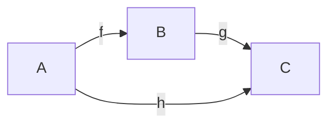

# 比較射σの統一定理
## — 幾何・忘却論・オイラーの等式を貫く typed 統一仮説 —

**v0.3 — 2026-04-17 三軸分離 + SU(2)_k スペクトル family + 3 層構造 統合版**

> F⊣G: meta.md §M1 参照。本文執筆中の F⊣G 変更禁止。
> 本稿は v0.2 からの拡張版。以下の新軸を追加した:
> 1. **§2.0 三軸分離** (種⑥): σ を群・スペクトル・位相の 3 軸で読む
> 2. **§5.bis SU(2)_k-sector** (種②③, F5-γ'): スペクトル軸の endpoint identity は `SU(2)_k` series の代数的階段であり、φ はその k=3 の 1 点。π-sector (超越的, 位相軸) とは **別軸** の端点
> 3. **§6 3 層構造** (C5): FaceLemma / Δ² / Bridge(C,A;D_C) を σ の局所存在層 / 骨格普遍層 / 橋梁担体層として積み上げる
> 4. **§5b C4 の Galois-like 対**: 三角形と円の内外極対として π を接続面の残存定数として読む
>
> ⚠️ v0.3 起草中の反証ラウンド (2026-04-17): 初期案の「φ-sector as π-sector の姉妹」は Ising anyon (k=2, `d²=2`) 反例で棄却。SU(2)_k family (`d = 2cos(π/(k+2))`) が正しい構造。φ (k=3) は family の 1 メンバー。詳細は Face5Lemma_draft.md §5.2-§5.3。

---

## §1 結論先行

本稿は次の 7 層で読む。

**K1 [SOURCE核]:**
walking triangle `Δ²` の 2-cell `σ: g∘f ⇒ h` は、比較という行為の最小形である。`Face Lemma` は、この比較面が立つ最小条件が「第三射の導入」であることを固定する。

**H1 [仮説 / C1]:**
幾何三角形・Face Lemma・Euler path・FEP は、σ の 4 つの言語表現というより、σ という比較行為の 4 つの実現面として読める。ここで言いたいのは、安い類比ではなく、共通の closure schema の存在である。

**H1b [仮説 / C1b]:**
`e^{iθ}` は σ の連続位相版であり、`cos θ + i sin θ` はその 2-cell を「三角形側の射影成分 / 円側の回転成分」の組で表した同一のものである。Euler 公式は σ の closure schema の存在から要求される構造的等式であって偶然の美的成立ではない。

**H2 [予想 / C2]:**
適切に定義された `BridgeDat(C,A)` において、`Δ²` は初期 bridge datum として振る舞い、`D_C` の正準性を押し出す可能性がある。

**K2 / H3 [SOURCE核 + 仮説 / C3]:**
`e^{iπ}+1=0` は、`統一表の関手化` では π-sector の typed endpoint identity として立っている。本稿はそれを、σ の完全反転に対応する endpoint window として読む。この endpoint identity が 4 ドメインに共通する「統一忘却式」へ上がるかは、まだ仮説の層にある。

**H4 [予想 / C4]:**
三角形 T に対する対 (I(T), O(T)) は Galois-like な内外極対をなし、正多角形極限で I と O が一致する。この一致点に残る不変量 π は、σ の closure schema が「離散比較」から「連続比較」へ忘却される際の残存定数であり、`e^{iπ}+1=0` の π と同一の出自をもつ。

**H5 [予想 / C5 / 上位メタ]:**
`FaceLemma.md` の comparison surface、`triangle_category_functor_map.md` の Δ² と L0-L4 ラダー、`統一表 v0.2` の `Bridge(C,A;D_C)` carrier は、同一の σ の **局所存在層 / 骨格普遍層 / 橋梁担体層** の 3 層表現である。C1-C4 はこの 3 層構造の異なる断面であり、3 層は「局所 → 骨格 → 橋梁」の積み上げ関係にある。

**K3' [SOURCE核 + 仮説 / 種②③ 合流 / Ising 反証後の修正版]:**
Face5 Lemma (incubator/Face5Lemma_draft.md) が立てば、Mac Lane pentagon coherence は σ の 5-cell 実現として機能する。この面の固有値構造は **SU(2)_k family** として階段状に並び、固有値は `d_{1/2}(k) = 2cos(π/(k+2))` で与えられる。φ (Fibonacci, k=3) はこの family の **1 点にすぎず**、Ising (k=2, `√2`)、SU(2)_4 (k=4, `√3`) 等と並ぶ家族の一員である。

これは π-sector (超越的位相定数) とは **軸が異なる**。π は位相軸の endpoint identity、SU(2)_k series はスペクトル軸の **代数的階段**。両者を「姉妹」と並列する初期案は Ising 反証 (§5.bis) で棄却された。三軸分離 (§2.0) の下では、π と SU(2)_k はそれぞれ別軸の端点として **並立ではなく直交** に配置される。

---

## §2 SOURCE で立つ核 — 3 層に分けた土台

### §2.0 三軸分離 — σ を読む 3 つの軸 [NEW]

σ 論文 v0.2 までは、σ の「実現面」を 4 ドメインに並べて書いていた。本版では、それらに先立つ **読解の軸** を 3 つに分離する。

**三軸**:

| 軸 | 問いの形 | Δ² での実現 | 正五角形での実現 |
|:---|:---|:---|:---|
| **群の軸** | σ はどの区別を忘れて閉じるか? | 自己同型群 S_3 (3 辺置換) | D_5 (5 辺二面体群) |
| **スペクトル軸** | σ はどの比率で再帰するか? | Q-matrix 固有値 (Fibonacci) | **φ** |
| **位相軸** | σ はどの周期で反転するか? | `e^{iπ}+1=0` (π-sector) | F-matrix pentagon eq (φ-sector) |

**仮説 (三軸独立性):**
この 3 軸は互いに還元不能であり、σ が Fix(G∘F) に近づくには 3 軸が同時に揃う必要がある。三軸のうち 1 つが退化すると σ は立たない:

- 群の軸が退化 (対称性なし): 比較の対象自体が同定できない
- スペクトル軸が退化 (固有値 1 のみ): 自己相似がなく、σ の再帰は発散しない/収束しない
- 位相軸が退化 (周期なし): σ の閉路完了が起こらない、endpoint identity が立たない

**三軸と 4 ドメイン・5 核主張の関係**:

| ドメイン / 核主張 | 主に効く軸 | 副次的な軸 |
|:---|:---|:---|
| 幾何三角形 (C1) | 群の軸 | スペクトル軸 (正多角形極限) |
| Face Lemma (C1) | 位相軸 (closure) | 群の軸 (対称) |
| Euler path (C1, C1b) | 位相軸 (`e^{iπ}`) | スペクトル軸 |
| FEP (C1) | 全軸 (VFE 最小化は三軸統合) | — |
| π-sector (C3) | 位相軸 | — |
| φ-sector (K3) | **スペクトル軸** | 群の軸 (A_5) |
| 3 層構造 (C5) | 全軸 (各層が軸に対応) | — |

この分離により、π-sector と φ-sector が自然に並ぶ:
- π-sector = **位相軸の typed endpoint identity**
- φ-sector = **スペクトル軸の typed endpoint identity**

両者は「σ の別断面」ではなく「σ を読む別軸」である。

**[open]**: 群の軸に対応する typed endpoint identity があるかは未検討。A_5 / E_8 との接続 (種⑤) がこの方向の候補。

---

### §2.1 局所存在層 — Face Lemma の comparison surface

`FaceLemma.md` (Paper II §3.4 経由) が固定している最小骨格は、comparison surface が立つ最小条件である。



**核**: 2 射では 1-skeleton に留まり、合成は書けても comparison surface は立たない。3 射で初めて 2-simplex が立ち、`g∘f` と `h` を外から照合できる。その面を塗る 2-cell が σ である:

$$\sigma: g\circ f \Rightarrow h$$

**この層が答える問い**: 「σ は**どこで**立つか」— 比較面の**局所存在**の条件。

**境界**: Face Lemma が言っているのは face の成立条件であって、global law の貼り合わせ完了ではない。`H^2_{\Theta}` は後段の obstruction であり、face の成立そのものと同一視してはいけない。

---

### §2.2 骨格普遍層 — Δ² の walking triangle

`triangle_category_functor_map.md` が固定しているのは、Face Lemma が住む最小 2-圏 Δ² の普遍性である。

- 3 対象 + 3 生成射 + 1 非自明 2-cell
- L0-L4 ラダー (純粋 → 計量 → phase → Euc → Hilb) で codomain を変えることで三角形の全ての側面を復元できる
- 任意の 2-圏 𝒟 の「三角形パターン」は Δ² からの 2-関手と一対一対応する (universal property)

**この層が答える問い**: 「σ は**何の**実現か」— 比較行為の**骨格普遍**。

Δ² は σ の habitat である。舞台であって主役ではない。だが「σ はどこにでも住める」ためには、この普遍 habitat が先立たなければならない。

---

### §2.3 橋梁担体層 — Bridge(C,A;D_C) の閉路完了機械 [NEW]

`統一表の関手化_構想ドラフト_v0.2.md` が導入したのは、Δ² が具体的な forgetting 圏で実現されるときの **carrier** である。

**定義 (Bridge carrier)**:
$$b = (\alpha_b, E_b, U_b) \in \mathrm{Bridge}(C, A; D_C)$$

- `α_b` = 累積忘却度 (path が走る層)
- `E_b` = 忘却濾過の持ち上げ (水平移送の source)
- `U_b` = 位相輸送 (`dU_b/dθ = iU_b`, `U_b(0) = 1_A` から `U_b(θ) = e^{iθ}` が一意に定まる)

**この層が答える問い**: 「σ は**どう**担われるか」— 比較行為の**橋梁担体**。

`Bridge(C, A; D_C)` は **閉路完了機械 (closure-completion machine) の carrier** であり、動的投影 (AdmPath) と静的投影 (StaticRead / SkelRead_π) の両方をここから取り出す。CCM1-CCM3 がこの carrier の存在条件、CCM4 がこの carrier から得られる comparison arrow の証明義務。

**境界**: 本 carrier は π-sector に閉じており、φ-sector の carrier は別定義が要る (§5.bis 参照)。

---

### §2.4 いま安全に言える核文 (3 層統合)

ここまでの SOURCE だけで閉じる核は次の 2 文に圧縮できる。

> σ は **局所的に** Face Lemma の comparison surface として立ち、**普遍的に** Δ² の 2-cell として実現され、**具体的に** Bridge(C,A;D_C) の carrier に担われる。3 層は独立ではなく、局所存在 → 骨格普遍 → 橋梁担体の積み上げ関係にある。

> 三軸 (群 × スペクトル × 位相) は σ の読解軸であり、各層で 3 軸が揃うときにのみ σ は Fix(G∘F) に近づく。π-sector は位相軸の典型、φ-sector はスペクトル軸の典型である。

この 2 文は §3 以降の仮説・予想 face への出発点である。

---

## §3 σ の 4 言語仮説 (C1)

### §3.1 幾何三角形

幾何では σ は、2 本の辺の合成と第 3 辺を比較する 2-cell として読むことができる。ここでは長さ・角度・面積より先に、「別ルート比較」の構造がある。

三角形の **自己同型群**:
- 不等辺 = {e} (区別を消す自由なし)
- 二等辺 = Z/2 (2 辺同一視)
- 正三角形 = S_3 (全辺同一視)

これは三軸の **群の軸** を Δ² で具体化した例である。

### §3.2 Face Lemma

Face Lemma では σ は、comparison surface が立ったことの証人である。ここでの核心は「第三射がある」ことであって、「すべての defect が解消される」ことではない。これは三軸の **位相軸** (closure 側) の具現。

### §3.3 Euler path と C1b — `e^{iθ}` は σ の連続位相版

Euler path 側では、σ は位相回転の比較射として読む。`θ=0` では整合、`θ=π` では完全反転が見える。`e^{iπ}+1=0` は、その完全反転が終点で静止した像である。

**C1b の具体化**: Euler 公式は偶然の美ではなく、σ の closure schema の構造的必要性として以下の分解を持つ:

$$e^{iθ} = \cos θ + i \sin θ$$

- 偶数項 (`cos θ`) = σ の **整合成分** (テイラー展開の偶奇分解における even 側)
- 奇数項 (`i sin θ`) = σ の **反転成分** (odd 側、i は反転因子)
- 加法定理 `e^{iθ_1} \cdot e^{iθ_2} = e^{i(θ_1+θ_2)}` = σ の **合成則** (モノイド構造)

このように読むと、Euler 公式は σ の 2 成分分解 + 合成則 + `θ = π` での完全反転の **3 点を同時に満たす唯一の連続写像** である。偶然ではなく**要求される構造**。

### §3.4 FEP

FEP 側では、σ は `Φ_{FEP} / Φ_{Phys} / Φ_{Epist}` の三実現をまたぐ比較射として置きたい。この節はまだ SOURCE が薄い。現段階では「接続候補面」であり、証明面ではない。

但し三軸分離の観点では、FEP は三軸すべてが必要になる場面 (VFE = -Accuracy + Complexity の最小化は群 × スペクトル × 位相の全軸を要求する) として読める。

### §3.5 4 言語仮説の言い方

以上をまとめると、本稿の C1 は次のように言い換えるのが適切である。

**仮説 C1 (σ の 4 言語統一仮説):**
比較射 `σ: g∘f ⇒ h` は、幾何三角形・Face Lemma・Euler path・FEP にまたがって、同一の closure schema の 4 つの実現面を与える。各実現面は三軸 (群 × スペクトル × 位相) のうちの主軸と副軸を持ち、全実現面の統合が σ の完全読解を与える。

ここで未証明なのは「4 つが厳密に同型である」ことではなく、「4 つが同じ比較行為を別のコーディングで実現している」という強い統一読解である。

---

## §4 BridgeDat の構成面 (C2)

### §4.1 bridge datum (§2.3 から再掲の定義)

`統一表` に従い:
$$b = (\alpha_b, E_b, U_b)$$

### §4.2 `U_b` の正準性 (π-sector)

橋梁公理 `dU_b/dθ = iU_b`, `U_b(0) = 1_A` から `U_b(θ) = e^{iθ}` が一意に定まる。したがって `U_b` は自由成分ではなく、bridge datum の自由度は主として `(α_b, E_b)` 側に寄る。

### §4.3 bridge morphism の提案定義

`BridgeDat(C,A)` の射を:
- 端点固定の単調連続写像 `φ_α: [0,π] → [0,π]`
- 各 θ における濾過の包含 `φ_E(θ): C_{α_b(θ)} ↪ C_{α_{b'}(φ_α(θ))}`

の組として置き、`D_C` の値保存を整合条件に課す。これは **定義** であり、定理ではない。

### §4.4 `Δ²` 始対象性の予想

**予想 C2 (初期 bridge datum 予想):**
`Δ²` は `BridgeDat(C,A)` の初期 bridge datum として働き、任意の bridge datum への比較射を一意に押し出す。

もし C2 が立てば、`D_C` は任意 choice ではなく、比較射を保つ decategorification としてかなり強く拘束される。

### §4.5 `D_C` 正準性との関係

必要なのは、`ev_π` の faithful/full 性と、濾過像から全体への extension theorem。現段階では構成予想として置く。

---

## §5 位相軸の π-sector とスペクトル軸の SU(2)_k family

### §5.1 位相軸 — π-sector の typed endpoint identity

`統一表 v0.2` の橋梁系で:
$$\Omega(\pi) + D_C(E(0)) = D_C(E(\pi))$$

境界条件 `D_C(E(0)) = 1_A`, `D_C(E(\pi)) = 0_A` を代入すれば:
$$e^{i\pi} + 1 = 0$$

右辺の `0` は裸の数ではなく `0_A` であり、「完全忘却状態へ落ちた終点」を表す。

**仮説 C3 (統一忘却式の読解):**
`e^{iπ}+1=0` は、σ の完全反転が endpoint window に現れた静的像であり、4 ドメインを貫く統一忘却式の候補である。ただし「候補」を外さない: いま立っているのは **位相軸の** π-sector typed corollary であって、他軸も貫いた統一定理ではない。

π は **超越的位相定数** (周期化商 `ℝ/2πℤ → S¹` の規格化定数) であり、連続変形によって他値と繋げない孤立した点。

---

### §5.bis スペクトル軸 — SU(2)_k family の typed endpoint identity [NEW, 反証後再構築版]

位相軸が π-sector で閉じるなら、スペクトル軸で閉じる endpoint identity は **単一の定数ではなく、代数的階段 (SU(2)_k series)** として現れる。

**SOURCE (標準 MTC 文献 / 計算検証 2026-04-17)**:
SU(2)_k modular tensor category における基本表現の量子次元:
$$d_{1/2}(k) = 2\cos\left(\frac{\pi}{k+2}\right)$$

| k | `d_{1/2}(k)` | `d²` | 固有方程式 | 圏の名前 | 代数的複雑度 |
|:---|:---|:---|:---|:---|:---|
| 1 | 1 | 1 | `d = 1` (自明) | 可換 | 1 次 (自明) |
| **2** | **√2 ≈ 1.414** | **2** | **`d² = 2`** | **Ising** | 2 次 (`ℚ(√2)`) |
| **3** | **φ ≈ 1.618** | **φ+1** | **`d²-d-1=0`** | **Fibonacci** | 2 次 (`ℚ(√5)`) |
| 4 | √3 ≈ 1.732 | 3 | `d² = 3` | SU(2)_4 | 2 次 (`ℚ(√3)`) |
| 5 | ≈ 1.802 | ≈ 3.247 | `d³-d²-2d+1=0` | SU(2)_5 | 3 次 |
| 6 | √(2+√2) ≈ 1.848 | `2+√2` | `d²=2+√2` | SU(2)_6 | 2 次 (`ℚ(√2)`上) |
| ∞ | → 2 | → 4 | — | 古典 SU(2) | 解析的 (代数ではない) |

**構造的要点**:
1. **k=1** は可換。Face5 は自明化 (α = id) → F5-β (非自明 α 要請) と整合
2. **k=2, 3, 4** は 2 次代数的数 (`√2`, `φ`, `√3`)。代数的複雑度最小
3. **k=5 以降** は 3 次以上の代数的数
4. **k→∞** で古典 SU(2) (d=2) へ degeneration。量子変形の解除
5. **Fibonacci (k=3) に特権はない**。φ は 2 次家族の中点

**Face5 との接続** (incubator/Face5Lemma_draft.md §5.2-§5.3 の検証成果):
Face Lemma (Face3) が「3 射で comparison surface 立つ」なら、Face5 は「5 射で pentagon coherence polytope 立つ」と延長する。SU(2)_k 各 k で Face5 は非自明に立ち、固有値は `2cos(π/(k+2))`。

**仮説 K3' (SU(2)_k-sector typed endpoint identity family):**
σ の Face5 延長が非自明に立つ MTC の族として SU(2)_k series が存在し、各 k でスペクトル軸の endpoint identity は:
$$d_{1/2}(k)^2 - \text{(有理式)} = 0, \quad d_{1/2}(k) = 2\cos\left(\frac{\pi}{k+2}\right)$$

で与えられる。Fibonacci の `φ²-φ-1=0` は **k=3 の specific case** にすぎない。

**重要な不一致**: K3' には Chebyshev 多項式由来の `2cos(π/(k+2))` という表式に **π が内在** する。つまり SU(2)_k series は「純粋にスペクトル軸」ではなく、**位相軸との交差点** にある。これは三軸分離 (§2.0) が示唆する軸の直交性への反例ではなく、むしろ「軸は 3 つあるが互いに交差する」という豊かな構造の兆候である。

### §5.2 π-sector と SU(2)_k-sector の対比 (反証後更新版)

| 観点 | π-sector | SU(2)_k-sector |
|:---|:---|:---|
| 三軸での位置 | 位相軸 | スペクトル軸 (π 内在) |
| Endpoint identity | `e^{iπ}+1=0` (単一) | `d(k) = 2cos(π/(k+2))` (k-family) |
| σ の側面 | 完全反転 (終点) | 自己融合 (k-階段) |
| 必要な Face 段階 | Face3 (3 射 σ 立つ) | **Face5** (5 射 pentagon 立つ) |
| 対応する構造定数 | π (超越, 周期化商) | `2cos(π/(k+2))` (代数, k-離散) |
| 典型圏 | `U(1)` phase bundle | SU(2)_k MTC (k=2 Ising, k=3 Fib, k=4 SU(2)_4, …) |
| Bridge carrier | `Bridge(C,A;D_C)` (統一表 v0.2) | (未定義、k ごとに異なる?) |
| 代数的複雑度 | 超越 (degree ∞) | 1 次 → 2 次 → 3 次 → … (k 増加で上昇) |

両 sector は σ を **別軸で読んだ** ときに現れる端点だが、SU(2)_k series の表式 `2cos(π/(k+2))` に π が内在するため、**軸は独立ではなく π-sector と交差している**。

### §5.bis.2 Tambara-Yamagami 族と ENO-anchored universal (2026-04-17 追加)

SU(2)_k family 単独では K3' は ◯ Kalon に留まる。**Tambara-Yamagami (TY) family** を検証すると、Face5 固有値階段はより広い landscape を持つことが判明する。

**SOURCE** (Tambara-Yamagami 1998, J. Algebra 209):
TY fusion category は有限 abelian 群 `A` でパラメータ付けられ、融合則 `m⊗m = ⊕_{a∈A} a` から `d(m) = √|A|`。

| `|A|` | `d(m)` | SU(2)_k 比較 |
|:---|:---|:---|
| 2 | √2 | Ising = TY(Z/2), k=2 と同型 |
| 3 | √3 | k=4 と同じ d 値、構造は別 |
| 4 | 2 | SU(2)_k の `k→∞` 古典極限値 |
| **5** | **√5** | **SU(2)_k に該当なし** (`d > 2`) |

**TY(Z/5) は SU(2)_k 圏外** であり、二家族は genuinely 別の階段。スペクトル軸の Face5 固有値は family-specific であって universal 式は存在しない。

**universal 骨格 — ENO 定理**:
**Etingof-Nikshych-Ostrik (2005)** により、任意の fusion category の Frobenius-Perron 次元は **totally real positive algebraic integer**。したがって:

**K3'' (C9) [仮説 / ENO-anchored universal]**:
σ の closure schema が 5-cell coherence で閉じるとき、スペクトル軸の endpoint identity 固有値 `d` は常に totally real positive algebraic integer である。universal な式は存在しないが、**universal な性質 (代数的整数性) は ENO 定理により保証される**。

SU(2)_k (Chebyshev `2cos(π/(k+2))`)、TY (`√|A|`)、Haagerup family (subfactor 由来) は同じ代数的整数性制約の下に並ぶ **独立した階段**。

詳細: `../incubator/Face5Lemma_draft.md` §5.4。Kalon 判定は ◎ Kalon△ (C9)。

**[open]**:
- 各 family での bridge carrier の明示的構成
- Haagerup、Extended Haagerup、near-group fusion categories での Face5 固有値の具体形
- 「π が SU(2)_k 表式に内在する」という事実の圏論的意味 (位相軸が スペクトル軸の枠組を提供している?)
- 逆向き: どの totally real positive algebraic integer が Face5 eigenvalue として実現されるか (C9 の十分条件)
- k→∞ 古典極限で σ closure schema に何が起きるか

---

## §5b 三角形と円の Galois-like 対 (C4) [NEW]

**予想 C4**:
三角形 T に対する対 `(I(T), O(T))` は Galois-like な内外極対をなし、正多角形極限で I と O が一致する。この一致点に残る不変量 π は、σ の closure schema が「離散比較」から「連続比較」へ忘却される際の残存定数であり、`e^{iπ}+1=0` の π と同一の出自をもつ。

### §5b.1 内外極対

- I(T) = 内接円 (T に内部から接する最大円)
- O(T) = 外接円 (T に外部から接する最小円)

正多角形列 `P_n` (n 辺の正多角形) に対し:
$$I(P_n) \subset I(P_{n+1}) \subset \cdots = \cdots \supset O(P_{n+1}) \supset O(P_n)$$

という単調収束構造があり、`n→∞` で I と O は同じ円 (極限円) に一致する。

### §5b.2 π の出自としての忘却残存

**SOURCE**: 正 3 角形の周長は `3√3` (π 不要の代数的数)。正 4 角形 (√2)、正 6 角形 (6)、など、任意の有限 n で周長は代数的数で書ける。

**INFERENCE**: π が必要になるのは **`n→∞` の極限だけ**である。π は「離散多角形列を連続円へ忘却する際に、忘却されきらずに残る定数」である。

### §5b.3 π と `e^{iπ}+1=0` の同出自

この読みのもとでは:
- 幾何的 π = 多角形 → 円の忘却残存
- Euler 公式の π = σ の完全反転 endpoint

両者が同じ π なのは偶然ではなく、**σ の closure schema が「離散比較 (多角形) → 連続比較 (円)」の極限で閉じる** からである。π はこの極限でのみ呼ばれる定数であり、接続面の残存不変量として機能する。

### §5b.4 Galois-like 対の声量調整

**注意**: 厳密な F⊣G 随伴としての I と O の位置づけは、三角形の圏と円の圏の lattice 構造を整備しないと閉じない。本稿では **Galois-like な内外極対** として声量を調整し、厳密化は別稿 (open 6/7) に委ねる。

---

## §6 3 層構造の積み上げ (C5) [NEW / 上位メタ]

**予想 C5**:
`FaceLemma.md` の comparison surface、`triangle_category_functor_map.md` の Δ² と L0-L4 ラダー、`統一表 v0.2` の `Bridge(C,A;D_C)` carrier は、同一の σ の **局所存在層 / 骨格普遍層 / 橋梁担体層** の 3 層表現である。

### §6.1 3 層の役割

| 層 | 問い | 正本文書 | σ の現れ方 |
|:---|:---|:---|:---|
| **局所存在層** | σ はどこで立つか | `FaceLemma.md` | comparison surface (2-simplex の面塗り) |
| **骨格普遍層** | σ は何の実現か | `triangle_category_functor_map.md` | walking triangle Δ² の 2-cell |
| **橋梁担体層** | σ はどう担われるか | `統一表 v0.2` | Bridge carrier `(α_b, E_b, U_b)` |

### §6.2 積み上げ関係

3 層は独立ではなく以下の順で積み上がる:

1. **局所存在層** が最下段: σ が**そもそも立つ**条件 (Face Lemma 最小条件)
2. **骨格普遍層** が中段: σ が立った後、**どの 2-圏でも同型に持ち上がる**普遍性 (Δ²)
3. **橋梁担体層** が最上段: σ が具体的な forgetting 圏で**実際に動く**ための carrier (`Bridge(C,A;D_C)`)

下段が立たなければ上段は意味を持たない。上段が閉じなければ下段は抽象的骨格に留まる。

### §6.3 C1-C4 と 3 層の対応

| 核主張 | 主に効く層 | 副次的な層 |
|:---|:---|:---|
| C1 (4 言語統一) | 骨格普遍層 (Δ² が 4 ドメインに分配) | 局所存在層 (各ドメインで Face) |
| C1b (Euler 公式) | 橋梁担体層 (`U_b(θ) = e^{iθ}`) | 骨格普遍層 |
| C2 (BridgeDat 初期性) | 橋梁担体層 (Bridge カテゴリ) | 骨格普遍層 (Δ² が始対象) |
| C3 (π-sector) | 橋梁担体層 (endpoint identity) | 全層 |
| C4 (Galois-like 対) | 骨格普遍層 (正多角形極限) | 局所存在層 |

C5 が立てば、これら 5 核主張は互いに独立な仮説ではなく、**3 層構造の異なる断面** として統一的に読める。

### §6.4 SU(2)_k-sector の 3 層位置

§5.bis で導入した SU(2)_k-sector は 3 層構造のどこに入るか? φ (k=3) を 1 点として含む family 全体で考える。

- 局所存在層: Face5 Lemma (incubator/Face5Lemma_draft.md) が対応 — **局所存在の 5-cell 拡張**。k ごとの非自明 α の存在条件は Face5 の最小性主張 (F5-α) に還元される
- 骨格普遍層: Mac Lane pentagon coherence の walking pentagon 圏が対応 (未定式化)。k-依存は骨格普遍層では消え、各 k は codomain 側の enrichment として現れる (SU(2)_k MTC の選択)
- 橋梁担体層: k ごとに異なる可能性 (未定義)。Fibonacci 用 carrier と Ising 用 carrier は別構造を持つだろう

3 層すべてに SU(2)_k-sector 版の対応物が要る。π-sector は 3 層すべてで定式化済みだが、SU(2)_k-sector は **3 層ともに不完全**。加えて k-family 全体を貫く universal 構造 (Chebyshev 階段 `2cos(π/(k+2))`) の圏論的意味も未踏。これが v0.3 以降の大きな open 課題。

**[観察]**: k-family の表式に π が内在する (`2cos(π/(k+2))`) ため、スペクトル軸の 3 層定式化には位相軸の π が不可避に出現する。これは 3 層 × 3 軸の格子が互いに直交しているのではなく、交差していることを示唆する。

---

## §7 rejection ledger / open variables

本稿の射程を保つために、捨ててはいないが、まだ言い切らないものをここへ隔離する。

1. `H^2_{\Theta}=0 \Longleftrightarrow σ が整合的に存在する`
   強すぎる。`H^2_{\Theta}` は global gluing obstruction の面であり、comparison surface の成立条件そのものではない。

2. `Δ² は BridgeDat(C,A) の始対象である` (C2)
   現段階では定理ではない。射の定義と extension theorem がまだ薄い。

3. `e^{iπ}+1=0` と `V-E+F=2` は同一の定理である
   過剰。いま言えるのは「同じ閉路完了機械の異なる静的窓」。

4. FEP 節は完成していない
   C1 の 4 言語統一仮説のうち最も open。

5. `σ` だけで全てが forced される
   橋梁公理、証明義務、境界条件を同時に背負わなければ typed corollary は落ちてこない。

6. C4 の「随伴」としての厳密形式化
   三角形の圏と円の圏の lattice 構造が未整備。本稿では「Galois-like 対」として声量調整。

7. π を円固有の定数として扱う読解
   本稿は「三角形と円の接続面の残存定数」として読む方を選択。

8. **[NEW]** SU(2)_k-sector の bridge carrier (旧 φ-sector bridge carrier)
   未定義。π-sector の `Bridge(C,A;D_C)` とは別の carrier が要る可能性が高く、さらに各 k で別構造になる可能性がある。universal k-family carrier が存在するかも未踏。

9. **[NEW]** Face5 Lemma の minimality 厳密証明 (F5-α)
   「5 射が pentagon coherence の最小条件である」の minimality は試作 (incubator/Face5Lemma_draft.md) で形は取れたが、Mac Lane coherence theorem の裏返し方向の厳密証明は未了。

10. **[NEW]** 三軸の還元可能性と交差
   群 × スペクトル × 位相の 3 軸が互いに独立かは未検証。特に SU(2)_k-sector の表式 `2cos(π/(k+2))` に π が内在することから、スペクトル軸と位相軸は **完全には独立ではない**。軸の交差の圏論的意味は未踏。

11. **[NEW]** 3 層の厳密積み上げ証明 (C5)
   局所存在 → 骨格普遍 → 橋梁担体の積み上げが関手的に定式化できるかは未踏。

12. **[棄却 → 再配置]** 旧 K3 「φ-sector は π-sector の姉妹」
   Ising anyon (`d² = 2`) の反例により棄却 (2026-04-17)。φ は SU(2)_k family の k=3 の 1 点にすぎず、π-sector と「姉妹」として並立するのは誤り。姉妹関係ではなく **別軸の端点** として再配置。詳細は Face5Lemma_draft.md §5.2-§5.3。

13. **[NEW]** SU(2)_k 以外の MTC 族での Face5 固有値検証
   Tambara-Yamagami, near-group categories, quantum groups at non-SU(2) roots などで同様の階段が出るか未踏。「Face5 = SU(2)_k」と即断してはならない。

---

## §8 結語

私はこの稿で、夢を縮めるつもりはない。押したいのは、「ことなるドメインが、σ という比較行為を介して一つにつながる」という強い見取り図である。

v0.2 までで地盤として踏めていたのは三点:
- `Δ²` が comparison の最小 habitat を与えること
- `Face Lemma` が第三射による comparison surface の成立条件を固定すること
- `統一表` が π-sector で typed endpoint identity を立てていること

v0.3 ではこの三点に以下を加えた:
- **三軸分離** (§2.0): σ を群・スペクトル・位相の 3 軸で読み分ける枠組み
- **3 層構造** (§6): 局所存在 → 骨格普遍 → 橋梁担体の積み上げ
- **SU(2)_k-sector family** (§5.bis): スペクトル軸の typed endpoint identity が単一値ではなく k-代数的階段として現れる。φ (k=3) はその 1 点
- **C4 Galois-like 対** (§5b): π を離散 → 連続忘却の残存定数として読む
- **C1b 構造的必要性** (§3.3): Euler 公式は偶然美ではなく σ の要求

v0.3 起草中に棄却したもの:
- 旧 K3「φ-sector は π-sector の姉妹」: Ising anyon (`d²=2`) 反例により棄却。φ は SU(2)_k family の k=3 の 1 点、π は位相軸の超越的端点。両者は姉妹ではなく **別軸の端点**

次に必要なのは、射程の後退ではない。以下の順序で押す:
1. §6 の 3 層積み上げを形式化する (C5 の定理化)
2. Face5 Lemma の minimality 証明を詰める (F5-α)
3. SU(2)_k-sector の bridge carrier を各 k で定義し、universal k-family carrier の存在可能性を探る
4. スペクトル軸と位相軸の交差 (`2cos(π/(k+2))` 内の π) の圏論的意味を詰める
5. FEP 節の SOURCE を埋める
6. `Δ²` から `D_C` への押し出しを本当に証明できるかの勝負

---

## 付録 A: 関連文書マップ

```
σ 統一論文 v0.3 (本稿)
  ├── §2.1 局所存在層 → ../infra/リファレンス/FaceLemma.md
  ├── §2.2 骨格普遍層 → ../incubator/triangle_category_functor_map.md
  ├── §2.3 橋梁担体層 → ./統一表の関手化_構想ドラフト_v0.2.md
  ├── §5.bis SU(2)_k-sector → ../incubator/Face5Lemma_draft.md (試作, §5.2-§5.3 に Ising 反証 + SU(2)_k family)
  └── 7 落書き背景 → ../incubator/pentagon_sigma_conjecture.md

meta 台帳: 比較射σの統一定理_v0.1.meta.md
  ├── §M1 F⊣G 宣言
  ├── §M2 核主張 C1-C5
  ├── §M3 Kalon 判定
  ├── §M4 ±3σ ゲート
  ├── §M5 Gauntlet ログ
  ├── §M6 棄却案
  └── §M7 Open Seeds (pentagon_sigma_conjecture 7 種への pointer)
```

---

## 付録 B: SOURCE / TAINT 台帳

**[SOURCE]**:
- `FaceLemma.md`: comparison surface の最小条件、stable/detectable/coherence-defective の切り分け
- `triangle_category_functor_map.md`: walking triangle `Δ²`、三角形パターンの普遍 habitat、L0-L4 ラダー、M1-M4 四機械
- `統一表の関手化_構想ドラフト_v0.2.md`: π-sector の typed endpoint identity、faithful/full、Bridge(C,A;D_C) carrier、閉路完了機械
- Mac Lane (1963) "Natural associativity and commutativity": pentagon + triangle coherence
- Moore-Seiberg (1989), Ocneanu, Kitaev: Fibonacci anyon (SU(2)_3) F-matrix、`d² = d + 1 ⇒ d = φ`
- 標準 MTC 文献: SU(2)_k MTC、量子次元 `d_{1/2}(k) = 2cos(π/(k+2))`、Ising (k=2) F-matrix Hadamard 型

**[TAINT / 仮説 / 予想]**:
- 本稿 §2.0 三軸分離の独立性 (さらに §6.4 の観察: スペクトル軸と位相軸は `2cos(π/(k+2))` で交差する)
- 本稿 §3.3 Euler 公式の σ 要求読解 (C1b)
- 本稿 §4 `BridgeDat` 射の定義、`Δ²` 始対象性 (C2)
- 本稿 §5.bis SU(2)_k-sector typed endpoint identity family (K3', F5-γ')
- 本稿 §5b Galois-like 対 (C4)
- 本稿 §6 3 層構造の積み上げ関手的定式化 (C5)
- FEP への統一的押し出し (C1 の FEP 面)

**[棄却済み]**:
- 旧 K3「φ-sector は π-sector の姉妹」: Ising anyon 反例により棄却 (2026-04-17)。Face5Lemma_draft.md §5.2 参照

---

*v0.3 — 2026-04-17. v0.1 からの拡張点: §2.0 三軸分離, §5.bis SU(2)_k-sector family (旧 φ-sector, Ising 反証後再構築), §5b C4, §6 C5, C1b Euler 要求読解。*
*射程は維持: C1-C5 のすべてを予想/仮説 face に留め、SOURCE 核との境界を明示。反証 round (2026-04-17) により φ 単独の特権性は棄却、SU(2)_k family へ射程拡大。*
